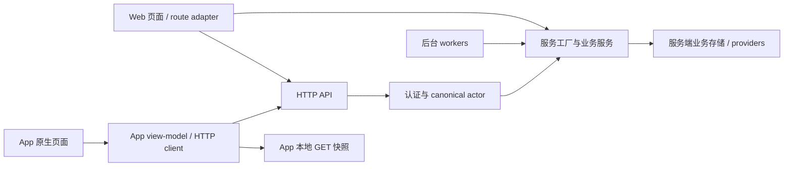

# 数据与契约边界

本文件描述当前实现和后续交接规则；不会建立第二套 API 类型定义。规范真源仍是 [cross-client-contract.md](../repos/orbits/docs/cross-client-contract.md) 与两端 AGENTS.md。

## 当前调用关系

Web 的服务端页面也要先解析会话与 canonical actor，例如 contacts/dashboard 和 today 的 page。图中的直接服务调用不是跳过授权。

| 内容 | 真源 / 当前边界 | Bridge 管什么 |
| --- | --- | --- |
| 业务规则、状态转换、持久化 | Web `features/**`、API 与存储/provider | 变化影响哪些消费者、是否已有 HTTP 暴露 |
| 客户端响应类型 | Web `shared/contract/*.ts` → App `src/api/contract/` | 版本基线、字段变化、适配任务 |
| 运行时 Schema | Web `shared/api-schema/` → App `src/api/schema/` | 校验覆盖范围、schemaVersion 兼容性 |
| 行业/语言字典 | `shared/domain/industries.ts`、`language.ts` → App `src/api/domain/` | 白名单与 ID/标签一致性 |
| 请求 body | 当前留在各 feature / App 请求构造器 | 方法、输入、版本条件、幂等性；不扩大复制白名单 |
| 端内 UI 状态 | 各客户端 | 选择、加载、错误恢复与导航差异；不要求共享组件 |
| 业务当前数据 | 同一后端环境下的服务端存储 | 用同 actor、同对象 ID 双向回读核实 |
| App SQLite 快照 | App 读取缓存 | 过期/刷新/换账号行为；不把缓存当数据同步真源 |
| 同步任务状态 | `bridge/handoffs.md` | 谁待处理、哪一端适配完、证据和剩余缺口 |

当前共享文件：12 个 `.ts`（含 index），覆盖 contacts/envelope/events/followups/industries/language/orbit-ai/profile/reminders/source/tasks；1 个 `mobile-contacts-dashboard.ts` Schema；2 个运行时字典。逐项 SHA-256 在 [基线快照](snapshots/2026-09-07-baseline.json)。

`npm run sync:contract` 是已有的显式复制操作，不是后台自动同步。应在契约变化已确认并安排 App 适配后执行；本轮副本无漂移，因此没有运行覆盖真实 App 文件的同步命令。测试中的同步命令只对临时夹具执行。

## 已确认的运行时边界

- App API 地址来自 `EXPO_PUBLIC_ORBIT_API_BASE_URL`，默认 `http://localhost:3000`，也有设备侧配置入口。只有指向同一服务/数据环境的 Web 与 App 才能比较业务状态；本轮未核实实际运行配置。
- 会话经 mobile credentials / Google bridge 获取，App 保存 Cookie；API 解析 canonical actor。登录 session user ID 与业务 actor 的映射不可凭客户端名称推断。
- 通用 client 校验响应壳并处理 401；`useValidatedApiResource` 才进一步应用显式 Schema。多数 `useApiResource<unknown>` 消费点依靠各自 mapper，不能因 shared 目录存在而认为全部被运行时保护。
- mobile dashboard 聚合同时向 7 个 loader 传同一 actor；aggregate 为必需，其余区块失败可降级，响应携带 `schemaVersion`、`generatedAt`、`unavailableSections`。Web 相关聚合变化要同步检查这个移动适配层。
- 普通资源通过首次加载和显式 refresh 更新；运营页面在任务活跃时每 3 秒刷新。通用 hook 没有全局实时广播。已打开的另一个客户端多久看到变化，需要逐模块验收，不给出未经测量的即时保证。
- 角色写入携带 `expectedRevision`；报名审核携带 `expectedApplicationVersion`；任务创建/操作有 idempotencyKey。它们属于不同接口规则，不能假定所有写操作都有同样的冲突处理。
- App 续聊后对已存 session 的更新存在不等待结果的 POST 路径。**这是持久化确认需复核的风险，不是已复现的数据丢失结论**；见 BR-003。

## 跨端一次写入的验收

每个关键业务至少做两次方向相反的回合，并写入同一 handoff：

1. 固定 Web/API 地址、App 地址、版本、账号/actor、对象 ID、模块模式与所需 worker。只记录脱敏标识，不保存 Cookie 或个人内容。
2. Web 修改 → 保存响应/对象版本 → App 刷新或重开 → 比较字段、状态、权限、统计口径。
3. App 修改 → 确认服务端持久化响应 → Web 刷新 → 比较相同内容。AI 历史要重开该会话，不能只看当前聊天内存。
4. 对版本化写入补一个两端同时编辑案例：旧版本提交被拒绝/提示刷新，不能静默覆盖新状态。未声明版本规则的接口先核实设计，不杜撰保证。
5. 对读取快照补断网、恢复网络、切换账号/服务器场景；对异步业务检查 queued/running/failed/published 等真实后端状态。
6. 失败或尚未运行的步骤保持开放，附接口错误/测试证据，再决定是 Web/API 缺口、App 适配缺口还是环境问题。

小雨是人脉与普通账号回归的已有测试身份；测试凭据继续从原有忽略环境文件加载，变量为 `ORBIT_XIAOYU_TEST_EMAIL`、`ORBIT_XIAOYU_TEST_PASSWORD`。活动 owner/operations/admission 等角色场景另需合法的角色夹具，不能假定小雨拥有所有权限。
