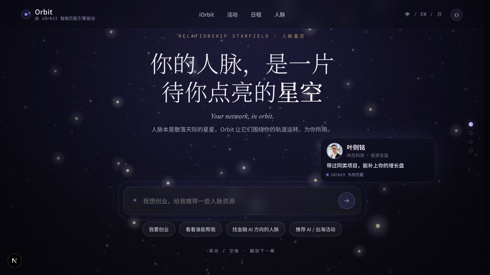
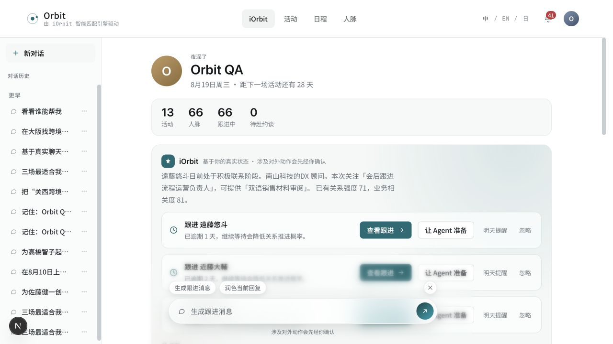
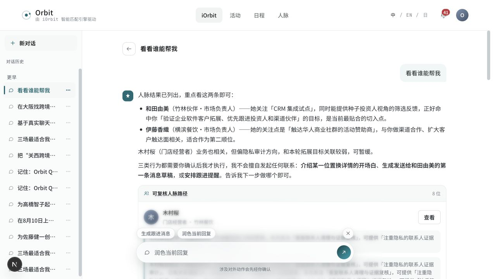
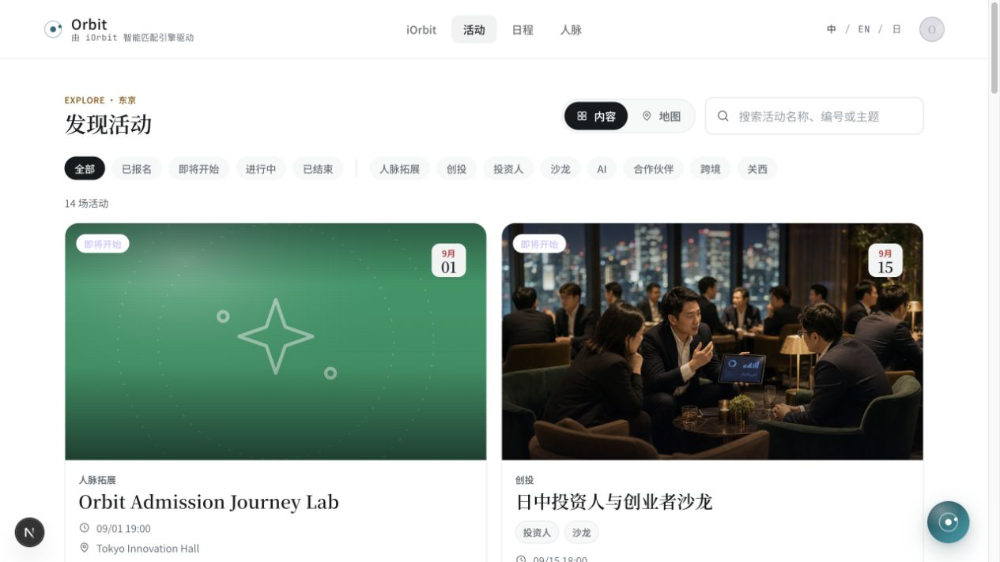
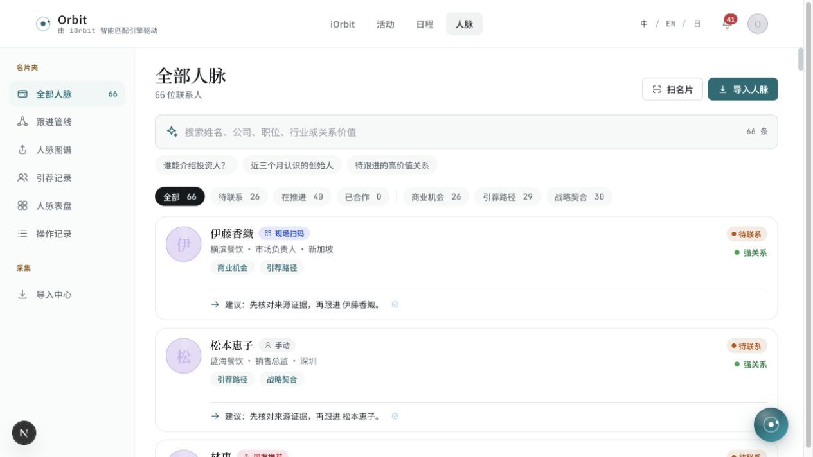
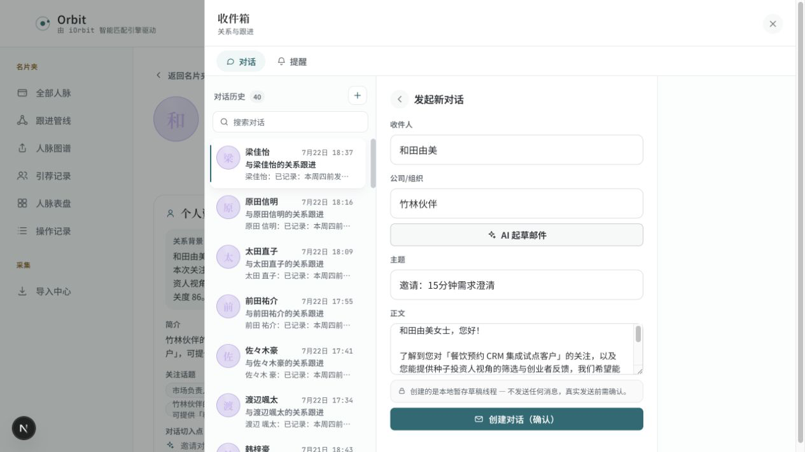
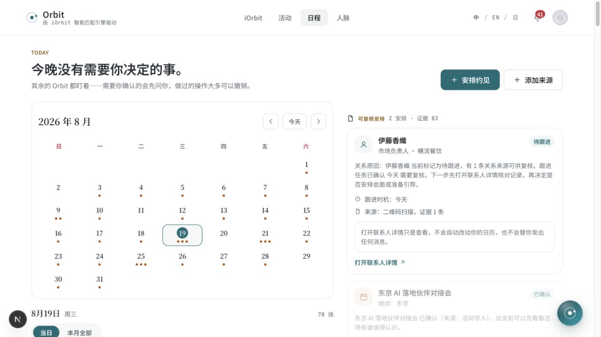

# Orbit 产品核心功能与用户体验审计

审计日期：2026-08-19  
审计对象：Orbit Web 个人用户主路径（移动端与活动主办方能力仅作范围补充）  
审计方式：本地 live 环境运行时走查、当前截图、可见 DOM、产品源码与现有功能清单交叉核对  

## 0. 证据边界

### 已确认事实

- 从公开落地页点击“看看谁能帮我”，产品会直接进入 iOrbit 并自动发起任务。
- 已登录、已有 66 位联系人数据的测试账户，约 14 秒得到第一份具体人脉推荐；系统列出 8 位候选，正文强调前 2 位。
- 推荐结果含具体人名、组织、匹配理由、来源记录和下一步选项。
- 联系人详情可以打开“起草邮件”，再点一次“AI 起草邮件”后超过 8 秒、在 23 秒内得到可编辑主题与正文；界面明确表示不会直接发送。
- 活动列表有 14 场活动、状态/主题筛选、内容/地图视图；选中活动详情显示完整活动旅程。
- iOrbit 首页对“日中投资人与创业者沙龙”提示“报名与回答 2 题”，同一活动详情却显示“报名暂不可用”。
- 日程页标题显示“今晚没有需要你决定的事”，同页又显示当天 78 场安排，许多项目标记“待确认”。
- 人脉页同时提供列表、跟进管线、人脉图谱、引荐记录、人脉表盘、操作记录和导入中心。

### 源码确认、但本轮未做无登录运行时验证

- 注册只要求邮箱和至少 8 位密码；部署可选 Google 登录。
- 当前部署未配置密码重置，界面会明确告知不会发送邮件或验证码。
- 现有产品清单包含 Web 38 个生产路由和移动端 48 个生产路由，但这只证明表面存在，不证明用户能顺利完成任务。

### 尚未验证

- 完全无数据、无历史联系人账户的首次冷启动路径。
- 真实活动报名成功、回答两题、匹配发布、座位生成和活动后复盘的端到端成功链路。
- 真实邮件/消息发送、日历写入和撤销。
- iOS 原生端本轮未截图走查。
- 屏幕阅读器、键盘全流程、缩放/重排和数值化颜色对比度。

因此，本报告对“已有关系数据用户”的判断置信度高；对“全新空账户的 Time to Value”只做风险判断，不做完成声明。

---

## 一、真正的核心价值

### 产品主要解决什么问题

商务活动和日常社交后，联系人、名片、聊天、活动信息与跟进承诺散落在不同地方。用户知道“认识了很多人”，但很难持续回答：为什么认识、现在谁最值得联系、该说什么、依据是什么。

### 用户为什么需要

用户真正需要的不是更多联系人，也不是一个泛用聊天机器人，而是把已有关系转化为可复核、可执行、不会越权的下一步。

### 不用 Orbit 时的替代方式

- 名片夹、通讯录、微信/邮件搜索。
- Excel、Notion、CRM 手工记录关系来源和下一步。
- 活动前自己翻参会名单，活动后靠记忆整理。
- 自己写跟进消息、设日历提醒。

### Orbit 具体好在哪里

- 把活动、扫码、名片、联系人、聊天和日历来源放进同一个关系上下文。
- 不只给名单，还给“为什么值得联系”和可查看依据。
- 从建议继续生成草稿，并把真实外部动作放在用户确认之后。
- 能把一次活动或一次对话沉淀为长期关系资产。

### 用户能得到的明确结果

一份有依据的优先联系人清单、具体跟进理由、可编辑消息草稿、提醒或活动准备建议。

### 最容易感知价值的用户

经常参加商务活动、联系人超过几十位、需要跨语言维护投资人/客户/渠道伙伴的创业者、商务负责人、投资人和社群组织者。

### 可能不需要的用户

- 联系人很少、没有持续商务跟进需求的人。
- 只需要一次性活动报名，不需要活动前后关系管理的人。
- 不愿提供任何关系来源，却期待高质量个性化推荐的人。
- 已经把关系工作完整放在成熟 CRM 并能持续维护的人。

### 一句话价值主张

这个产品帮助**经常参加商务活动并维护大量关系的创业者、投资人和商务人员**，在**活动前后或需要跟进某段关系**时，通过**基于真实来源的人脉理解、匹配和行动草稿**，更方便地完成**找对人、想清下一步并安全发起跟进**，最终获得**更高质量的会面、合作和关系推进**。

判断：价值本身成立，但公开首页“你的人脉是一片星空”偏情绪化，未在 10 秒内明确说出“帮你找出该联系谁，并准备下一步”。

---

## 二、主要功能优先级

| 优先级 | 用户完成了什么 | 用户问题 | 场景 | 频率 | 核心价值 | 判断理由 |
|---|---|---|---|---|---|---|
| P0 | 找到现在最值得联系的人 | 人很多，不知道先找谁 | 活动前、每周关系盘点 | 高频 | 是 | 这是“关系资产被激活”的第一价值时刻 |
| P0 | 看懂一段关系及其依据 | 不知道为什么认识、是否值得信任 | 推荐后、跟进前 | 高频 | 是 | 没有来源就只是普通 AI 猜测 |
| P0 | 把建议变成可确认的下一步 | 知道该联系谁，但不知道说什么 | 联系前 | 高频 | 是 | 决定产品是信息展示还是行动闭环 |
| P1 | 把联系人和关系来源收进系统 | 没有数据就无法个性化 | 活动现场、名片整理、外部导入 | 中高频 | 是 | 是核心价值的必要输入 |
| P1 | 搜索和筛选已有关系 | 快速找到某类人或某段关系 | 日常工作 | 高频 | 是 | 66 位以上时必须存在 |
| P1 | 发现并判断值得参加的活动 | 不知道哪里有目标人群 | 活动前 | 中频 | 部分 | 活动是重要关系来源，但不是产品本体 |
| P1 | 完成活动报名与两项画像回答 | 让系统知道本场目标 | 报名时 | 低到中频 | 是 | 匹配与座位推荐的必要前提；当前被状态冲突阻断 |
| P1 | 获得活动前匹配、开场白和现场建议 | 到场后不知道找谁聊 | 活动前和现场 | 低到中频 | 是 | 把活动从“人多”变成“人对” |
| P1 | 活动后整理联系人并安排跟进 | 活动记忆快速流失 | 活动后 48 小时 | 中频 | 是 | 决定关系能否沉淀和复用 |
| P1 | 审核提醒、任务和外部动作 | 不想错过，也不想被 Agent 越权 | 每日 | 高频 | 是 | 是安全闭环的必要部分 |
| P1 | 注册、登录和建立最小个人目标 | 需要账户与个性化基础 | 首次使用 | 一次 | 否 | 非差异化，但不可缺失 |
| P2 | 查看人脉图谱、表盘和分布 | 宏观了解网络结构 | 月度复盘 | 低频 | 部分 | 有价值，但不应抢占首次使用路径 |
| P2 | 管理引荐记录和跟进管线 | 管理多段关系进度 | 中后期 | 中频 | 部分 | 对高活跃用户有价值 |
| P2 | 使用多语言界面 | 跨境团队使用 | 持续 | 中频 | 否 | 提升可用性，不创造核心价值 |
| P2 | 查看对话历史、Agent 过程和操作记录 | 复核系统依据和动作 | 有疑问时 | 低到中频 | 部分 | 增强信任，但当前展示过重 |
| P3 | 查看活动地图 | 按位置找活动 | 偶发 | 低频 | 否 | 搜索与地点筛选可覆盖多数需求 |
| P3 | 使用主办方后台、平台与管理页 | 运营活动 | 另一角色 | 低频 | 对个人用户否 | 应作为独立产品路径，不应干扰个人用户 |
| P3 | Party、签到和现场图谱 | 特定活动现场运营 | 偶发 | 低频 | 部分 | 依赖活动规模与供给，不适合作为首要卖点 |

重复与分散：顶部 iOrbit、悬浮 iOrbit、结果页快捷输入、联系人“问 iOrbit”、多处快速问题都在解决“向 Agent 提问”，入口过多但上下文和结果落点并不一致。

---

## 三、P0/P1 功能使用方法

### 1. 找到现在最值得联系的人（P0）

**为什么使用**：用户有明确目标，但不知道现有人脉里谁能帮助自己。  
**前提**：已有账户、已授权或导入一批联系人/活动来源；空账户效果本轮未验证。

**真实操作**

1. 从公开首页看到目标输入框和示例问题。
2. 点击“看看谁能帮我”或输入目标。
3. 系统直接进入 iOrbit，并自动提交问题；提交前没有二次预览。
4. 用户看到“正在深度思考/整理答复”等状态。
5. 约 14 秒后得到答案，正文先强调 2 位联系人，下面再列出 8 位可复核候选。
6. 用户阅读匹配理由，必要时查看联系人或“查看依据”。
7. 用户选择生成跟进消息、继续追问或打开联系人。

**最终结果**：具体人名、组织、匹配理由、关系路径、证据数量和下一步建议。  
**下一步**：生成跟进消息最自然；但页面同时给出 8 位候选、Agent 8 步过程、反馈、依据和悬浮输入，注意力被稀释。

### 2. 看懂一段关系及其依据（P0）

**为什么使用**：用户需要确认推荐不是模型臆测。  
**前提**：联系人必须有扫码、名片、手动或活动等来源。

**真实操作**

1. 从推荐结果或人脉列表点击联系人。
2. 看到关系阶段、强弱、组织、角色和认识来源。
3. 阅读关系背景、简介、关注话题和对话切入点。
4. 查看“双向价值分析”。
5. 展开“查看依据”，或检查互动时间线和来源证据 ID。
6. 判断是否继续问 iOrbit、起草邮件或查看管线。

**最终结果**：关系为什么存在、最近证据、双方价值和建议动作。  
**下一步**：起草邮件或设提醒，逻辑自然；但“来源数据·只读”“关系强度”“业务相关度”等内部化表达偏重，普通用户需要解释。

### 3. 把建议变成可确认的下一步（P0）

**为什么使用**：用户知道要联系谁，但不想从空白开始写。  
**前提**：联系人详情与建议已存在。

**真实操作**

1. 在联系人详情点击“起草邮件”。
2. 系统打开右侧关系收件箱，而不是在原页直接显示草稿。
3. 用户看到姓名和公司已自动填入。
4. 用户还要再点“AI 起草邮件”。
5. 超过 8 秒、在 23 秒内系统填入主题和正文。
6. 用户审阅并修改文本。
7. 用户可以点“创建对话（确认）”；界面明确说明只创建本地暂存草稿，不发送。
8. 真实外部发送不在本轮已确认链路内。

**最终结果**：可编辑邮件主题与正文。  
**下一步**：当前只到“本地草稿线程”，仍需用户理解“创建对话”和“发送消息”不是一回事。

### 4. 把联系人和来源收进系统（P1）

**为什么使用**：让系统拥有可复核关系数据。  
**前提**：用户愿意扫描名片、二维码、手工填写或导入外部数据；相关权限和隐私说明必须清楚。

**已确认入口**

1. 人脉页提供“扫名片”“导入人脉”和左侧“导入中心”。
2. 联系人卡片标注“现场扫码、名片扫描、手动、朋友推荐”等来源。
3. 详情页继续展示具体来源和证据。

**未验证部分**：上传、OCR 纠错、重复联系人合并、授权失败、导入完成回读。  
**最终结果**：带来源的联系人草稿或正式关系资产。  
**下一步**：应立即给出“已识别什么、还需确认什么、能帮你得到什么”，而不是让用户先理解完整导入系统。

### 5. 搜索和筛选已有关系（P1）

**为什么使用**：联系人多时按姓名、公司、职位、行业、关系价值或阶段找人。  
**前提**：已有联系人。

**真实操作**

1. 进入“人脉”。
2. 在搜索框输入自然语言或关键词，或使用“谁能介绍投资人？”等快捷问题。
3. 也可按待联系、在推进、商业机会、引荐路径、战略契合筛选。
4. 查看联系人卡片上的来源、状态和建议。
5. 打开详情继续行动。

**最终结果**：缩小后的联系人集合和每人的建议。  
**下一步**：打开详情自然；但横向筛选维度多、左侧子产品多，新用户难以判断先用搜索、筛选、图谱还是 Agent。

### 6. 发现并加入活动（P1）

**为什么使用**：用户想找到能接触目标人群的活动。  
**前提**：活动有真实报名窗口；账户和个人目标可用。

**真实操作**

1. 顶部点击“活动”。
2. 浏览内容卡片或地图，使用状态、主题和搜索筛选。
3. 打开活动详情。
4. 阅读活动介绍、时间、地点、费用、议程、适合人群和容量。
5. 点击报名并回答 2 个画像问题。
6. 系统保存活动画像，等待匹配与座位结果。

**本轮结果**：第 1–4 步可完成，第 5 步被“报名暂不可用”阻断；与此同时 iOrbit 仍要求用户进入这条旅程。  
**下一步**：没有可执行下一步，闭环断裂。

### 7. 活动前匹配与活动后复盘（P1）

**为什么使用**：活动前缩小目标，活动后把记忆变成关系资产。  
**前提**：报名成功、画像回答、参会者数据和活动生命周期状态正确。

**产品展示流程**

1. 报名并回答 2 题。
2. 完成活动画像。
3. 查看推荐人、匹配理由、座位和开场白。
4. 现场交换名片。
5. 活动后收到复盘、联系人和跟进清单。

**本轮结果**：详情页只展示“AI 示例”，未确认真实个性化结果。  
**下一步**：方向正确，但若活动不可报名，示例越丰富，越像演示而非可用产品。

### 8. 审核日程、提醒和动作（P1）

**为什么使用**：每天知道哪些关系需要决定，避免遗漏和越权。  
**前提**：任务与联系人/活动正确关联，重复任务已去重。

**真实操作**

1. 顶部进入“日程”。
2. 先看到当天摘要、月历和可复核安排。
3. 按日或全月查看任务。
4. 展开任务，检查联系人、来源、原因和下一步。
5. 打开联系人或活动详情。
6. 决定安排会面、准备消息、忽略或延后。

**本轮结果**：页面有明确来源和安全说明，但同一天 78 场、多个联系人重复出现、标题又说无事需要决定。  
**下一步**：当前不是“优先级队列”，而是高噪声任务堆积。

### 9. 注册并建立最小账户（P1，源码确认）

1. 进入注册页。
2. 输入邮箱和至少 8 位密码，或在部署支持时用 Google。
3. 创建账号后返回登录。
4. 登录后先完成通用档案。
5. 再添加关系来源或体验演示数据。

风险：当前已登录会话使本轮无法截图验证真实注册；空账户是否能在 3 分钟内获得价值未知。密码重置尚未配置，会影响账户恢复信任。

---

## 四、流程是否符合普通人习惯

| 检查项 | 结论 | 关键问题 |
|---|---|---|
| 入口 | 基本容易找到 | 顶部四项清楚，但 Agent 入口重复；个人用户与主办方路径未完全分离 |
| 理解 | 部分清楚 | “找到谁、写什么”清楚；“关系资产、活动画像、可复核路径、Agent 过程”需要学习 |
| 步骤 | 首次查询少，行动链偏多 | 从联系人到草稿需要打开收件箱并再点一次 AI 起草 |
| 直觉 | 局部符合 | 点击首页快捷问题会直接执行而非先填入/预览，超出部分用户预期 |
| 反馈 | 生成状态充分 | AI 等待有状态；但等待时间没有预估，活动不可报名缺少原因与恢复路径 |
| 纠错 | 中等 | 草稿可编辑且不自动发送；推荐结果的反馈按钮存在，但修改筛选依据不够直接 |
| 信任 | 设计原则好，状态实现有硬伤 | 来源、证据、确认都好；活动与日程状态矛盾会抵消这些优点 |

### 主要流失点

1. 首页很美，但 10 秒内不一定明白最终产物是什么。
2. 全新用户没有关系数据时，价值可能延后到导入之后。
3. 点击示例直接执行，用户没有机会补充目标或预览。
4. 14 秒的首次答案和 8–23 秒的草稿生成没有时间预期。
5. 结果页正文、8 位候选、过程、依据、反馈、快捷输入同时出现，阅读负担重。
6. 推荐用户去报名，活动却不可报名，形成死路。
7. 日程的“无事”与 78 场待确认互相否定。
8. 人脉侧栏有 7 个子入口，新用户会探索功能而不是完成任务。
9. “创建对话（确认）”与“发送邮件”之间的关系不够直白。

---

## 五、便捷性评分

| 维度 | 分数 | 判断依据 | 主要问题 |
|---|---:|---|---|
| 找到功能的便捷性 | 7/10 | 顶部四入口明确，首页有快捷问题 | 同类 Agent 入口重复，侧栏功能过多 |
| 理解功能的便捷性 | 6/10 | 具体文案多，结果有行动建议 | 品牌文案抽象、内部概念多、角色路径混合 |
| 开始使用的便捷性 | 7/10 | 已有数据账户一键即可查询 | 空账户冷启动未证实，示例会直接执行 |
| 完成任务的便捷性 | 5/10 | 查询快，草稿可生成 | 报名被阻断；跨 iOrbit、联系人、收件箱、日程 |
| 获得结果的速度 | 6/10 | 首次人脉价值约 14 秒 | 草稿需 8–23 秒且无预计时间 |
| 修改和纠错的便捷性 | 6/10 | 草稿可编辑、有反馈、外部动作确认 | 推荐条件和任务优先级不易直接修正 |
| 重复使用的便捷性 | 7/10 | 历史、快捷问题、搜索、提醒齐全 | 任务噪声可能让用户逃避日程页 |
| 整体上手难度 | 5/10 | 主入口可用 | 功能层级与术语明显增加学习成本 |

明确结论：**有一定学习成本**。

### 核心任务步骤

“从目标到可编辑跟进草稿”当前约 8 个主要步骤：进入/选择目标 → 自动提交 → 等待 → 阅读推荐 → 打开联系人 → 点击起草邮件 → 再点 AI 起草 → 审阅草稿。

- 真正必要：表达目标、等待处理、选择联系人、审阅草稿，共 4 步。
- 产品额外负担：自动跳转后再理解结果页、打开联系人详情、进入收件箱、第二次点击 AI 起草，共 4 步。
- 可自动获得：当前联系人、组织、关系来源、用户目标、最近互动、沟通语言。
- 可合并：结果中的“生成跟进消息”应直接在当前联系人卡片内生成草稿预览。
- 可延后：图谱、表盘、过程追踪、来源 ID、全量 8 位候选。
- 默认选择：默认只展示前 3 位；默认生成“简短、非销售、需确认”的第一版草稿。
- 可删除/隐藏：首次使用时隐藏图谱、表盘、引荐记录、操作记录等二级入口。
- 注册前体验：可用演示数据先返回 2 位示例人选和一条草稿，再解释导入后会如何个性化。

---

## 六、新用户能否迅速上手

| 时间节点 | 能否理解 | 能否操作 | 能否获得价值 | 主要障碍 |
|---|---|---|---|---|
| 10 秒 | 部分 | 是 | 否 | “星空”叙事强于具体结果；看得到输入框但不清楚会输出什么 |
| 1 分钟 | 已有数据用户：是 | 是 | 是，约 14 秒可得推荐 | 空账户未验证；结果页信息密度高 |
| 3 分钟 | 已有数据用户：可以完成查询并生成草稿 | 是 | 是 | 草稿需 8–23 秒；跨页面和弹层；报名路径可能阻断 |
| 首次使用结束 | 能理解“找谁、为什么、说什么” | 基本能 | 有价值 | 是否愿意二次使用取决于推荐质量与任务噪声 |

判断：已有数据用户可以在 1 分钟内得到价值；全新用户尚不能确认，因为导入、权限和空状态没有被本轮端到端验证。

---

## 七、Time to Value

### 当前 TTV

- **已有数据账户**：从首页点击示例到具体人脉推荐约 14 秒，1 次主动点击。
- **从推荐到可编辑草稿**：还需打开联系人、打开收件箱、再次发起生成，草稿生成超过 8 秒、在 23 秒内完成。
- **全新空账户**：未知；很可能受注册、建档、导入/授权和数据质量影响，风险高于现有演示账户。

### 理想 TTV

- 10 秒内看懂产品输出。
- 30 秒内用演示数据看到“推荐人 + 理由 + 草稿”。
- 导入真实数据后 10 秒内返回第一份个性化建议。

### 导致价值变晚的步骤

- 先讲品牌意象，后讲具体产物。
- 结果页先展示大段解释和多种次级信息。
- 草稿需要跨入收件箱并第二次调用 AI。
- 空账户很可能要先导入数据。

### 如何提前

1. 首页输入框下直接展示一张匿名示例结果：2 个人、2 条理由、1 条草稿。
2. 点击示例先把文本填入输入框并显示“将基于你已授权的 66 位联系人查找”，再由用户发送。
3. 第一屏只给“最值得联系的 3 人”，其余折叠。
4. 联系人卡片直接内联“生成草稿”，不先打开完整详情与收件箱。
5. 注册、更多档案和非必要授权放到演示结果之后。

---

## 八、核心功能闭环

| 核心功能 | 需求触发 | 操作入口 | 产品结果 | 后续行动 | 实际收益 | 是否闭环 |
|---|---|---|---|---|---|---|
| 找值得联系的人 | 有目标，不知找谁 | 首页/iOrbit | 人选、理由、依据 | 打开联系人、生成草稿 | 缩短筛选时间 | 基本闭环 |
| 看懂关系 | 想判断推荐是否可靠 | 联系人详情 | 来源、关系背景、双向价值 | 联系或延后 | 降低误判 | 基本闭环 |
| 生成跟进草稿 | 不知怎么开口 | 详情/结果 | 可编辑主题与正文 | 创建本地草稿，再确认发送 | 降低写作成本 | 到草稿闭环；真实发送未证实 |
| 活动发现与报名 | 想接触目标人群 | 活动页 | 活动详情和适合人群 | 报名、回答两题 | 获得匹配资格 | 当前断裂：报名不可用 |
| 活动前匹配 | 已报名，准备到场 | 活动旅程 | 推荐人、座位、开场白 | 现场交流 | 提高社交效率 | 本轮仅示例，不算真实闭环 |
| 活动后复盘 | 活动刚结束 | iOrbit/活动详情 | 联系人、摘要、跟进清单 | 写消息、设提醒 | 记忆变资产 | 能力存在，真实成功未验证 |
| 日程与跟进 | 担心遗漏 | 日程 | 当天任务和来源 | 确认、延后、打开详情 | 及时推进 | 被 78 场噪声和文案矛盾破坏 |

---

## 九、疑似伪功能或过度功能

| 功能 | 问题类型 | 为什么可能是伪功能 | 建议 |
|---|---|---|---|
| 活动详情中的 AI 示例 | 结果无法行动 | 当前活动不可报名，却大量展示未来推荐、座位和复盘 | 保留 1 个简短预览；报名不可用时说明原因和恢复时间 |
| 人脉图谱/表盘/多种分布 | 低频、与首用无关 | 新用户更需要“今天联系谁” | 后移到“分析”二级区，达到数据门槛后再提示 |
| 8/8 Agent 过程全量展示 | 看起来高级 | 普通用户只关心依据、影响和是否已执行 | 默认折叠成三句：用了什么、依据什么、做了什么 |
| 多个 iOrbit 入口 | 重复功能 | 顶部、悬浮、快捷输入、联系人问 Agent 解决同一件事 | 统一为上下文感知入口，保留一个主输入 |
| 78 个半小时 Follow-up task | 依赖成本/噪声过高 | 同日重复、人名重复、文案模板化，无法形成优先级 | 合并为 3–5 个“今天最值得决定”的动作 |
| 13/66/66/0 数量看板 | 价值弱 | 展示库存，不告诉用户机会和风险 | 改为“3 个该跟进、1 个活动准备、2 个待确认” |
| 主办方后台与个人工具同一产品层 | 定位分散 | 两类用户目标不同 | 角色化入口与导航，登录后只显示当前角色 |
| 活动地图 | 可被简单功能替代 | 当前活动量 14 场，地点筛选即可覆盖 | 后置，先做好搜索与适合度排序 |

---

## 十、具体优化方案

| 优先级 | 当前问题 | 修改方案 | 修改前流程 | 修改后流程 | 预期效果 |
|---|---|---|---|---|---|
| 立即 | iOrbit 推荐报名，但详情不可报名 | 建立统一活动状态源；所有 CTA 根据同一状态渲染；不可报名时给原因、开放时间和“提醒我” | 推荐 → 详情 → 死路 | 推荐即显示真实状态 → 报名或订阅开放提醒 | 报名 CTA 有效率、错误点击率、信任 |
| 立即 | “无事需要决定”与 78 场待确认矛盾 | 重新定义 Today：只显示去重后的 3–5 个需决定动作；其他进入“全部安排” | 标题无事 → 下方海量待确认 | 标题与队列由同一聚合结果生成 | 今日动作完成率、页面退出率 |
| 立即 | 推荐到草稿跨页面且要二次生成 | 在推荐联系人卡片内直接生成草稿预览；详情与收件箱改为次级入口 | 推荐 → 详情 → 起草 → 收件箱 → AI 起草 | 推荐 → 生成草稿 → 审阅 | 从 4 个额外步骤降到 1 个 |
| 立即 | 结果页信息过载且输入框遮挡卡片 | 第一屏只显示前 3 人和核心理由；悬浮输入收起；过程与全量候选折叠 | 大段正文 + 8 人 + 过程 + 输入 | 3 人摘要 → 展开依据/更多人 | 结果理解时间、首个行动点击率 |
| 短期 | 首页价值表达抽象 | 主标题改为“从你认识的人里，找出现在最值得联系的 3 位”；副标题展示产物 | 星空隐喻 → 输入 | 具体结果 → 示例 → 输入 | 10 秒理解率、示例点击率 |
| 短期 | 示例问题点击即执行 | 默认先填入输入框并显示数据范围，可一键发送 | 点击即跳转执行 | 点击填入 → 用户确认发送 | 误触率、取消率、目标完整度 |
| 短期 | AI 等待无时间预期 | 显示预计 10–20 秒；先流式返回“正在查哪些来源”；超时给恢复入口 | 只显示思考中 | 预计时间 + 分阶段反馈 + 重试 | 等待放弃率 |
| 短期 | 首次使用暴露过多子产品 | 新用户只显示 iOrbit、活动、人脉、今天；图谱/表盘/引荐/操作记录放“更多” | 7 个侧栏子入口 | 3 个高频入口 + 更多 | 首次任务完成率 |
| 短期 | 空账户价值未知 | 加入无需导入的演示任务；结果后解释如何用真实数据替换 | 注册 → 建档 → 导入 → 等待价值 | 演示结果 → 注册 → 渐进式导入 | 新用户激活率、TTV |
| 后续 | 任务来源多但优先级弱 | 以影响、时效、关系阶段和用户目标统一排序；重复人名合并 | 多条模板任务 | 每人一个决策卡，展开子任务 | 日活、任务完成率 |
| 后续 | 信任信息过重 | 默认展示“依据 3 条、未执行外部动作”；详细 trace 按需展开 | 全量过程占据结果 | 简明安全摘要 → 详细过程 | 阅读完成率、信任反馈 |

---

## 十一、最简核心流程重设计

### 步骤 1：立即说明能得到什么

**用户看到**：标题“从你认识的人里，找出现在最值得联系的 3 位”，下方一张匿名示例结果。  
**用户做**：选择一个目标示例或输入自己的目标。  
**系统做**：只填入目标，不自动执行；显示将使用的数据范围。  
**为什么**：先建立正确预期和控制感。

### 步骤 2：一次确认开始

**用户看到**：“将基于 66 位联系人、13 场活动和最近互动查找，不会联系任何人。”  
**用户做**：点击“开始查找”。  
**系统做**：在 10–20 秒内分阶段反馈，先返回首位候选。  
**为什么**：把授权边界和等待预期一次说清。

### 步骤 3：只返回最重要的 3 位

**用户看到**：每人一行——为什么是他/她、依据几条、建议下一步。  
**用户做**：选 1 位，或修改目标。  
**系统做**：保留其余候选在“更多结果”中。  
**为什么**：减少选择和阅读负担。

### 步骤 4：原地生成行动草稿

**用户看到**：所选联系人卡片展开，显示“生成消息草稿”“设提醒”“查看详情”。  
**用户做**：点“生成消息草稿”。  
**系统做**：自动带入姓名、组织、关系背景和语言，在卡片内生成第一版。  
**为什么**：不再跨详情页和收件箱。

### 步骤 5：审阅并选择边界清楚的结果

**用户看到**：可编辑草稿，以及“仅保存草稿”“复制”“发送前确认”三个明确动作。  
**用户做**：编辑并保存或复制。  
**系统做**：记录草稿与来源，不进行外部发送。  
**为什么**：把“产物”和“外部动作”明确分开。

### 对比

| 指标 | 当前流程 | 优化后 |
|---|---:|---:|
| 完成核心任务步骤 | 8 | 5 |
| 必填信息数量 | 目标 1 项；空账户未知 | 目标 1 项，其他渐进补充 |
| 页面/大型弹层切换 | 3–4 | 0 |
| 首次价值出现 | 已有数据约 14 秒 | 演示即时；个性化首位候选目标 <10 秒 |
| 主要流失点 | 8 | 3 |
| 需要理解的新概念 | 至少 6 个 | 2 个：依据、确认 |

---

## 十二、最终产品经理结论

### 最重要的三个功能

1. 基于真实关系来源找出现在最值得联系的人。
2. 解释为什么值得联系，并允许用户复核依据。
3. 把判断直接转成可编辑、发送前确认的跟进草稿或提醒。

### 第一次使用最应该体验

“告诉 iOrbit 一个目标 → 得到 3 位具体联系人和理由 → 选择 1 位生成草稿”。它同时证明产品懂用户的人脉、结果不是泛泛而谈、而且能转化为行动。

### 当前最大的三个体验问题

1. **核心状态互相矛盾**：报名可用性和 Today 待确认数量不一致，直接破坏信任。
2. **结果到行动被产品结构割裂**：用户要跨 iOrbit、联系人详情、收件箱和日程理解同一件事。
3. **功能和信息密度过高**：首次用户面对过多入口、候选人、过程与分析页，核心路径不够突出。

### 最应该删除或延后

- 首次使用延后人脉图谱、表盘、引荐记录、操作记录和完整 Agent trace。
- 活动不可报名时删除大面积“未来 AI 效果”展示，只保留简短示例和明确恢复路径。
- Today 删除重复模板任务，先做去重与优先级。

### 最应该立即优化的流程

先从根上统一“活动状态”和“今日决策状态”，再把“推荐 → 草稿”压缩成一个页面内的两步操作。不是换文案或加引导，而是让所有入口共享同一真实状态、让核心结果直接通向行动。

### 产品是否足够便捷

**用户可以上手，但部分流程明显繁琐。**

### 用户是否能够快速感知价值

**已有数据用户能快速理解并在 1 分钟内获得价值；全新用户的价值获得时间尚未证实。**

### 一句话总评

这个产品目前最大的优势是**能把真实关系证据转成具体人选、理由和可确认草稿**，最大的障碍是**系统状态矛盾与功能分层过重，让用户不知道哪条路径真正可用**。要让普通用户快速上手并感知价值，最应该先做的是**统一真实状态，并把“给出目标 → 推荐 3 人 → 原地生成草稿”收敛成唯一核心路径**。

---

## 截图证据

### 1. 公开落地页

健康度：**中等**。主输入清楚，品牌氛围强，但具体结果表达不足。

### 2. iOrbit 首页

健康度：**中等偏低**。真实状态、跟进和操作入口丰富，但信息密度与悬浮输入影响聚焦。

### 3. 首次人脉推荐结果

健康度：**中等偏高**。结果具体、可复核、可行动；全量候选和浮层遮挡造成负担。

### 4. 活动发现

健康度：**中等偏高**。浏览和筛选符合习惯，卡片信息完整。

### 5. 活动旅程详情

健康度：**低**。视觉完整，但当前核心动作不可用，且与上游推荐状态冲突。

### 6. 人脉列表

健康度：**中等**。来源、关系状态和建议清楚；侧栏和筛选维度过多。

### 7. AI 邮件草稿

健康度：**中等偏高**。姓名和组织自动带入、草稿可编辑、安全边界清楚；生成入口重复。

### 8. Today 日程

健康度：**低**。页面布局清楚，但“无事”与大量待确认安排互相矛盾。

## 可访问性风险与验证缺口

### 可见优点

- 主要图标按钮在 DOM 中大多有可访问名称。
- 页面有主导航、main、heading、dialog、alert/status 等语义结构。
- 收件箱宽度分隔条声明可使用左右方向键。
- 草稿和外部动作边界使用可见文本，而非只依赖颜色。

### 可见风险

- 多处灰色小字和浅色标签可能存在对比度风险，需数值检测。
- 66 位联系人、78 条日程与 40 条对话形成很长的键盘和屏幕阅读器遍历路径。
- 粘性快捷输入遮挡结果卡片的部分内容。
- 中英文术语混用（EXPLORE、Follow-up task、Agent、AI 示例）增加认知负担。
- 结果、依据、过程、反馈和输入同时出现，阅读顺序对辅助技术用户可能不够简洁。

本轮不能据截图宣称符合 WCAG；仍需键盘、VoiceOver/TalkBack、200%/400% 缩放、焦点恢复、动态状态播报和颜色对比度专项验证。
