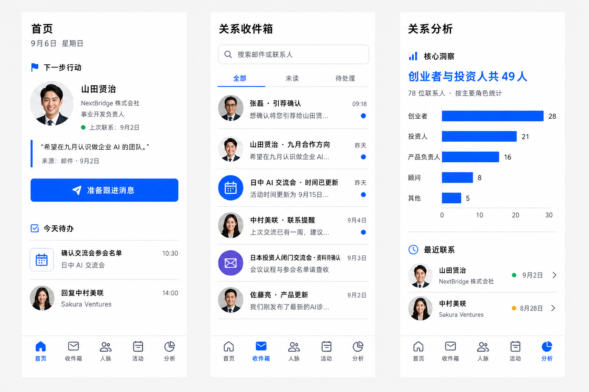
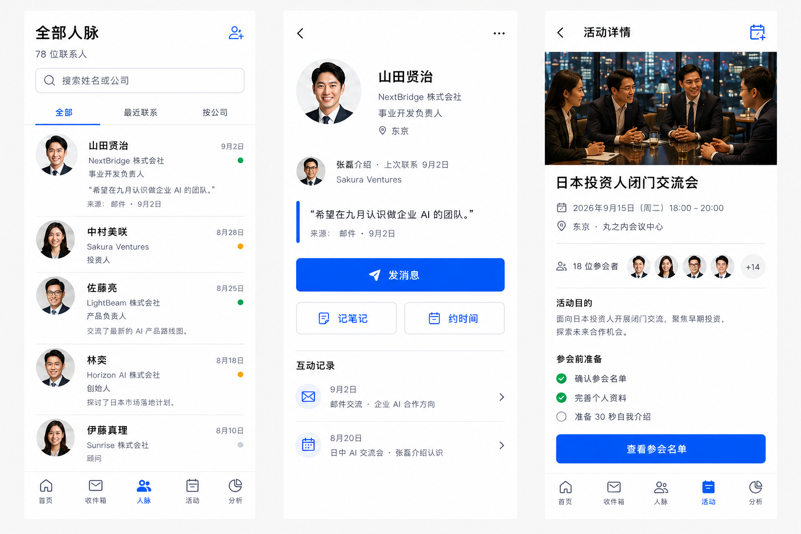
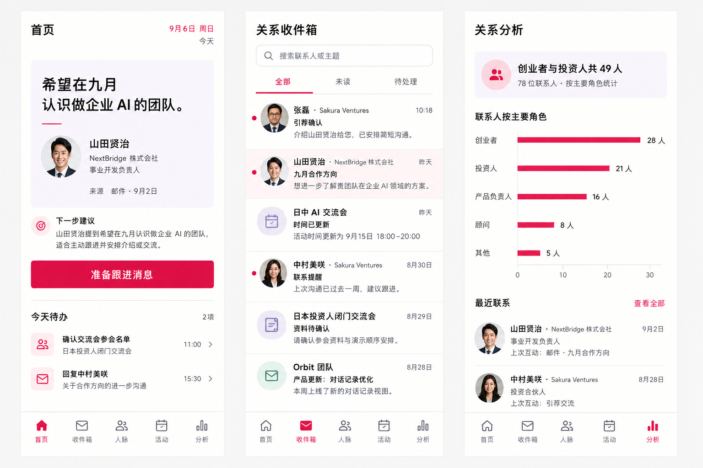
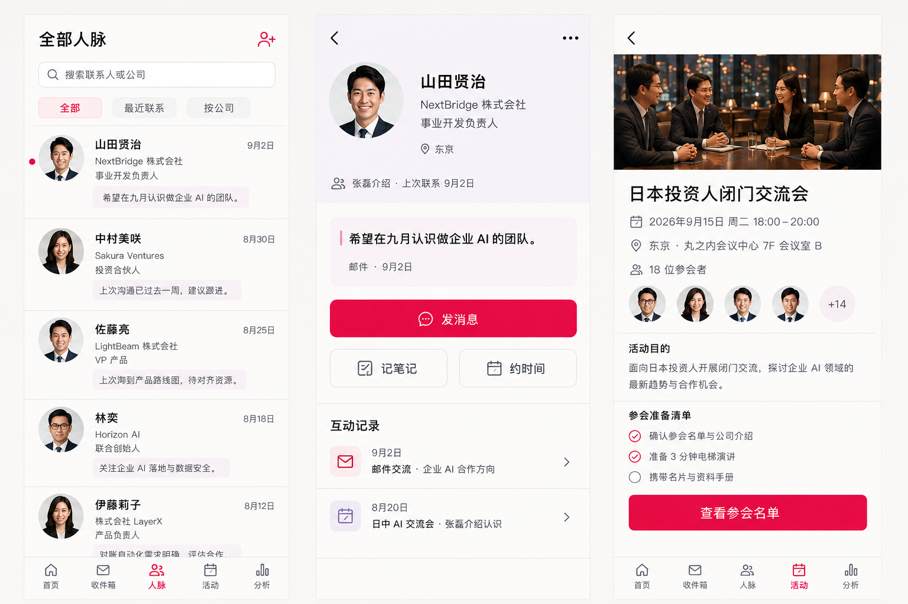
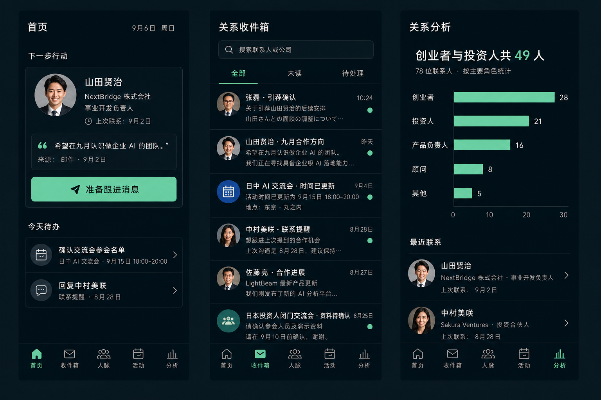
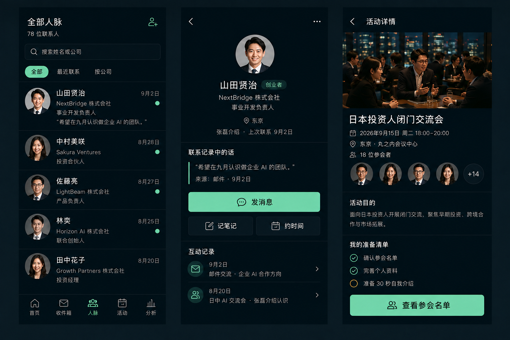

# Orbit · 三套偏好收敛方案

日期：2026-09-06

本轮根据用户对 Eight Hero Action、Conversation Transcript 和 After Hours 的偏好生成。与竞品的外观重叠不作为本轮筛选条件。使用内置 ImageGen，并实际附加上述六张参考图；每套 B 板额外附加同套 A 板以保持视觉一致。

每套六个页面，拆成两张三竖屏展示板：
- A：首页、关系收件箱、关系分析。
- B：全部人脉、联系人详情、活动详情。

这里选择主页面与次级页面混合展示，方便同时评审全局风格、收件箱可读性、柱形图和人物/活动照片。

## 方案对照

| 方案 | 主导偏好 | 组合方式 | A | B |
| --- | --- | --- | --- | --- |
| Blue Brief · 蓝色行动 | Eight Hero | 蓝白主动作 + 带来源的简短引文 + 联系日期 | [主页面](blue-brief-a.png) | [人物与活动](blue-brief-b.png) |
| Open Conversation · 对话线索 | Conversation | 对话内容先于建议 + 覆盆子色主动作 + 浅紫阅读区 | [主页面](open-conversation-a.png) | [人物与活动](open-conversation-b.png) |
| Night Signal · 夜色跟进 | After Hours | 墨色工作界面 + 薄荷色主动作 + 来源明确的联系理由 | [主页面](night-signal-a.png) | [人物与活动](night-signal-b.png) |

## 阅读建议

Blue Brief 最接近用户偏爱的 Eight Hero，主动作醒目、日常操作直接。Open Conversation 更强调记住对方说过什么，列表会相对疏朗。Night Signal 适合比较深色风格与鲜明主动作的组合效果，后续实现时需要单独验证日间阅读对比度。

## 视觉规格与检查

六张正式 PNG 画布均为 1536×1024，每张只有三个完整竖屏。提示词以 390×844 为单页目标；生成图的边距和单页尺寸仍有小幅变化，因此这些是视觉方向稿，不是像素精确的实施图纸。人物与活动照片未做后期非等比缩放。

逐张检查了页面数量、整体竖屏观感、人物与照片几何、主动作层级、五种收件箱信息类型及图表数值。三套图表均标出 28、21、16、8、5，总和 78；创业者与投资人总数为 49。

已知生成稿细节：个别联系日期、头像与身份标签在跨页面之间仍有出入；Open Conversation 联系人列表末行靠近底部导航。确定方向后需要统一示例数据、明确滚动边界，并从组件层校准尺寸和可访问性。此轮没有修改产品代码。

完整生成提示词见 [PROMPTS.md](PROMPTS.md)。B 板在公共提示词后增加“匹配同套 A 板”的配色、字重、图标与人物身份约束；Night Signal B 另指定引用使用简单竖线。

## Blue Brief

## Open Conversation

## Night Signal

