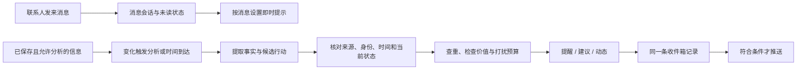

# Orbit 收件箱重设计：联系人消息与三类通知

日期：2026-09-16。状态：用户已指示“按照这个设定”编制新 Sprints；产品方向已批准，尚未实施。

用户目标：通知类型少、容易理解；Orbit AI 能自主从已有信息中发现值得提醒的事情；不同类别有稳定图标。

本稿依据 `/Users/xzhao/Projects/orbit` 的 `chat-agent` 源码与既有 Bridge 记录调研，本文为主仓库中的规格副本，原设计工作树保留历史草稿。历史 QA 数量不作为当前运行数据统计。本次交付是产品、信息来源和行为设计，不代表真实推送或新界面已验收。

## 1. 核心决定与备选

收件箱首先分为 **消息 / 通知** 两个独立入口。消息承载联系人之间的真实通信；通知内部采用三类：**提醒 / 建议 / 动态**，分别表示“有件事到时间了 / AI 发现了值得考虑的事 / 有件事发生了变化”。联系人通信拥有完整会话与回复能力，不埋在动态里。

2026-09-16 用户纠正：初稿把联系人通信并入动态，弱化了核心通信入口。本修订将消息独立，并同步调整图标、未读、推送、设置和验收。笔记、邮件、活动、名片仍是信息来源，不各自增加通知类别；AI 分析消息必须另有分析权限，不影响用户正常接收消息。

| 方案 | 优点 | 代价 | 选择 |
| --- | --- | --- | --- |
| 消息独立，通知分提醒、建议、动态 | 联系人通信直达；通知区分确定事项、AI 判断、实际变化 | 两个入口，需要分别显示未读 | 推荐 |
| 两类：提醒、动态 | 导航最少 | AI 建议混入确定事项，用户容易误认为已经答应过 | 不采用 |
| 按业务分活动、待办、人脉、消息、AI、系统 | 方便开发模块归属 | 同一事件跨多个类别，类型会不断增加 | 不采用 |

本稿修正之前“必须有对象、原因、动作、时间才能通知”的过严建议：**建议可以没有截止时间；提醒必须有可核实的时间依据；动态必须有真实发生的变化。** 对象可以是人，也可以是活动、任务或导入批次。

## 2. 三类通知与图标

图标复用 App 现有 Ionicons：24px 轮廓图标，置于 36px 容器；正文始终显示类别名称，颜色不是唯一识别方式。Web 使用对应图形，保持同一类别含义。下表的颜色是语义方向，实际取既有主题中满足对比度的 token，不新建一套品牌色。

| 类别 | 用户理解 | 固定图标 | 视觉方向 | 典型内容 | 主操作 |
| --- | --- | --- | --- | --- | --- |
| 提醒 | 有件明确的事该处理了 | `time-outline`，时钟 | 暖色强调，非默认红色 | 今天发报价；会面 30 分钟后开始；用户设定的提醒 | 查看待办 / 查看日程 / 稍后提醒 |
| 建议 | Orbit 找到了值得你考虑的下一步 | `sparkles-outline`，星光 | 品牌强调色 | 笔记里有未安排的承诺；某联系人可能适合你的项目；会前有资料可准备 | 查看建议 / 准备草稿 / 加入待办 |
| 动态 | 有件事发生了变化 | `swap-horizontal-outline`，变化箭头 | 中性色 | 约谈请求、改期、取消；识别完成；需要重新连接数据源 | 查看变更 / 确认识别结果 |

消息入口使用 `chatbubble-ellipses-outline` 气泡，消息列表使用联系人头像和真实称呼；通知入口使用 `notifications-outline` 铃铛，内部使用时钟、星光、变化箭头。名片完成与邀请不再各造通知类别。未读点与类别图标分离；风险或紧急状态用文字说明，不再引入新类别。

分类按事件语义确定，不按目标 URL 或是否来自 AI 判断：同一会面，“时间改了”是动态，“即将开始”是提醒，“建议提前了解对方”是建议。

## 3. 信息从哪里来

只读取用户允许 AI 使用、服务端已经确认保存、属于当前账号或明确共享给该账号的信息。手机未保存草稿、等待同步的本地编辑、不可访问的会话、未授权邮箱不在范围内。

| 信息来源 | 能提供什么事实 | AI 可以发现什么 | 不能据此断言什么 |
| --- | --- | --- | --- |
| 笔记、会面纪要 | 原文、关联联系人、记录时间、用户写下的承诺和下一步 | 尚未安排的动作；需要准备的材料；近期需求 | 写下“可以考虑”不等于承诺；笔记创建时间不等于截止时间 |
| Orbit 对话、用户允许分析的消息 | 发言人、原文、时间、对象 | 明确请求；承诺；需要回复的问题 | 没有读取外部沟通，不能断言“你一直没回复” |
| 已保存待办与提醒计划 | 标题、状态、截止时间、用户选择的提醒时间 | 到期；与新信息重复或冲突的事项 | 不凭记录创建时间补造截止时间；已完成任务不催办 |
| 已确认日程、约谈、报名活动 | 参与身份、时间地点、变更版本 | 会前准备；时间冲突；改期影响 | 活动结束不等于用户实际参加过，也不等于已见过所有参会者 |
| 联系人资料、人脉记录、用户目标 | 身份、用户保存的专长/需求、已确认关系、当前目标 | 与目标相关的联系机会、可准备的介绍 | 姓名/公司不能证明能力；久未联系不等于关系变差 |
| 已授权且实际同步的邮件/外部日历 | 同步范围内的邮件和安排，附读取时间 | 介绍线索、时间安排、明确约定 | 接口或契约存在不等于已读取用户邮箱；同步失败不等于没有新消息 |
| 产品后台业务事件 | 约谈变更、导入批次结果、连接失效 | 直接生成具体动态 | 普通保存成功、静默重试、每张名片中间进度不刷收件箱 |

**每条 AI 产物必须保存来源指针**：原始记录 ID、版本、原文片段或结构化字段、发生时间、读取时间，以及相关对象 ID。姓名只用于展示和候选检索，不能替代联系人 ID。两个同名联系人无法消歧时，只在建议详情让用户选择，不生成指向任意一人的提醒。

多来源推断必须显示关键来源。例如“你正在寻找日本渠道合作伙伴”来自用户目标，“陈晨有渠道合作经验”来自已保存的会面笔记，二者一起支持建议；不能只展示一个泛称“AI 分析”。

## 4. 自主发现怎样变成通知

### 4.1 两种发现机制

- 事实变化：保存笔记、收到新消息、修改日程、更新目标或导入完成后，围绕发生变化的记录与相关对象分析。连续编辑去抖；草稿尚未保存不触发。
- 时间到达：通过定时规则检查确认的提醒时间、活动临近和建议的有效窗口。定时器不等于每隔一段时间对全库重新生成通知。

仅发生在已启用的 AI 分析范围内；沿用已授权设置，没有权限的来源不参与。关闭“主动发现”后停止新候选、撤销未投递的自动发现通知，不关闭用户亲自设定的提醒。

### 4.2 事实、解释、行动分开

AI 负责理解原文、连接上下文、提出具体动作；代码负责权限、源记录版本检查、时间解析、查重、限额、安静时段和投递。模型不能靠自报高置信度绕过规则。

- 明确记录：“我答应周五给佐藤发报价。”→ 来源支持“周五发送报价”这一承诺。
- 推断：“佐藤询问过价格，但笔记没有记录后续安排。”→ 只能建议“是否准备一份报价”，不能说用户答应过。
- 缺数据：“Orbit 里没有记录回复。”→ 只说明 Orbit 内的可见范围，不能说用户没在电话或其他软件里回复。

提醒准入：具体事项、有效对象、仍有效的状态、明确时间依据。除用户设定提醒外，AI 从原文识别的承诺必须明确主语/动作/时间，时间可基于原文发生日和账号时区无歧义解析；冲突或含糊则降为建议。用户已开启主动发现时，这类有据的提醒可以自动发出，不要求先逐条批准，也不自动写入一条待办。

建议准入：可定位的来源 + 与用户当前需求的相关性 + 具体建议动作 + 此刻出现的理由。没有截止时间是正常情况。单纯“90 天没联系”、通用寒暄、只有身份没有需求，不足以发通知。时间间隔只能辅助排序，不能单独触发。

动态准入：账号有关的真实变化，用户需要知道或继续处理。显示变更前后或具体结果，不能只写“有更新”。

### 4.3 五个完整例子（均为设计示例）

| 已有信息 | 系统发现 | 最终通知 | 动作 |
| --- | --- | --- | --- |
| 会面笔记：“答应佐藤今天 17:00 前发报价。”尚无完成记录 | 明确承诺、时间可核实 | **提醒：今天 17:00 前给佐藤发送报价**；来源标为“会面笔记中的约定” | 准备草稿 / 已处理；“已处理”只处理本提醒，无关联待办时不制造待办 |
| 笔记：“佐藤想了解产品价格。”无时间约定 | 可能值得提供资料 | **建议：可以给佐藤准备一份报价说明**；正文解释来源 | 准备草稿 / 暂不需要 |
| 用户正在找渠道伙伴；陈晨笔记记录其相关经验 | 目标和已知经验相关 | **建议：陈晨可能适合这次渠道合作**；列出两项来源 | 查看理由 / 准备联系草稿 |
| 对方将已确认会面从 14:00 改为 15:00 | 有真实时间变化 | **动态：与林悦的会面改到 15:00**；正文“原定今天 14:00” | 查看会面 |
| 一个 12 张名片批次产生最终结果 | 有可处理的结果 | **动态：12 张名片识别完成，2 张需要确认** | 查看结果 |

时间显示为日期和必要时区；“今天/周五”随用户当前日期重算，保存的绝对期限不改变。没有时间的建议不展示伪造的截止时间。

## 5. 发送哪些，什么时候打扰

以下为建议默认值，作为本版产品规则待批准，不是当前已上线行为。

| 来源与类别 | 进入收件箱 | 锁屏 Push 默认策略 |
| --- | --- | --- |
| 用户设定的提醒 | 到提醒时间才出现 | 按用户设定，独立于 AI 预算；同事项同时间只投递一次 |
| AI 识别到明确期限的提醒 | 到有效提醒窗口出现 | 可以推送；与建议共同受主动打扰预算限制 |
| 普通建议 | 筛选后出现 | 默认静默 |
| 有可核实时间窗口的建议 | 筛选后出现 | 可以推送，例如“明天见面，今天适合准备”；每日最多 1 次，计入 AI 总预算 |
| 联系人新消息 | 即时进入消息会话，不复制到通知动态 | 独立消息 Push 设置；不受 AI 预算或分析开关限制；当前正在查看对应会话时不再响铃 |
| 约谈请求、已确认会面的重要改期/取消 | 即时更新动态条目 | 开启动态 Push 时可推送；当前正在查看对应对象时不再响铃 |
| 名片识别完成等一般动态 | 批次结束或等待用户处理时出现 | 默认静默 |
| 普通保存/同步成功、后台重试 | 留在原页面状态 | 不生成通知 |

自动识别到明确期限但无提醒时间的承诺：有精确时刻则提前 2 小时提醒；发现时已进入该窗口但尚未到期，则核实后立即提醒；只有日期则当天 09:00（账号时区）提醒。已过期的历史承诺不补发一串到期提醒；有新证据且仍有处理价值时至多形成一条静默建议。用户设置的时间始终优先。

自动日程提醒：已确认参与的会面/活动默认提前 30 分钟；已有相同目的的用户提醒时沿用用户设置。会前准备属于建议，不再额外叠加多个“会前”“待办”“关系”到期通知。

### 5.1 控制打扰的具体规则

- AI 主动 Push 总量每天最多 **2 次**，其中建议最多 **1 次**；按账号本地日、跨设备共用逻辑预算。明确用户设定的提醒和真实他人消息不计入这 2 次。
- 新的 AI 建议每天最多 **3 条进入收件箱**；没有合格内容就不凑数。候选按时间窗口、与当前目标的直接关联、证据新鲜度排序。其余仅供相关 AI 对话按需读取，不制造“还有很多通知”的红点。
- 同一来源事实、同一对象、同一动作共享事项标识。重复分析、改写标题、多个证据描述同件事，不新增行或重复 Push。
- 用户“暂不需要”后，原事项保持关闭。只有新的实质事实变化才能生成新版本；不能每天增加“未联系天数”后再次打扰。
- 普通建议默认 7 天后失效；有实际时间窗口的建议以窗口结束为准。失效的未处理建议退出默认列表且停止 Push，历史保留失效标记；不能重新生成相同建议来重置有效期。到期提醒在期限后停止自动补推，条目可保留为逾期状态，直到源事项完成、取消或用户处理。
- 用户选择“稍后提醒”建立明确的新投递时间；阅读通知不会自动稍后提醒。
- 同一会话的未读消息聚成一行，保留最新摘要和消息数量；60 秒内新消息至多一次提示音。名片按批次聚合。
- 同一个用户操作的同步反馈不再给本人发送动态。例如刚点了保存或完成，不追加“保存成功/完成成功”收件箱条目。
- 22:00–08:00 默认安静；需要延期的 Push 在出队前重新核实。错过事件有效窗口则放弃 Push；已经完成、取消或已处理的事情不能早晨重新推送。用户主动选择夜间提醒时，创建界面明确提示并允许该计划例外；仍遵守设备通知权限及系统勿扰设置。
- 限额达到时，已符合准入的提醒仍可进入收件箱；自动建议仍受每日 3 条限制。不得将被限流候选滚到次日集中补发。

## 6. 收件箱与通知内容

保留现有 Ink 列表方向。收件箱顶层为 **消息 / 通知**，各自显示未读；首次进入默认消息，后续记住该账号最近选中的入口。Push 直接进入对应会话或通知目标。通知页内才提供 **全部 / 提醒 / 建议 / 动态** 筛选，不再保留活动/待办/人脉的平行分类。

### 联系人消息

- 一行一个会话：联系人头像、用户保存的真实称呼、最新原文预览、时间、未读消息数。缺头像用姓名首字，缺真实称呼不展示内部 ID。
- 点击进入会话历史，可阅读和回复。发送中、发送失败、重试显示在消息自身；真实送达/已读状态只在服务端有证据时展示。
- 收到消息立即记录和展示，不等 AI 分析、不经建议价值筛选；关闭 AI 仍可收发消息。会话免打扰只控制提示，不丢消息。
- 消息示例：**佐藤健一**／“报价资料收到了，明天下午方便聊一下吗？”／14:32／2 条未读。原文保持原样，AI 不替联系人改写发言。
- AI 可以在被允许分析时，从这条消息发现安排会面的建议；普通新消息不一律再生成“请回复”建议。只有额外的时间依据或行动价值才进入通知，并引用原消息；不将 AI 建议伪装成联系人发言。
- 当前通信范围以已接通的 Orbit 联系人会话为准。已授权邮件可以作为建议来源并打开原邮件；尚未接通的邮件回复、微信等渠道不能宣传为可直接收发。
- 联系请求/约谈提议进入动态；接受后或存在实际通信时进入对应消息会话。结构化约谈状态可以在会话中引用，但同一业务事件只提示一次。

### 通知内容

列表每行：左侧类别图标；右侧依次是类别与出现时间、明确标题、最多两行“为什么现在告诉你”、来源短标签。点击进入已有对象详情或建议详情。列表不铺开按钮，也不在每行堆所有原文证据。

示例：

> 提醒 · 10 分钟前
>
> **今天 17:00 前给佐藤发送报价**
>
> 你在昨天的会面笔记里记录了这个约定。
>
> 来源：9 月 15 日会面笔记

> 建议 · 刚刚
>
> **陈晨可能适合这次渠道合作**
>
> 你正在寻找日本渠道伙伴；之前的会面笔记记录了他的相关经验。
>
> 来源：合作目标、陈晨的会面笔记

> 动态 · 20 分钟前
>
> **与林悦的会面改到今天 15:00**
>
> 原定 14:00，对方已确认新时间。
>
> 来源：会面安排

建议详情只有四块：发现、依据、建议动作、处理入口。主要按钮至多一个；辅助按钮“暂不需要”，更多菜单提供“减少此类建议”。“准备草稿”只生成草稿；“加入待办”确认内容后写入真实待办；向联系人发送消息仍需用户亲自发送。

通用禁用文案：“复核与某人的下一步”“有一条关系提醒”“请查看更新”“建议保持联系”。通知必须指出具体信息增量。

列表显示当前账号语言；联系人姓名、公司和原文引用保持原样。跨语言来源可以另给摘要，原文可展开，不将翻译伪装成原始发言。

### 6.1 读过、处理过、完成了是三个概念

- 打开通知、通知页全部已读：只改变通知阅读状态，不清空消息未读。消息页的全部已读仅推进会话阅读游标。两者都不得自动接受建议、确认联系人信号、完成待办或回复消息。
- 暂不需要、已处理：关闭这一条建议或提醒；有对应源对象时不擅自改变源对象的完成状态。
- 从原文发现的提醒在用户点“已处理”后保留事项去重记录；即使原文没改，下次扫描也不能再次创建。AI 提取承诺时必须核对作者和发言人，“我会发送”不能被转移成另一个人的承诺。
- 完成待办：只能调用待办自身操作，成功后关闭相关提醒。
- 建议接受后：保留原来源与接受记录，创建/关联真实待办；原建议标为已采纳，不再次作为建议催促。
- 新消息：按真实消息游标维护未读；消息页徽标统计未读消息数，会话行显示自身数量。通知页徽标只统计未读通知条数。收件箱外层仅显示有未读的小圆点，不混合两种计数；历史消息不受通知的 30 天展示窗口影响。

默认未读点用于三类已经实际入箱的条目，不统计候选、投递次数或每台设备回执。历史记录默认展示近 30 天，但未处理且仍有效的提醒保留至处理或失效，不因为 30 天窗口悄悄消失。

### 6.2 到达目的地

- 提醒打开具体待办/日程；从原文发现但未建待办的提醒打开通知详情及来源，不能伪造任务 ID。
- 建议打开具体建议及其证据，可以继续带上下文的 AI 对话。
- 新消息直接打开对应会话；约谈动态打开对应约谈；识别结果打开对应批次。
- 目标已删除：历史记录显示“相关内容已删除”，不进入 404；未投递记录取消。来源失去访问权限时立即隐藏相关摘录并停止动作。

## 7. 设置保持简单

一个“AI 主动发现”开关：控制授权信息范围内的后台发现与自动建议/提醒。开启时说明分析哪些已连接来源并复用已有分析权限；不暗中打开关闭过的消息分析或新增外部授权。

一个独立“联系人消息推送”开关，并支持会话免打扰；一个“通知推送”设置区，只有“提醒 / 建议 / 动态”三个开关。共用安静时段和锁屏详情设置。关闭 AI 主动发现或通知 Push 不关闭联系人消息推送；关闭任意 Push 均不删除应用内内容。建议 Push 开启后仍只推有时间窗口的建议；普通建议始终静默。

系统通知权限未授予时，保留应用内内容并如实显示状态。锁屏默认隐藏敏感正文，用户可以选择显示详情；这是渠道隐私选项，应用内始终提供完整、可访问的依据。

## 8. 与现状的对应关系

| 现有入口或内容 | 新设计去向 |
| --- | --- |
| 用户创建的 task / schedule reminder | 提醒；仍由原待办/日程持有业务真相 |
| `followup_due` 和旧关系提醒 | 有有效事项、明确期限则归提醒，并与既有提醒去重 |
| “复核与 XXX 的下一步”等生成测试记录 | 不满足内容门槛，不迁移成新未读通知；留可审计迁移记录，不以翻译代替补足事实 |
| 旧 `pre_event` 会前简报 | 有准备价值则为建议；具体开始时间提示为提醒，两者共享事项关联 |
| 旧 `post_event` 会后联系 | 有实际会面/参与证据与具体动作才为建议；有明确承诺日期则为提醒 |
| `relationship_stale` 久未联系 | 不单独通知；出现与当前目标相关的新证据时可以支持建议 |
| 邮件介绍、日历会面、交叉关系信号 | 作为证据；形成具体有价值动作时才入建议，原始信号不逐条铺满收件箱 |
| 对话消息 | 独立消息入口，保留会话、原文、回复和阅读游标，不再复制成动态 |
| 约谈提议、反提议、确认、改期、取消 | 动态；同一变化不重复生成提醒 |
| 约谈 T24h/T1h | 迁移时保留用户明确配置；未由用户选择的历史自动多阶段策略由统一开始提醒替代 |
| 约谈结束后记录纪要提示 | 有必要且没有纪要时为建议；时间到了不等于会面已实际完成 |
| 名片识别完成/需复核 | 动态，批次聚合 |
| `IORBIT/proactive/system` 技术标签 | 依据实际含义进入三类，技术标签不向用户展示 |

源码核实的能力：现有收件箱读取提醒、会话和关系信号；信号采集器已有到期待办/近期活动/久未联系规则；通知服务有投递账本、设备身份及读/忽略操作。**通用笔记承诺提取、跨来源机会发现、三类统一契约、集中去重与限额是本稿提出的改造能力，不宣称已经接通。**

之前的类型调研遗漏了预约通知投影中的提议、反提议、确认、取消等业务事件，本稿已补入动态。历史 40 条提醒是既有生成测试数据样本，不能据此断言当前 AI 每次运行都会生成 40 条。

## 9. 最小技术边界

不新建独立通知微服务。在现有 Web/API 通知模块内收口：来源适配 → 候选判断 → 一份账号级收件箱记录 → 投递计划/设备回执。已有待办、日程、对话服务继续负责各自状态。

每条用户可见通知至少有：稳定 ID、账号、三选一类别、具体标题、原因/变化摘要、来源引用及版本、目标/动作、出现时间、有效期、已读/已处理状态、事项去重键。时间额外区分事实发生时间、期限、计划提醒时间和投递时间，不再混用 createdAt。

Web/API 负责决定类别与 Push 资格，两端显示同一记录；App 不通过链接前缀猜类别，不自行重新推断。公开共享契约是唯一契约源，按现有 sync:contract 流程同步 App。

一个提醒的一次投递只选一个执行者：本地系统定时器或服务端 Push。迁移/设备注册时明确交接并取消旧计划，不能让二者都响。跨设备共用通知与已读状态，设备回执独立；已读同步只能尽力避免另一设备尚未发送的提示，不能撤回 OS 已展示的横幅。

模型调用失败时保留候选的可重试状态，不生成通用空话。确定性的用户提醒/真实动态不依赖模型可用性。扫描有分页、游标、批量和重试上限；模型预算不足时保留任务进度，不无限全库循环，也不把未读取的数据当成没有事件。

源记录修改后旧候选失效，重新核对；外部同步不完整或来源冲突时降为静默建议或暂不发送。投递前再核对是否完成、取消、过期、忽略或失去权限；同一事实的内容改写不能让已读变未读。

迁移先只读盘点、生成差异与可恢复映射，再按批准范围启用新流。保持已有阅读状态和用户提醒计划；不删除用户原始任务、笔记或消息。历史无效通知归档，不能通过部署让所有旧数据重新变成未读。

## 10. 术语衔接与设计冲突

沿用根 `CONTEXT.md` 的“待办”“待办建议”“已结束不等于已完成”。“消息”指联系人之间在会话中实际发送的通信内容；“建议”指尚未被用户采纳、由 Orbit 依据可追溯信息提出的具体下一步；“提醒”是关于有效事项的时间提示；“动态”是与用户有关的实际业务变化。用户可见文案不用“复核跟进”。

现有词汇表把“系统通知”限定为已确认提醒计划。本稿建议扩展为一种投递渠道，可提示联系人消息，或展示符合规则的提醒、建议、动态；产品方向已批准；由 Sprint 0038 同步更新词汇表并实现渠道与业务对象的区分。

既有 AI 定位文档要求关键时机主动、频控、免打扰，且对外发送由用户决定，本稿保留这些边界。旧文档统一将 Push 跳回 AI 对话；这里建议优先打开具体事项/建议/会话，AI 对话作为建议详情的延续入口。此导航变更随产品方向进入 Sprint 0037～0040。

## 11. 后续实现验收标准

1. 收件箱有独立消息/通知入口，通知仅有提醒、建议、动态三类；联系人头像和类别图标含义不同，颜色不可见时仍能辨认。
2. 保存包含明确承诺的笔记，服务端可自动发现、展示原文依据、按可信时间提醒；无截止时间的相关笔记产生建议，不伪造时间或已确认待办。
3. 同名联系人、来源权限变化、原文否定、含糊时间、已过期或矛盾记录不能错误推送。
4. 一件事来自笔记、任务和日程时不会出现三条相同提醒；普通改写、轮询和重试不重复发送。
5. 只因长时间没联系，不能批量通知几万名联系人；实际调用和新增建议数量符合有界策略。
6. 全部已读不完成任务/确认建议；跨端处理成功后服务端取消尚未投递的提醒；重复点击接受不创建两个待办。
7. 多设备、安静时段、预算上限、用户夜间提醒例外、过期抑制、本地与服务端投递交接均有行为测试。
8. 同账号 Web 与 iPhone 17 Pro Simulator 验证笔记→发现→来源详情→采纳/忽略→双端回读；Web 改动后重新生产构建、重启并确认健康再验 App。需要真实 OS 推送的验收另提供有效 push 环境，不能用 Simulator 内列表替代投递验收。
9. 截图与真实例子覆盖三类、中文/日文/英文、暗色、大字号、空态、失败、源内容删除和无权限。图标复用现有库，文案无内部代号。
10. 旧 40 条生成提醒不被重放为新未读；每条迁移状态都有证据，原始业务数据保留。
11. 两个真实测试账号在 Web/App 间收发联系人消息、回复及同步阅读游标；关闭 AI 后仍可通信，通知全部已读不清空消息未读，消息原文和历史不受 AI 改写或通知过期影响。消息免打扰、发送失败重试和 Push 直达会话另行验证，收件箱展示不能代替实际消息送达验收。

## 12. 调研依据

以下均是调研时 `chat-agent` 的源码路径；本任务工作树可能处于较早版本，因此后续实现应再次核对目标分支。

- `repos/orbit-app/src/view-models/inbox-feed.ts`：当前按 href 分类、三源聚合及信号 confirmed 与 read 的混用。
- `repos/orbit-app/src/screens/inbox/RelationshipInboxScreen.tsx`：现有四筛选、Push delivery 详情、会话导航。
- `repos/orbits/features/notifications/live-service.ts`：到期时间回退 createdAt、优先级和分组投影。
- `repos/orbits/features/notifications/action-writer.ts`：title/body 重复写入。
- `repos/orbits/features/agent/signals/source-collector.ts`：到期待办、活动和 90 天关系陈旧规则。
- `repos/orbits/features/notifications/DELIVERY.md`：投递账本、设备回执、静默时段、source lifecycle。
- `repos/orbits/features/appointments/notification-projector.ts`：约谈业务事件与既有多阶段提醒。
- `bridge/2026-09-15-data-authority-ai-read-surface.md`：AI 可见数据与服务端权威源边界。
- `bridge/2026-09-15-unified-inbox.md`：历史共同环境验收范围及数据缺口。
- `CONTEXT.md`、`docs/superpowers/specs/2026-07-11-orbit-ai-positioning-boundary-design.md`：既有领域语言与 AI 自主性定位。

## 13. 审阅范围

本版产品方向已由用户“按照这个设定在这里设计新的sprints出来”确认，覆盖三个决定：联系人消息独立，通知采用提醒/建议/动态三类；允许有来源且符合规则的 AI 自主发现直接入箱并有限 Push；采用文中频控默认值与具体目的地导航。执行拆分见 [通知项目计划](../../../repos/orbit-app/docs/sprints/NOTIFICATION_PROGRAM.md)，对应 0037～0040。本稿本身不改变运行服务、数据库、提醒设置或消息发送行为。
