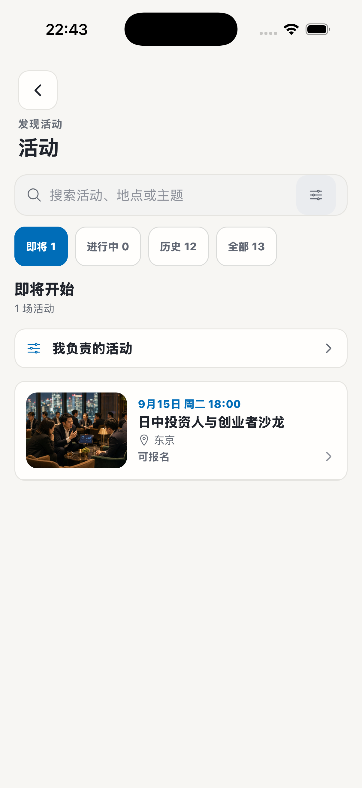
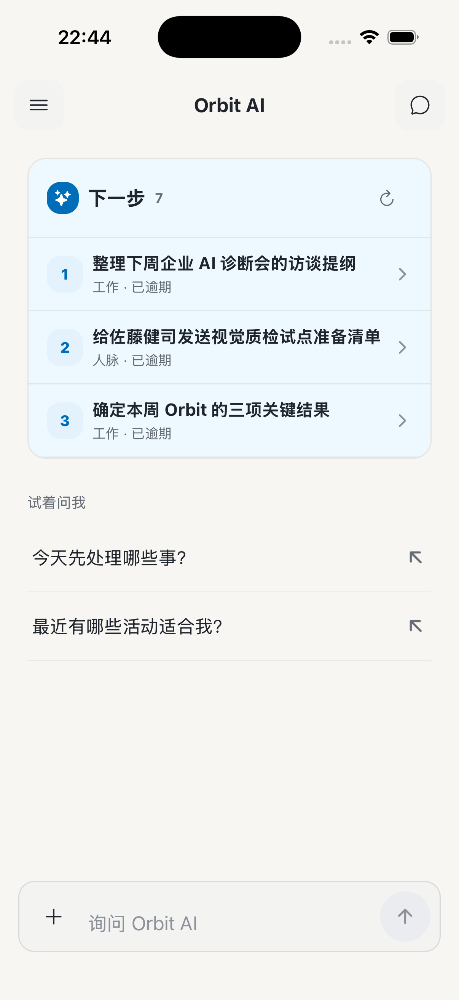
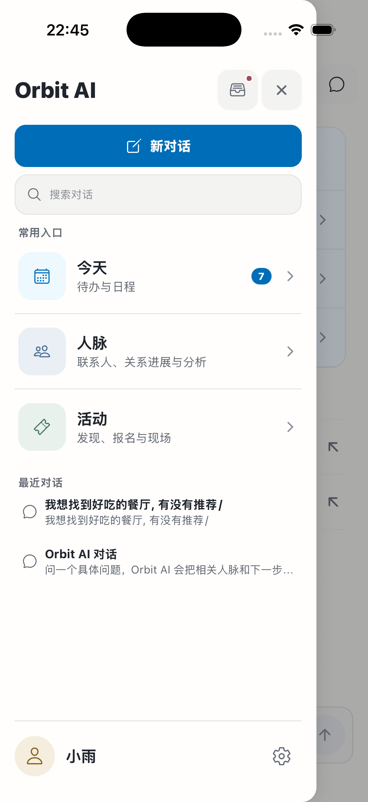
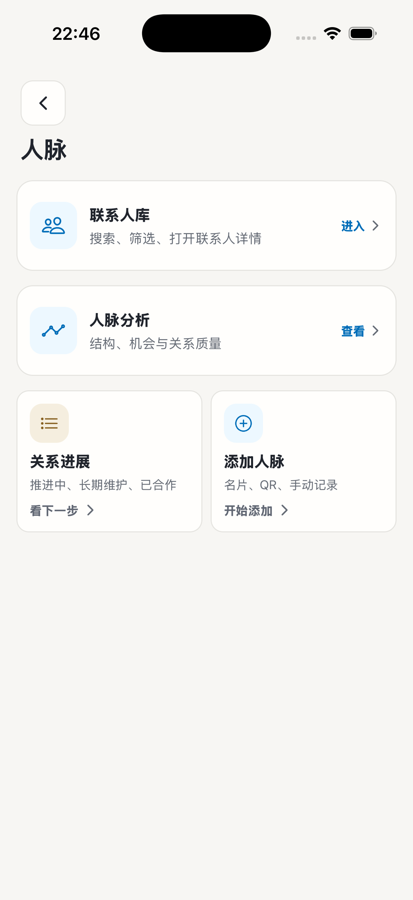
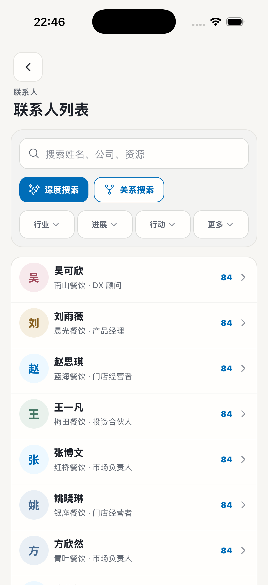
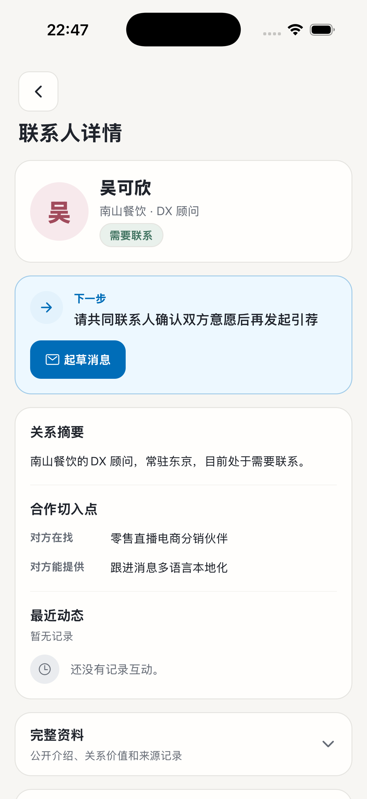
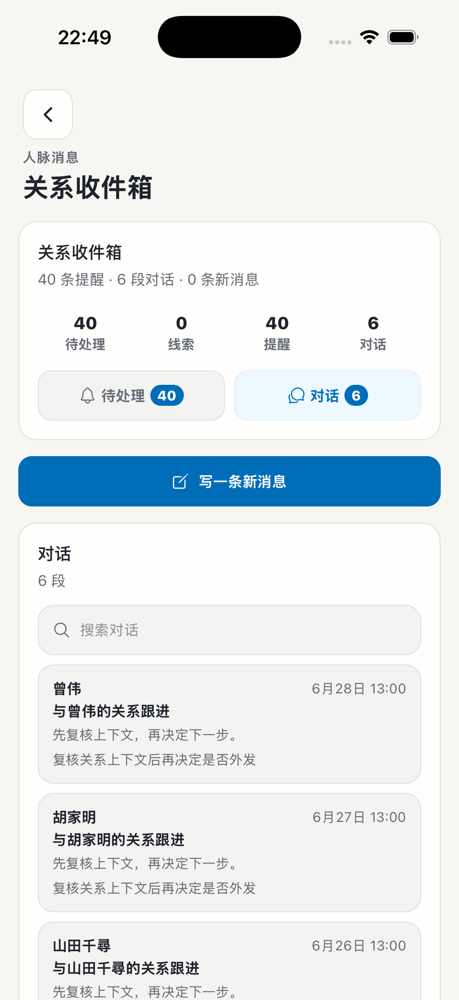
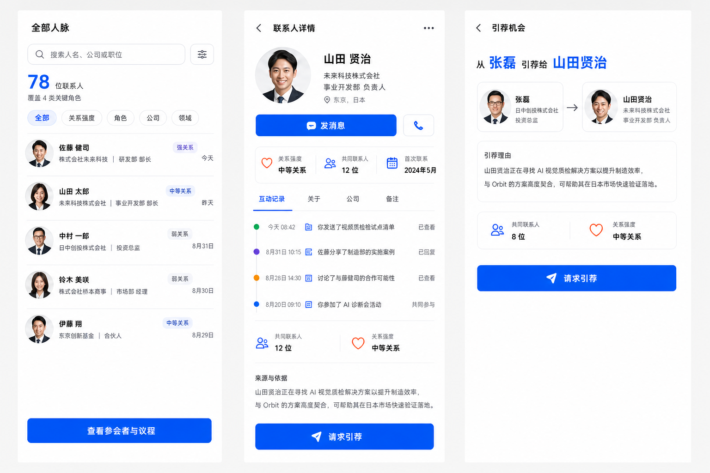

# Orbit｜所选风格与原生实现差距

状态：已完成 [Figma 在线对照板](https://www.figma.com/design/kgaxpbwG82TaIMbtFmKvv6?node-id=1-559)。用户完成登录后，通过已授权的浏览器完成排板；重新打开文件确认内容已保存。

交付范围：1 个 Section，7 张原生实拍、3 张历史参考板和 15 个可编辑文字层。逐组放大核对截图、编号与批注，无溢出或遮挡。详细记录见 [在线交付说明](FIGMA-DELIVERY.md)。

历史附件：[10 页 PDF 对照稿](output/pdf/orbit-design-transfer-review.pdf) 是登录完成前的本地阅读快照，曾逐页渲染检查；其中关于授权受阻的状态已经过时，以本页及在线板为准。它不是 Figma 文件。

证据日期：2026-09-07。iPhone 17 Pro，402×874pt，浅色、默认字号。沿用同次核对中已检查的原生截图，不是改后效果图。仅整理，不改应用代码。

## 板头结论

“保留功能结构”在后续实施中被收窄为“基本保留视觉布局，只调整主题”。主题、圆角和部分统计布局有变化，但没有充分落实已选风格。

三个断点：联系人列表与详情被排除在主要视觉调整范围之外；后续参考稿本身收窄为配色与圆角微调；验收接受了旧字号、字重和层级不变。

## Figma 排板约定（已执行）

- Section 名称：Orbit · 所选风格与原生实现差距 · 2026-09-07。
- 下列 01–07 按顺序横向排成一行。截图展示尺寸 402×874，保持完整安全区与原始比例；相邻截图间距 200px。
- 每张截图下方放对应编号、页面名、总体状态、保留项、差距、建议和检查边界。批注用独立文字层，不涂改原始截图。
- 上方单列板头结论；下方放“补齐顺序与验收”。原参考单独放在“已选风格来源”区域，不混成改后截图。
- 完成时检查 7 张图均可见、编号对应正确、文字无溢出，再提供真实 Figma 链接。上传成功不等于排板完成。

以下坐标为画布坐标；Section 位于 (-100, -100)，其内部坐标相应加 100。

| 编号 | 页面 | 截图左上角 X / Y |
| --- | --- | --- |
| 01 | 活动列表 | 0 / 240 |
| 02 | AI 首页 | 602 / 240 |
| 03 | 抽屉 | 1204 / 240 |
| 04 | 人脉入口 | 1806 / 240 |
| 05 | 联系人列表 | 2408 / 240 |
| 06 | 联系人详情 | 3010 / 240 |
| 07 | 关系收件箱 | 3612 / 240 |

## 01｜活动列表

总体状态：内容可读，顶部与筛选占高偏大。

- 保留：活动图片、时间、筛选、进入活动的路径。
- 差距：返回按钮、眉题、页名纵向堆叠；筛选都像独立按钮。首个活动卡约从 y=423pt 开始。
- 建议：收紧导航与标题占高，降低普通筛选的边框和字重，保留全部操作。
- 边界：不能为了精简视觉而删除入口或改路由；小控件的实际触控范围仍需验证。

## 02｜AI 首页

总体状态：新问题引导与下一步工作区域清楚，应保留。

- 保留：已批准的聊天结构、问题引导、任务入口。
- 差距：大面积浅蓝容器与三行近似强调，主次偏平均。
- 建议：通过文字、间距和容器边界区分主要动作与辅助内容。
- 边界：不恢复旧参考中的关系仪表盘，不新增任务或改变交互。

## 03｜抽屉

总体状态：入口与主操作明确，是已落实的部分。

- 保留：现有三个入口、主操作、顺序及导航。
- 差距：本轮未发现需要重做其结构的证据。
- 建议：只随统一文字、间距和状态规范做必要一致性调整。
- 边界：不因为旧参考含底部导航而替换抽屉；未做完整 VoiceOver 操作测试。

## 04｜人脉入口

总体状态：四个目的地完整，视觉主次不足。

- 保留：四个入口及顺序。
- 差距：联系人库、分析和下方工具使用相近的白底描边、蓝色图标方块。
- 建议：区分主入口与工具入口的字号、边界和留白。
- 边界：不把入口页直接替换成联系人列表，不合并功能。

## 05｜联系人列表

总体状态：人物行已紧凑，但首屏重心落在控制区。

- 保留：搜索、深搜、关系搜索、四项筛选、评分和现有紧凑列表行。
- 差距：首个人物约从 y=384pt 开始；外围控制区套框较重；姓名与右侧分数同时重强调。
- 建议：减少外围套框，让姓名成为主要文字锚点，分数退为次级，统一搜索与筛选形状。
- 边界：“需要联系”等状态在当前无障碍标签里存在，但视觉行未呈现；增加可见字段须单独审定。不能伪造头像、引文或来源时间。搜索动作可见高度约 38pt，需验证触控扩展。

## 06｜联系人详情

总体状态：内容顺序清楚，主操作不够明确。

- 保留：身份 → 下一步 → 关系摘要／合作切入点／最近动态 → 折叠资料。
- 差距：连续描边卡片主导阅读；“起草消息”约 105×42pt，仍是左对齐的小按钮。
- 建议：强化现有主操作，通过背景、细分隔和留白区分资料与操作，不让每段都依赖卡框。
- 边界：当前联系人没有互动记录，不用虚构引文或照片补足参考效果；不擅自移出折叠内容。主动作可见高度 42pt，低于项目 44pt 基线，需验证触控区域。

## 07｜关系收件箱

总体状态：统计已横排，消息主体仍被多层容器挤压。

- 保留：四项统计、两个页签、新消息、搜索及对话职责。
- 差距：标题／汇总、全宽新消息按钮、对话区标题／计数／搜索占高；首条对话约从 y=581pt 开始。外卡片再套内消息卡，姓名与主题层级接近。
- 建议：统计降权、压缩重复容器间距、去掉消息内外双框，区分发件人、主题、正文和时间。
- 边界：不删除统计或页签，不变更分类，不自动发送消息；未验证暗色与大字状态。

## 已选风格来源

以下是历史偏好参考，不是当前应用截图，也不是逐像素复制授权。它们包含的旧导航、不同字段与图表不迁回现有应用。2026-09-07 被否定的新方案不纳入此板。

### Eight Hero Action

提取：明确主操作、紧凑人物行、身份信息层级。

### Conversation Transcript

提取：正文／引文／来源各自清楚、普通列表少框。引文与来源须有真实数据支持。

### After Hours

提取：安静底色、克制边界、语义明确的状态强调；不等于直接把浅色页改成暗色。

## 补齐顺序与验收

1. 先落实联系人列表＋详情，作为一组样本；不再生成新风格。
2. 对照原偏好的明确特征验收，再扩展到收件箱和其他页面。
3. 每页记录：参考特征 → 目标组件 → 改前 → 改后。当前资料只有“改前”，不能填成已实施。
4. 同时确认功能结构未变、风格特征在真实数据上出现；覆盖长姓名、无头像、空态。
5. 本轮没有暗色、大字和完整无障碍验收；截图检查不能替代这些测试。

## 资料说明

- `screenshots/`：本次 7 张未加工原生截图，按编号排列。
- `references/`：此前已选方向的 3 张原始参考板。
- `output/pdf/`：可直接阅读的 10 页 PDF；7 张实拍同时出现在总览和各自的逐页核对页，另有 3 张历史参考，共 17 次图片放置。
- 详细源码与实施记录见资料包外同目录上一级 `README.md`；本文件独立携带结论、批注和图片，不依赖临时截图目录。
- 尚待完成：Figma 创建／摆放／可视检查和在线链接交付。
