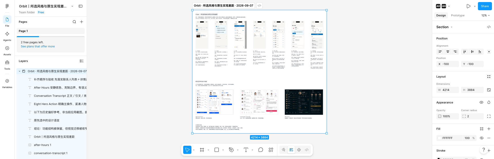

# Figma 对照板交付记录

2026-09-07：[打开在线对照板](https://www.figma.com/design/kgaxpbwG82TaIMbtFmKvv6?node-id=1-559)。

- 文件：Orbit｜所选风格与原生实现差距｜2026-09-07。
- 页面：Page 1；Section：Orbit · 所选风格与原生实现差距 · 2026-09-07，节点 1:559。
- 内容：7 张原生实拍、3 张历史参考板、15 个可编辑文字层，共 25 个内容节点。
- 原生实拍保持完整比例，展示为 402×874，横向间隔 200；批注为独立文字层，未涂改截图。
- 已逐组放大检查 01–03、04–05、06–07 与参考区；编号对应正确，文字没有溢出或遮挡。
- 已在新标签页重新打开同一文件，确认 Section 及全部 25 个内容节点仍在，完成保存验证。
- 本次只整理差距核对，不是改后设计或应用实施。未更改业务数据、应用代码、共享权限或付费设置。

建议先阅读 05 联系人列表、06 联系人详情，再看 07 收件箱。完整保留项、差距、建议与边界见在线批注及 [BOARD.md](BOARD.md)。

历史 PDF 生成于用户完成登录前，其中授权受阻的状态已过时；保留供离线查看审查内容，不作为当前交付状态。以本记录和在线文件为准。
