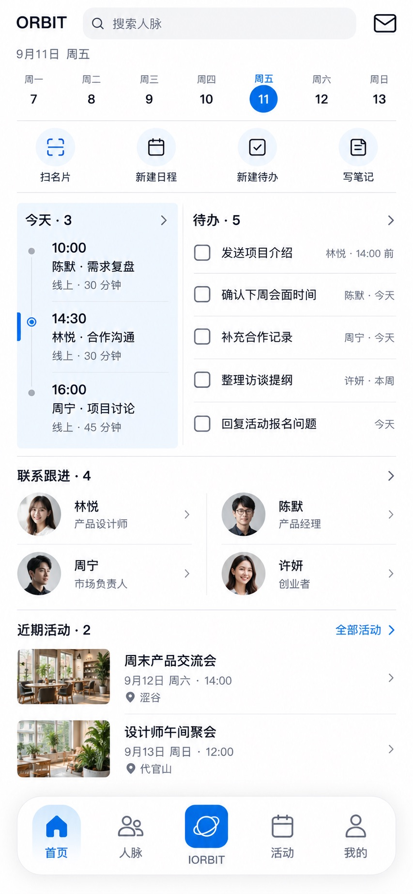

# P01 · 首页

[返回页面目录](../PAGE_CATALOG.md) · [独立设计图](../screens/01-home-approved.jpg)

## 定位

路由／状态：`/home`。实现标记：已确认首页。本页图是静态设计参考，不是运行中 App 的截图。

页面目标：首页默认入口与四个快捷动作、今天日程／待办、联系跟进、近期活动。

## 入口与返回

从默认启动入口进入；底栏返回同一首页。

## 信息与动作

主要信息：周条、四个快捷动作、今天左右分栏、联系跟进、近期活动。

操作及去向：搜索到 P71；扫描到 P11/P12；日程到 P28；待办到 P26；笔记后期到 P48；收件箱到 P35。

## 业务边界

首页图已批准且原样复制。当前 /home 仍重定向到 /ai，调整默认路由属于后续实施。

## 布局要求

保留根页悬浮长岛底栏；正文滚动区域预留底栏高度和安全区，不遮挡最后一行。 采用浅蓝章节、左侧细蓝线、对齐字段与轻分隔线。字号、触控、行高和安全区以 [UI 规格](../UI_DESIGN_SPEC.md) 为准，不从 JPEG 像素直接换算。

## 状态与验收

在主状态之外补齐适用的加载、空内容、搜索无结果、请求失败、无权限／过期状态。表单还需键盘遮挡、验证失败、保存中、保存失败保留输入与未保存退出提示；不适用的状态应标明，不强行增加功能。

至少核对：返回到原来源；动作对象不串号；失败不显示成功；长文本和系统大字号不截断关键内容。详细场景见 [状态与验收](../STATES_AND_ACCEPTANCE.md)，业务流程见 [功能规格](../FUNCTIONAL_SPEC.md)。

## 图像校订

图片决定视觉方向，字段权限、数据状态、按钮可用性以文字规格与真实契约为准。头像、事件和数值均为虚构样例；生成图中的额外文案或装饰不自动成为需求。

## 画面细化参考

以下是本页首轮图像的具体画面说明，便于复现视觉意图；它不是 API 规范。如与上方业务说明冲突，以中文业务说明为准。原始生成与校订记录保留在未压缩完整版；本上传版保留逐页画面说明。

使用用户已批准的首页 V3 02-split-day 原图，不重新生成。
