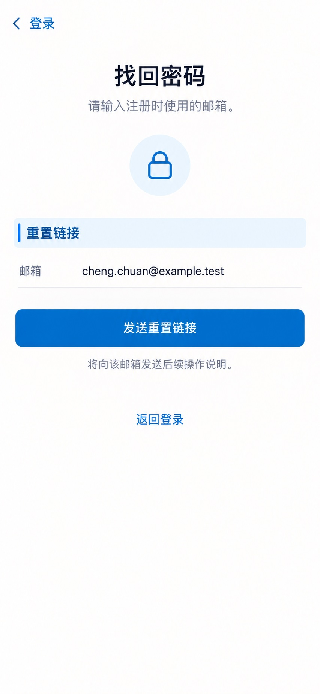

# P04 · 找回密码

[返回页面目录](../PAGE_CATALOG.md) · [独立设计图](../screens/04-forgot-password.jpg)

## 定位

路由／状态：`/account/forgot-password`。实现标记：现有。本页图是静态设计参考，不是运行中 App 的截图。

页面目标：填写邮箱并申请重置链接，不泄露账号是否存在。

## 入口与返回

从登录进入。

## 信息与动作

主要信息：邮箱和重置链接说明。

操作及去向：发送重置链接后展示中性结果；返回登录。

## 业务边界

不能从反馈泄露邮箱是否注册；发送失败保留输入。

## 布局要求

这是二级／表单／独立工作页，不显示全局底部导航；使用标准返回入口，保留来源上下文。 采用浅蓝章节、左侧细蓝线、对齐字段与轻分隔线。字号、触控、行高和安全区以 [UI 规格](../UI_DESIGN_SPEC.md) 为准，不从 JPEG 像素直接换算。

## 状态与验收

在主状态之外补齐适用的加载、空内容、搜索无结果、请求失败、无权限／过期状态。表单还需键盘遮挡、验证失败、保存中、保存失败保留输入与未保存退出提示；不适用的状态应标明，不强行增加功能。

至少核对：返回到原来源；动作对象不串号；失败不显示成功；长文本和系统大字号不截断关键内容。详细场景见 [状态与验收](../STATES_AND_ACCEPTANCE.md)，业务流程见 [功能规格](../FUNCTIONAL_SPEC.md)。

## 图像校订

图片决定视觉方向，字段权限、数据状态、按钮可用性以文字规格与真实契约为准。头像、事件和数值均为虚构样例；生成图中的额外文案或装饰不自动成为需求。

## 画面细化参考

以下是本页首轮图像的具体画面说明，便于复现视觉意图；它不是 API 规范。如与上方业务说明冲突，以中文业务说明为准。原始生成与校订记录保留在未压缩完整版；本上传版保留逐页画面说明。

Authentication secondary 找回密码, back 登录, no dock. Small lock/key outline icon (not decorative hero), concise 请输入注册时使用的邮箱。 Pale-blue chapter 重置链接, email field 邮箱 cheng.chuan@example.test. Primary 发送重置链接, muted 将向该邮箱发送后续操作说明。 Quiet 返回登录. This is before send, no 已发送 or success state. No reveal whether account exists; no extra sms flow, policy, supportphone. Large calm lowerwhitespace allowed.
