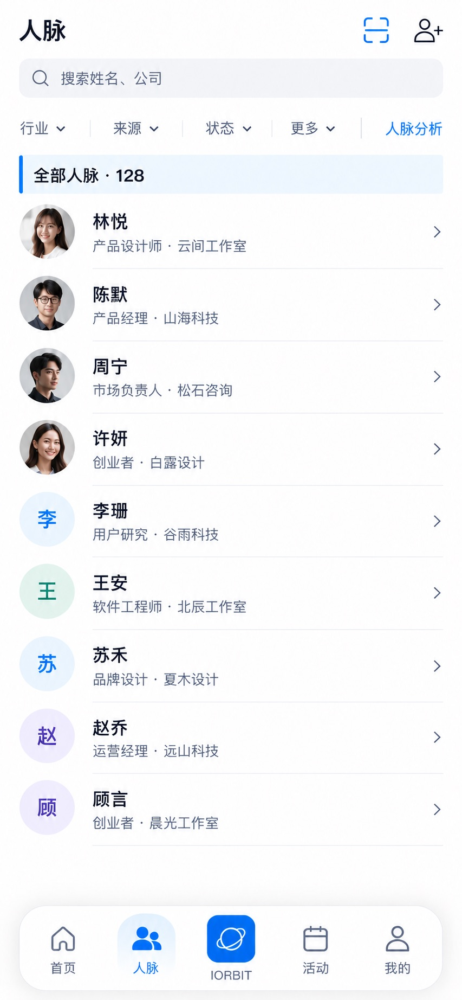

# P07 · 人脉列表

[返回页面目录](../PAGE_CATALOG.md) · [独立设计图](../screens/07-contacts.jpg)

## 定位

路由／状态：`/contacts`。实现标记：现有 · 根页新布局。本页图是静态设计参考，不是运行中 App 的截图。

页面目标：搜索、筛选、扫描、添加、分析入口与紧凑列表。

## 入口与返回

底栏人脉根页；保留筛选与滚动位置。

## 信息与动作

主要信息：搜索、来源/行业/状态筛选、扫描、添加、分析入口、紧凑列表。

操作及去向：行到 P08；添加到 P10；分析到 P15。

## 业务边界

根页显示长岛底栏。列表可继续滚动，不要求把 128 人塞入首屏。

## 布局要求

保留根页悬浮长岛底栏；正文滚动区域预留底栏高度和安全区，不遮挡最后一行。 采用浅蓝章节、左侧细蓝线、对齐字段与轻分隔线。字号、触控、行高和安全区以 [UI 规格](../UI_DESIGN_SPEC.md) 为准，不从 JPEG 像素直接换算。

## 状态与验收

在主状态之外补齐适用的加载、空内容、搜索无结果、请求失败、无权限／过期状态。表单还需键盘遮挡、验证失败、保存中、保存失败保留输入与未保存退出提示；不适用的状态应标明，不强行增加功能。

至少核对：返回到原来源；动作对象不串号；失败不显示成功；长文本和系统大字号不截断关键内容。详细场景见 [状态与验收](../STATES_AND_ACCEPTANCE.md)，业务流程见 [功能规格](../FUNCTIONAL_SPEC.md)。

## 图像校订

图片决定视觉方向，字段权限、数据状态、按钮可用性以文字规格与真实契约为准。头像、事件和数值均为虚构样例；生成图中的额外文案或装饰不自动成为需求。

## 画面细化参考

以下是本页首轮图像的具体画面说明，便于复现视觉意图；它不是 API 规范。如与上方业务说明冲突，以中文业务说明为准。原始生成与校订记录保留在未压缩完整版；本上传版保留逐页画面说明。

Root page 人脉 with floating capsule nav, 人脉 active. Compact header 人脉, scan icon and add-person icon right. Search 搜索姓名、公司. Quiet single text link 人脉分析, no standalone AI generation buttons. One row filters 行业 / 来源 / 状态 / 更多. Pale-blue chapter strip 全部人脉 · 128 with thin blue left tick. TEN compact rows avatars name plus role/company: 林悦 产品设计师·云间工作室; 陈默 产品经理·山海科技; 周宁 市场负责人·松石咨询; 许妍 创业者·白露设计; 李珊 用户研究·谷雨科技; 王安 软件工程师·北辰工作室; 苏禾 品牌设计·夏木设计; 赵乔 运营经理·远山科技; 顾言 创业者·晨光工作室; 宋岚 产品顾问·栖云咨询. First four realistic headshots others initials; chevrons right. One unified white list with thin separators, no ten cards. Clear root dock follows attached approved home shape exactly, all five labels visible, inset rounded white capsule floating above bottom.
