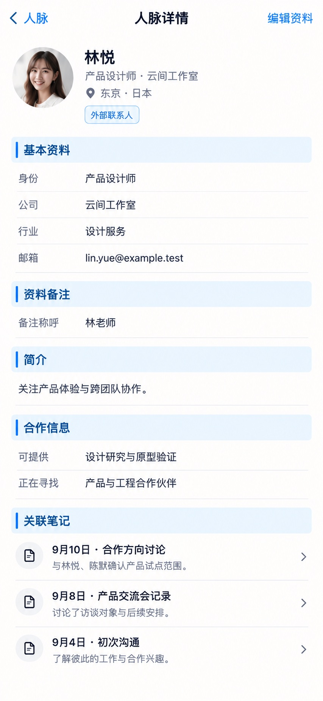

# P08 · 人脉详情

[返回页面目录](../PAGE_CATALOG.md) · [独立设计图](../screens/08-contact-detail.jpg)

## 定位

路由／状态：`/contacts/[id]`。实现标记：现有＋D7后期目标。本页图是静态设计参考，不是运行中 App 的截图。

页面目标：身份与资料、资料备注、合作信息、关联笔记只读回看。

## 入口与返回

人脉列表、搜索、日程引用等进入；返回原来源。

## 信息与动作

主要信息：身份、基本资料、资料备注、简介、合作信息、关联笔记。

操作及去向：编辑到 P09；关联笔记到 P49；不在详情输入互动纪要。

## 业务边界

关联笔记是后期目标。外部联系人不因姓名相同就获得站内聊天入口。

## 布局要求

这是二级／表单／独立工作页，不显示全局底部导航；使用标准返回入口，保留来源上下文。 采用浅蓝章节、左侧细蓝线、对齐字段与轻分隔线。字号、触控、行高和安全区以 [UI 规格](../UI_DESIGN_SPEC.md) 为准，不从 JPEG 像素直接换算。

## 状态与验收

在主状态之外补齐适用的加载、空内容、搜索无结果、请求失败、无权限／过期状态。表单还需键盘遮挡、验证失败、保存中、保存失败保留输入与未保存退出提示；不适用的状态应标明，不强行增加功能。

至少核对：返回到原来源；动作对象不串号；失败不显示成功；长文本和系统大字号不截断关键内容。详细场景见 [状态与验收](../STATES_AND_ACCEPTANCE.md)，业务流程见 [功能规格](../FUNCTIONAL_SPEC.md)。

## 图像校订

图片决定视觉方向，字段权限、数据状态、按钮可用性以文字规格与真实契约为准。头像、事件和数值均为虚构样例；生成图中的额外文案或装饰不自动成为需求。

## 画面细化参考

以下是本页首轮图像的具体画面说明，便于复现视觉意图；它不是 API 规范。如与上方业务说明冲突，以中文业务说明为准。原始生成与校订记录保留在未压缩完整版；本上传版保留逐页画面说明。

Page: 人脉详情, secondary page, NO bottom navigation. Back chevron label 人脉 on left, centered compact title 人脉详情, right blue 编辑资料. Top compact identity block female headshot for 林悦, 产品设计师 · 云间工作室, location 东京·日本. Compact outlined status 外部联系人, no verified account/chat button (identity cannot be guessed). Five light-blue section strips with thin blue left tick: 基本资料, 资料备注, 简介, 合作信息, 关联笔记. Basic label/value rows 身份 产品设计师 / 公司 云间工作室 / 行业 设计服务 / 邮箱 lin.yue@example.test. Profile note body 备注称呼：林老师. Intro 关注产品体验与跨团队协作。 Collaboration rows 可提供 设计研究与原型验证 / 正在寻找 产品与工程合作伙伴. Linked notes are read-only rows 9月10日 · 合作方向讨论 (与林悦、陈默确认产品试点范围。), 9月8日 · 产品交流会记录, 9月4日 · 初次沟通. Use small document icons and chevrons, do not add note writing, note input, 保存备注, conversation memo editor, separate 问 AI CTA or chat bubble. This screen is the approved future notes relationship direction, but merely visual not backend status. Room at bottom, not cramped. Clearly express hybrid of reference 2 blue chapters and reference 3 aligned fields.
