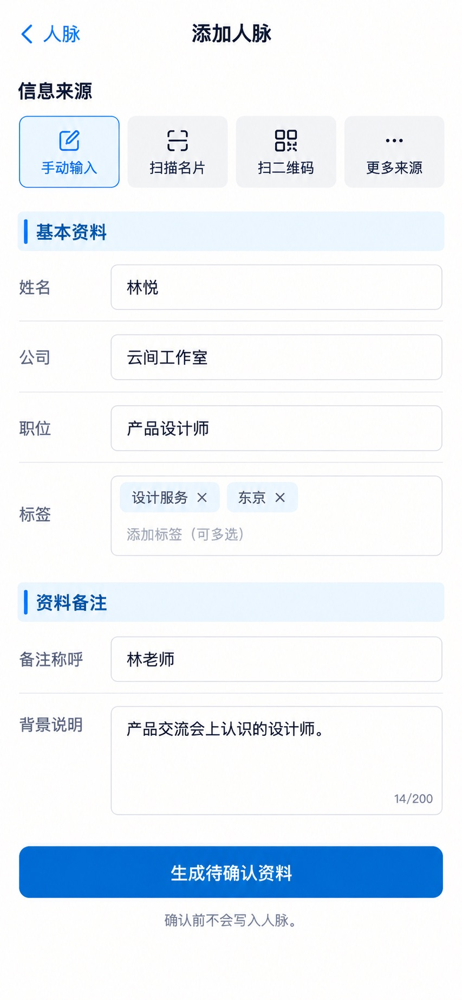

# P10 · 添加人脉

[返回页面目录](../PAGE_CATALOG.md) · [独立设计图](../screens/10-add-contact.jpg)

## 定位

路由／状态：`/contacts/new`。实现标记：现有＋资料备注分工目标。本页图是静态设计参考，不是运行中 App 的截图。

页面目标：保留多种来源；生成待确认资料后由用户确认。

## 入口与返回

从人脉根页添加进入。

## 信息与动作

主要信息：手动、名片、二维码和其他已有来源；基本资料与识别用备注。

操作及去向：生成待确认资料后人工复核；不得跳过确认自动写入。

## 业务边界

保留非名片来源，不凭新图删除既有入口。

## 布局要求

这是二级／表单／独立工作页，不显示全局底部导航；使用标准返回入口，保留来源上下文。 采用浅蓝章节、左侧细蓝线、对齐字段与轻分隔线。字号、触控、行高和安全区以 [UI 规格](../UI_DESIGN_SPEC.md) 为准，不从 JPEG 像素直接换算。

## 状态与验收

在主状态之外补齐适用的加载、空内容、搜索无结果、请求失败、无权限／过期状态。表单还需键盘遮挡、验证失败、保存中、保存失败保留输入与未保存退出提示；不适用的状态应标明，不强行增加功能。

至少核对：返回到原来源；动作对象不串号；失败不显示成功；长文本和系统大字号不截断关键内容。详细场景见 [状态与验收](../STATES_AND_ACCEPTANCE.md)，业务流程见 [功能规格](../FUNCTIONAL_SPEC.md)。

## 图像校订

不沿用图中生成的 14/200 等计数器。背景说明只用于识别，不恢复互动日志输入。

## 画面细化参考

以下是本页首轮图像的具体画面说明，便于复现视觉意图；它不是 API 规范。如与上方业务说明冲突，以中文业务说明为准。原始生成与校订记录保留在未压缩完整版；本上传版保留逐页画面说明。

Secondary 添加人脉, back 人脉, no dock. Source choices 手动输入 / 扫描名片 / 扫二维码, 手动输入 active; quiet 更多来源. Pale-blue chapter 基本资料, fields 姓名 林悦 / 公司 云间工作室 / 职位 产品设计师 / 标签 设计服务、东京. Pale-blue 资料备注, field 备注称呼 林老师 and small background description 产品交流会上认识的设计师。 Primary 生成待确认资料. Small note 确认前不会写入人脉。 No automaticcreate or steppercent, no interactionjournal/meetingminute input; no new AIauto-run onmount. Preserve calm aligned form. Source includes more modes offscreen, not removed.
