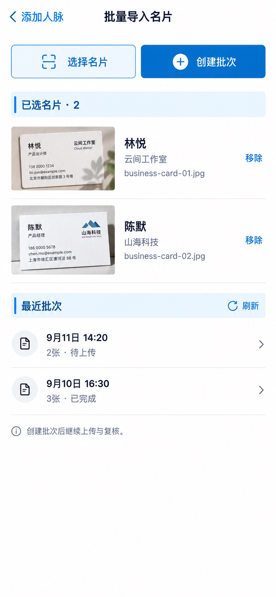

# P11 · 批量导入名片

[返回页面目录](../PAGE_CATALOG.md) · [独立设计图](../screens/11-card-import-start.jpg)

## 定位

路由／状态：`/contacts/new/batch2`。实现标记：现有。本页图是静态设计参考，不是运行中 App 的截图。

页面目标：选择文件、创建批次、查看最近批次。

## 入口与返回

添加人脉中的批量名片入口。

## 信息与动作

主要信息：选择文件、已选图片、移除、创建批次、最近批次。

操作及去向：创建批次后进入该批次上传与复核。

## 业务边界

图片数不是人脉数；本页示例是两个人各一张卡。

## 布局要求

这是二级／表单／独立工作页，不显示全局底部导航；使用标准返回入口，保留来源上下文。 采用浅蓝章节、左侧细蓝线、对齐字段与轻分隔线。字号、触控、行高和安全区以 [UI 规格](../UI_DESIGN_SPEC.md) 为准，不从 JPEG 像素直接换算。

## 状态与验收

在主状态之外补齐适用的加载、空内容、搜索无结果、请求失败、无权限／过期状态。表单还需键盘遮挡、验证失败、保存中、保存失败保留输入与未保存退出提示；不适用的状态应标明，不强行增加功能。

至少核对：返回到原来源；动作对象不串号；失败不显示成功；长文本和系统大字号不截断关键内容。详细场景见 [状态与验收](../STATES_AND_ACCEPTANCE.md)，业务流程见 [功能规格](../FUNCTIONAL_SPEC.md)。

## 图像校订

名片缩略图上的号码、地址、英文域名都是生成道具；不要复制为示例数据或识别结果。

## 画面细化参考

以下是本页首轮图像的具体画面说明，便于复现视觉意图；它不是 API 规范。如与上方业务说明冲突，以中文业务说明为准。原始生成与校订记录保留在未压缩完整版；本上传版保留逐页画面说明。

Secondary 批量导入名片, back 添加人脉, NO dock. Top two actions 选择名片 and primary 创建批次. Chapter 已选名片 · 2, show two realistic fictional business-card small photo thumbnails on white surface: 林悦 云间工作室 and 陈默 山海科技, each has filename business-card-01.jpg/business-card-02.jpg and 移除 text. These are two separate people, NOT two sides of samecard. Chapter 最近批次 with quiet 刷新. Two rows 9月11日 14:20 · 2张 · 待上传 and 9月10日 16:30 · 3张 · 已完成, chevrons. No auto-created batch state, no scanpercent, no duplicates claim. Clear footer note 创建批次后继续上传与复核。
