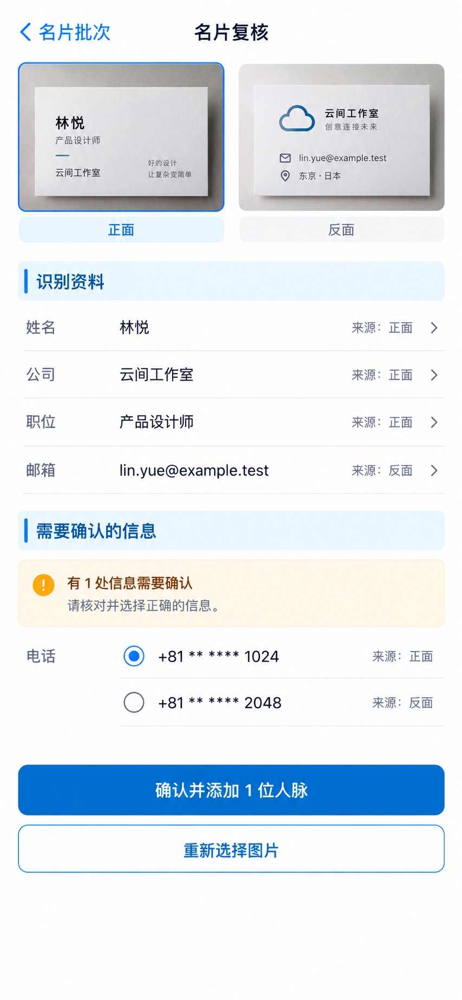

# P12 · 名片复核

[返回页面目录](../PAGE_CATALOG.md) · [独立设计图](../screens/12-card-review.jpg)

## 定位

路由／状态：`/contacts/new/batch2/[id]`。实现标记：现有＋B5双面目标。本页图是静态设计参考，不是运行中 App 的截图。

页面目标：名片批次的字段复核；两面同卡目标需契约支持。

## 入口与返回

从具体 batch2 批次进入。

## 信息与动作

主要信息：正反面预览、识别字段、来源、冲突候选。

操作及去向：逐字段复核；明确确认后添加一位人脉；可替换图片。

## 业务边界

双面同卡属于 B5 增强，不能将一张卡两面创建成两人。

## 布局要求

这是二级／表单／独立工作页，不显示全局底部导航；使用标准返回入口，保留来源上下文。 采用浅蓝章节、左侧细蓝线、对齐字段与轻分隔线。字号、触控、行高和安全区以 [UI 规格](../UI_DESIGN_SPEC.md) 为准，不从 JPEG 像素直接换算。

## 状态与验收

在主状态之外补齐适用的加载、空内容、搜索无结果、请求失败、无权限／过期状态。表单还需键盘遮挡、验证失败、保存中、保存失败保留输入与未保存退出提示；不适用的状态应标明，不强行增加功能。

至少核对：返回到原来源；动作对象不串号；失败不显示成功；长文本和系统大字号不截断关键内容。详细场景见 [状态与验收](../STATES_AND_ACCEPTANCE.md)，业务流程见 [功能规格](../FUNCTIONAL_SPEC.md)。

## 图像校订

图片决定视觉方向，字段权限、数据状态、按钮可用性以文字规格与真实契约为准。头像、事件和数值均为虚构样例；生成图中的额外文案或装饰不自动成为需求。

## 画面细化参考

以下是本页首轮图像的具体画面说明，便于复现视觉意图；它不是 API 规范。如与上方业务说明冲突，以中文业务说明为准。原始生成与校订记录保留在未压缩完整版；本上传版保留逐页画面说明。

Secondary 名片复核, back 名片批次, NO dock. One person's two-sided card future-design state: compact side-by-side actual photo thumbnails tabs 正面 / 反面 for 林悦 云间工作室 with fake email lin.yue@example.test. Blue chapter 识别资料. Aligned editable rows 姓名 林悦 source 正面; 公司 云间工作室 source 正面; 职位 产品设计师 source 正面; 邮箱 lin.yue@example.test source 反面. Small amber row 有1处信息需要确认, field 电话 with two candidate fictional masked options +81 ** **** 1024 and +81 ** **** 2048, radio selection first, source per candidate. No real phone numbers. Primary 确认并添加1位人脉, secondary 重新选择图片. Must not say bothcards create2people. No fakeconfidencepercentage or wordcounts. This is a later B5 two-sided enhancement visual grounded in current batch2 review.
