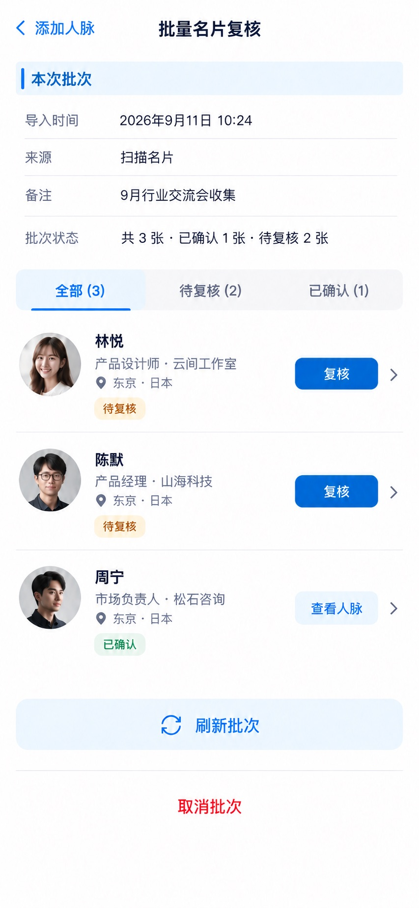

# P13 · 批量名片复核

[返回页面目录](../PAGE_CATALOG.md) · [独立设计图](../screens/13-card-batch-legacy.jpg)

## 定位

路由／状态：`/contacts/new/batch/[id]`。实现标记：现有 · 兼容链路。本页图是静态设计参考，不是运行中 App 的截图。

页面目标：旧批次复核和确认记录，不替换为另一协议。

## 入口与返回

旧批次路径继续可访问。

## 信息与动作

主要信息：批次状态、全部/待复核/已确认、每张卡的复核入口。

操作及去向：复核到对应记录；取消批次须确认且由服务端状态允许。

## 业务边界

兼容链路与 batch2 不同，不能只更换 URL 当成迁移完成。

## 布局要求

这是二级／表单／独立工作页，不显示全局底部导航；使用标准返回入口，保留来源上下文。 采用浅蓝章节、左侧细蓝线、对齐字段与轻分隔线。字号、触控、行高和安全区以 [UI 规格](../UI_DESIGN_SPEC.md) 为准，不从 JPEG 像素直接换算。

## 状态与验收

在主状态之外补齐适用的加载、空内容、搜索无结果、请求失败、无权限／过期状态。表单还需键盘遮挡、验证失败、保存中、保存失败保留输入与未保存退出提示；不适用的状态应标明，不强行增加功能。

至少核对：返回到原来源；动作对象不串号；失败不显示成功；长文本和系统大字号不截断关键内容。详细场景见 [状态与验收](../STATES_AND_ACCEPTANCE.md)，业务流程见 [功能规格](../FUNCTIONAL_SPEC.md)。

## 图像校订

图片决定视觉方向，字段权限、数据状态、按钮可用性以文字规格与真实契约为准。头像、事件和数值均为虚构样例；生成图中的额外文案或装饰不自动成为需求。

## 画面细化参考

以下是本页首轮图像的具体画面说明，便于复现视觉意图；它不是 API 规范。如与上方业务说明冲突，以中文业务说明为准。原始生成与校订记录保留在未压缩完整版；本上传版保留逐页画面说明。

Secondary 批量名片复核, back 添加人脉, no dock. Existing olderbatch compatibilityview. Chapter 本次批次, status 共3张 · 已确认1张 · 待复核2张 (consistent). Small tabs 全部 / 待复核 / 已确认, 待复核 selected. Two preview rows fictional businesscards 林悦 云间工作室 待复核 with button 复核; 陈默 山海科技 待复核 with button 复核. Third quiet row 周宁 松石咨询 已确认 查看人脉. Toolbar quiet 刷新批次, bottom redtext 取消批次 only ifallowedstate (this example stillreviewing). No magical automaticwrite, no novelwizard, no generatedall-complete icon; no raw batchIDs.
