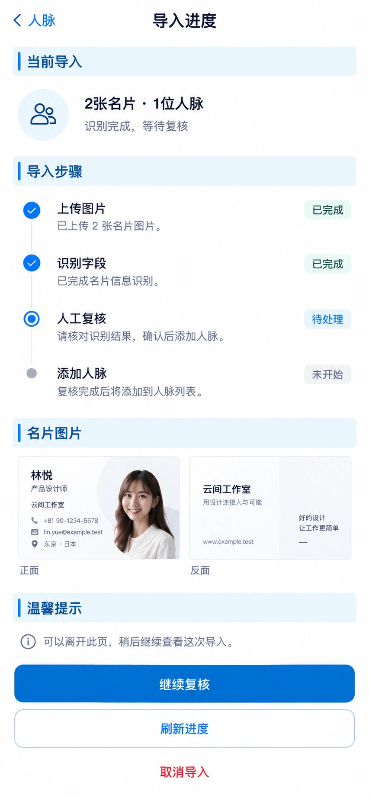

# P14 · 导入进度

[返回页面目录](../PAGE_CATALOG.md) · [独立设计图](../screens/14-contact-import-progress.jpg)

## 定位

路由／状态：`/contacts/new/import/[id]（当前缺失）`。实现标记：待实现 · B5。本页图是静态设计参考，不是运行中 App 的截图。

页面目标：按导入ID恢复真实进度，接入服务端已有持久进度。

## 入口与返回

从导入提示或恢复入口进入；当前路由缺失。

## 信息与动作

主要信息：导入 ID 对应的上传、识别、复核、写入状态。

操作及去向：刷新真实进度；继续复核；符合条件时取消导入。

## 业务边界

这是待实现页面；要接服务端持久进度，不用本地计时伪造百分比。

## 布局要求

这是二级／表单／独立工作页，不显示全局底部导航；使用标准返回入口，保留来源上下文。 采用浅蓝章节、左侧细蓝线、对齐字段与轻分隔线。字号、触控、行高和安全区以 [UI 规格](../UI_DESIGN_SPEC.md) 为准，不从 JPEG 像素直接换算。

## 状态与验收

在主状态之外补齐适用的加载、空内容、搜索无结果、请求失败、无权限／过期状态。表单还需键盘遮挡、验证失败、保存中、保存失败保留输入与未保存退出提示；不适用的状态应标明，不强行增加功能。

至少核对：返回到原来源；动作对象不串号；失败不显示成功；长文本和系统大字号不截断关键内容。详细场景见 [状态与验收](../STATES_AND_ACCEPTANCE.md)，业务流程见 [功能规格](../FUNCTIONAL_SPEC.md)。

## 图像校订

标题语义精修为“2 张图片 · 1 张双面名片”，添加成功后才显示已新增人数。

## 画面细化参考

以下是本页首轮图像的具体画面说明，便于复现视觉意图；它不是 API 规范。如与上方业务说明冲突，以中文业务说明为准。原始生成与校订记录保留在未压缩完整版；本上传版保留逐页画面说明。

Secondary 导入进度, back 人脉, no dock. Future missing-route design for persisted server progress, not fake production screenshot. Chapter 当前导入, label 2张名片 · 1位人脉 (frontbackgroup oneperson), status 识别完成，等待复核. List stages 上传图片 已完成 / 识别字段 已完成 / 人工复核 待处理 / 添加人脉 未开始. Small two businesscard image thumbnails 正面／反面 for same林悦. Primary 继续复核. Quiet actions 刷新进度 and 取消导入. Helper 可以离开此页，稍后继续查看这次导入。 No percentages, timed estimates, pretendcreatedcontact, duplicate2people, or code/API jargon. Pale-blue band+blue tick style.
