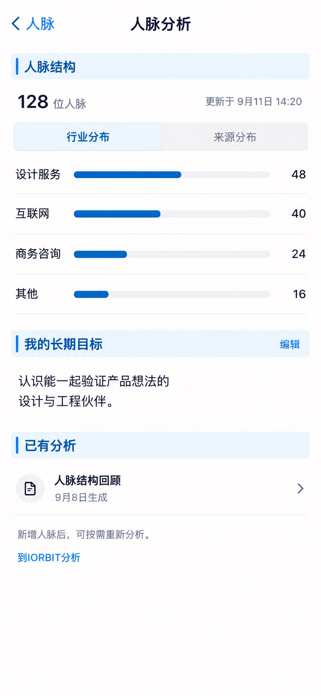

# P15 · 人脉分析

[返回页面目录](../PAGE_CATALOG.md) · [独立设计图](../screens/15-contact-analysis.jpg)

## 定位

路由／状态：`/contacts/dashboard`。实现标记：现有＋D3设计建议。本页图是静态设计参考，不是运行中 App 的截图。

页面目标：确定性结构、长期目标、已有报告与按需AI入口。

## 入口与返回

从人脉分析入口进入。

## 信息与动作

主要信息：确定性行业/来源结构、长期目标、已有报告。

操作及去向：分桶到 P16；长期目标编辑；按需到 IORBIT 分析。

## 业务边界

页面加载不重新生成报告；D3 分工待确认。

## 布局要求

这是二级／表单／独立工作页，不显示全局底部导航；使用标准返回入口，保留来源上下文。 采用浅蓝章节、左侧细蓝线、对齐字段与轻分隔线。字号、触控、行高和安全区以 [UI 规格](../UI_DESIGN_SPEC.md) 为准，不从 JPEG 像素直接换算。

## 状态与验收

在主状态之外补齐适用的加载、空内容、搜索无结果、请求失败、无权限／过期状态。表单还需键盘遮挡、验证失败、保存中、保存失败保留输入与未保存退出提示；不适用的状态应标明，不强行增加功能。

至少核对：返回到原来源；动作对象不串号；失败不显示成功；长文本和系统大字号不截断关键内容。详细场景见 [状态与验收](../STATES_AND_ACCEPTANCE.md)，业务流程见 [功能规格](../FUNCTIONAL_SPEC.md)。

## 图像校订

图片决定视觉方向，字段权限、数据状态、按钮可用性以文字规格与真实契约为准。头像、事件和数值均为虚构样例；生成图中的额外文案或装饰不自动成为需求。

## 画面细化参考

以下是本页首轮图像的具体画面说明，便于复现视觉意图；它不是 API 规范。如与上方业务说明冲突，以中文业务说明为准。原始生成与校订记录保留在未压缩完整版；本上传版保留逐页画面说明。

Secondary 人脉分析, back 人脉, NO dock. Blue chapter 人脉结构, compact total 128位人脉, quiet 更新于9月11日14:20. Readable horizontal bars with exact counts 设计服务48 / 互联网40 / 商务咨询24 / 其他16 (sum128), each labelleft countalignedright, bar lengths proportional. Quiet view 来源分布 tab. Blue chapter 我的长期目标 with two-line text 认识能一起验证产品想法的设计与工程伙伴。 and 编辑 text. Blue chapter 已有分析, one reportrow 人脉结构回顾 9月8日生成 and chevron. Small neutralnote 新增人脉后，可按需重新分析。 Single quiet blue link 到IORBIT分析; explicitly no auto-run badge/progress. No fake opportunityscores or circularmassivecharts, restrained data-first.
