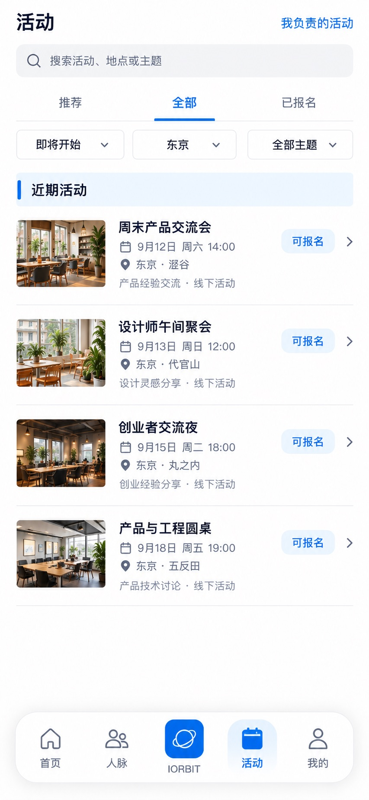

# P19 · 活动发现

[返回页面目录](../PAGE_CATALOG.md) · [独立设计图](../screens/19-events.jpg)

## 定位

路由／状态：`/events`。实现标记：现有＋发现入口设计建议。本页图是静态设计参考，不是运行中 App 的截图。

页面目标：推荐与全部公开活动并存，搜索筛选及个人状态。

## 入口与返回

底栏活动根页。

## 信息与动作

主要信息：推荐、全部、已报名；关键词、时间、地点、主题筛选。

操作及去向：活动到 P20；获授权的管理入口到 P24。

## 业务边界

没有推荐仍能看全部公开活动；主办角色不是人人都有。

## 布局要求

保留根页悬浮长岛底栏；正文滚动区域预留底栏高度和安全区，不遮挡最后一行。 采用浅蓝章节、左侧细蓝线、对齐字段与轻分隔线。字号、触控、行高和安全区以 [UI 规格](../UI_DESIGN_SPEC.md) 为准，不从 JPEG 像素直接换算。

## 状态与验收

在主状态之外补齐适用的加载、空内容、搜索无结果、请求失败、无权限／过期状态。表单还需键盘遮挡、验证失败、保存中、保存失败保留输入与未保存退出提示；不适用的状态应标明，不强行增加功能。

至少核对：返回到原来源；动作对象不串号；失败不显示成功；长文本和系统大字号不截断关键内容。详细场景见 [状态与验收](../STATES_AND_ACCEPTANCE.md)，业务流程见 [功能规格](../FUNCTIONAL_SPEC.md)。

## 图像校订

图片决定视觉方向，字段权限、数据状态、按钮可用性以文字规格与真实契约为准。头像、事件和数值均为虚构样例；生成图中的额外文案或装饰不自动成为需求。

## 画面细化参考

以下是本页首轮图像的具体画面说明，便于复现视觉意图；它不是 API 规范。如与上方业务说明冲突，以中文业务说明为准。原始生成与校订记录保留在未压缩完整版；本上传版保留逐页画面说明。

Root page 活动, floating five-item capsule dock active 活动. Compact title 活动, right text 我负责的活动 (fictional authorized organizer context). Search 搜索活动、地点或主题; segmented text tabs 推荐 / 全部 / 已报名, 全部 active. Secondary filters 即将开始 / 东京 / 全部主题. Pale-blue chapter band 近期活动 and fine left blue tick. Four photo rows separated thin lines, small landscape event-photo on left about88x70 logical pt; title with date/location beneath, discrete right blue pill 可报名. 周末产品交流会 9月12日 周六 14:00 东京·涩谷; 设计师午间聚会 9月13日 周日 12:00 东京·代官山; 创业者交流夜 9月15日 周二 18:00 东京·丸之内; 产品与工程圆桌 9月18日 周五 19:00 东京·五反田. Each has short factual line e.g. 产品经验交流 · 线下活动; don't fabricate personalized recommendation or capacity. Follow approved floating dock not flat toolbar.
