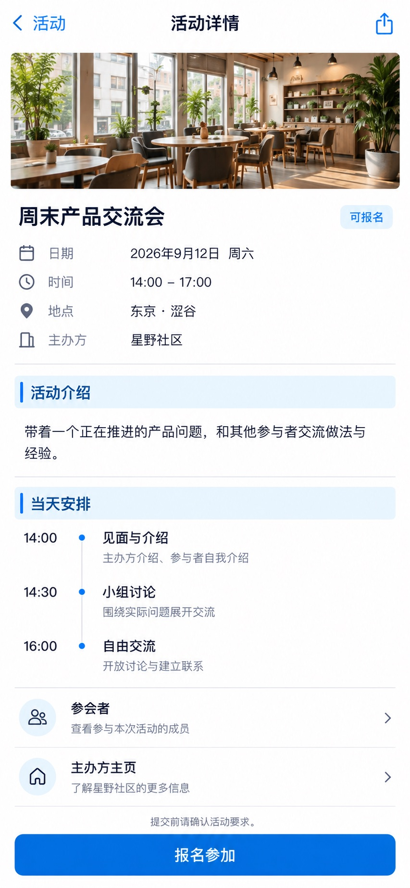

# P20 · 活动详情

[返回页面目录](../PAGE_CATALOG.md) · [独立设计图](../screens/20-event-detail.jpg)

## 定位

路由／状态：`/events/[id]`。实现标记：现有。本页图是静态设计参考，不是运行中 App 的截图。

页面目标：公开介绍、时间地点、流程、主办方及权威报名资格。

## 入口与返回

活动发现、邀请或日程预览进入。

## 信息与动作

主要信息：图片、权威报名状态、时间地点、介绍、安排、主办方。

操作及去向：报名到 P21；参会者到 P23；主办方到 P25。

## 业务边界

报名资格来自服务端，不仅凭日期或前端按钮判断。

## 布局要求

这是二级／表单／独立工作页，不显示全局底部导航；使用标准返回入口，保留来源上下文。 采用浅蓝章节、左侧细蓝线、对齐字段与轻分隔线。字号、触控、行高和安全区以 [UI 规格](../UI_DESIGN_SPEC.md) 为准，不从 JPEG 像素直接换算。

## 状态与验收

在主状态之外补齐适用的加载、空内容、搜索无结果、请求失败、无权限／过期状态。表单还需键盘遮挡、验证失败、保存中、保存失败保留输入与未保存退出提示；不适用的状态应标明，不强行增加功能。

至少核对：返回到原来源；动作对象不串号；失败不显示成功；长文本和系统大字号不截断关键内容。详细场景见 [状态与验收](../STATES_AND_ACCEPTANCE.md)，业务流程见 [功能规格](../FUNCTIONAL_SPEC.md)。

## 图像校订

图片决定视觉方向，字段权限、数据状态、按钮可用性以文字规格与真实契约为准。头像、事件和数值均为虚构样例；生成图中的额外文案或装饰不自动成为需求。

## 画面细化参考

以下是本页首轮图像的具体画面说明，便于复现视觉意图；它不是 API 规范。如与上方业务说明冲突，以中文业务说明为准。原始生成与校订记录保留在未压缩完整版；本上传版保留逐页画面说明。

Secondary event detail, back 活动, title 活动详情, share icon, NO global dock. Small cinematic cafe event photograph full innerwidth height140pt, not giant cover. Title 周末产品交流会 (20pt). Subtle pill 可报名. Aligned metadata date 2026年9月12日 周六 / time 14:00–17:00 / location 东京·涩谷 / host 星野社区. Pale-blue chapter strips 活动介绍 and 当天安排. Factual intro: 带着一个正在推进的产品问题，和其他参与者交流做法与经验。 Agenda compact aligned time rows 14:00 见面与介绍 / 14:30 小组讨论 / 16:00 自由交流. Quiet entry 参会者 and 主办方主页. Footer sticky actionarea notdock: primary50pt 报名参加, small above 提交前请确认活动要求. No price or capacity invented, no fake personalized recommendation. This fixture assumes authoritative server says eligible; not a frontend date-based decision.
