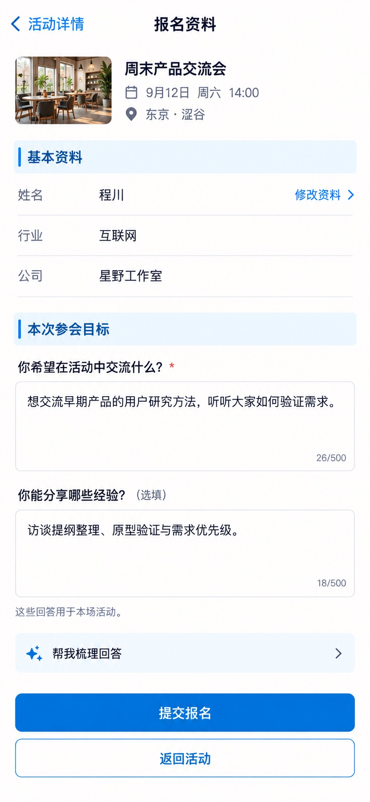

# P21 · 活动报名

[返回页面目录](../PAGE_CATALOG.md) · [独立设计图](../screens/21-event-registration.jpg)

## 定位

路由／状态：`/events/[id]/register`。实现标记：现有 · B2完善。本页图是静态设计参考，不是运行中 App 的截图。

页面目标：按活动题集填写，辅助问答可选，提交失败保留答案。

## 入口与返回

从活动详情报名进入。

## 信息与动作

主要信息：资料摘要、本场活动题集、必填和选填、可选辅助问答。

操作及去向：提交后按结果到 P22；回到活动不丢未提交回答。

## 业务边界

刷新、辅助问答、失败重试不覆盖手填内容；不要从图中推导 500 字限制。

## 布局要求

这是二级／表单／独立工作页，不显示全局底部导航；使用标准返回入口，保留来源上下文。 采用浅蓝章节、左侧细蓝线、对齐字段与轻分隔线。字号、触控、行高和安全区以 [UI 规格](../UI_DESIGN_SPEC.md) 为准，不从 JPEG 像素直接换算。

## 状态与验收

在主状态之外补齐适用的加载、空内容、搜索无结果、请求失败、无权限／过期状态。表单还需键盘遮挡、验证失败、保存中、保存失败保留输入与未保存退出提示；不适用的状态应标明，不强行增加功能。

至少核对：返回到原来源；动作对象不串号；失败不显示成功；长文本和系统大字号不截断关键内容。详细场景见 [状态与验收](../STATES_AND_ACCEPTANCE.md)，业务流程见 [功能规格](../FUNCTIONAL_SPEC.md)。

## 图像校订

图中 26/500、18/500 等不是已确定的字数限制，精修时移除，除非契约另有验证规则。

## 画面细化参考

以下是本页首轮图像的具体画面说明，便于复现视觉意图；它不是 API 规范。如与上方业务说明冲突，以中文业务说明为准。原始生成与校订记录保留在未压缩完整版；本上传版保留逐页画面说明。

Secondary form 报名资料, back 活动详情, no dock. Compact eventcontext 周末产品交流会 9月12日 周六14:00 东京·涩谷. Pale-blue section 基本资料 with aligned rows 姓名 程川 / 行业 互联网 / 公司 星野工作室. Quiet 修改资料 link. Blue chapter 本次参会目标. Required question 你希望在活动中交流什么？ with multiline typed answer 想交流早期产品的用户研究方法，听听大家如何验证需求。 Optional question 你能分享哪些经验？ answer 访谈提纲整理、原型验证与需求优先级。 Small explanatory line 这些回答用于本场活动。 Quiet optional folded row 帮我梳理回答 chevron (embedded assist, not full second AI workstation). Bottom primary 提交报名 and 返回活动 secondary. Current unsubmitted state: no 已报名 badge/no successcheckmark before submit. Preserve ample space for error text and keyboard; don't fake consent or mandatory terms not supplied.
