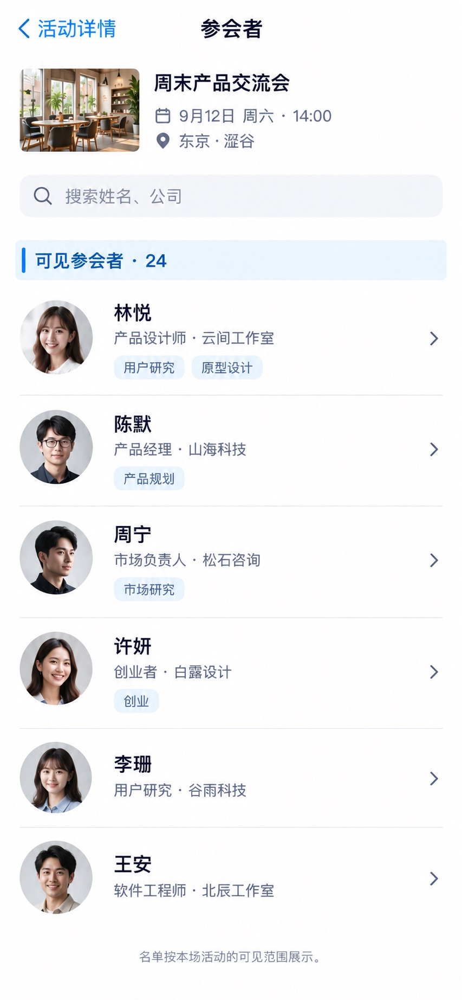

# P23 · 参会者

[返回页面目录](../PAGE_CATALOG.md) · [独立设计图](../screens/23-event-attendees.jpg)

## 定位

路由／状态：`/events/[id]/attendees`。实现标记：现有 · 权限敏感。本页图是静态设计参考，不是运行中 App 的截图。

页面目标：只显示本活动允许查看的参会者资料。

## 入口与返回

活动详情或现场模式进入。

## 信息与动作

主要信息：在当前活动权限范围内可见的姓名、公司、职业、标签。

操作及去向：搜索与查看被允许的公开资料。

## 业务边界

不泄露手机号邮箱，不默认公开全部报名记录或自动加人脉。

## 布局要求

这是二级／表单／独立工作页，不显示全局底部导航；使用标准返回入口，保留来源上下文。 采用浅蓝章节、左侧细蓝线、对齐字段与轻分隔线。字号、触控、行高和安全区以 [UI 规格](../UI_DESIGN_SPEC.md) 为准，不从 JPEG 像素直接换算。

## 状态与验收

在主状态之外补齐适用的加载、空内容、搜索无结果、请求失败、无权限／过期状态。表单还需键盘遮挡、验证失败、保存中、保存失败保留输入与未保存退出提示；不适用的状态应标明，不强行增加功能。

至少核对：返回到原来源；动作对象不串号；失败不显示成功；长文本和系统大字号不截断关键内容。详细场景见 [状态与验收](../STATES_AND_ACCEPTANCE.md)，业务流程见 [功能规格](../FUNCTIONAL_SPEC.md)。

## 图像校订

图片决定视觉方向，字段权限、数据状态、按钮可用性以文字规格与真实契约为准。头像、事件和数值均为虚构样例；生成图中的额外文案或装饰不自动成为需求。

## 画面细化参考

以下是本页首轮图像的具体画面说明，便于复现视觉意图；它不是 API 规范。如与上方业务说明冲突，以中文业务说明为准。原始生成与校订记录保留在未压缩完整版；本上传版保留逐页画面说明。

Secondary 参会者, back 活动详情, NOdock. Compact context 周末产品交流会. Search 搜索姓名、公司. Blue chapter 可见参会者 · 24. Six profile rows 林悦 产品设计师·云间工作室 tags用户研究 原型设计; 陈默 产品经理·山海科技 tags产品规划; 周宁 市场负责人·松石咨询 tags市场研究; 许妍 创业者·白露设计 tags创业; 李珊 用户研究·谷雨科技; 王安 软件工程师·北辰工作室. Privacy-conscious onlynameprofessioncompanytags not emailphone. Each quiet chevron to permittedprofile, no automaticaddall/DM. Small footer 名单按本场活动的可见范围展示。 Fictional authorizedviewerfixture, no publicprivateleak.
