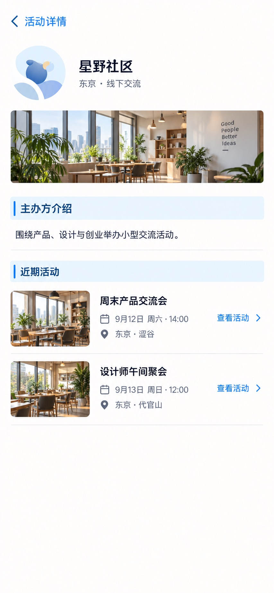

# P25 · 主办方主页

[返回页面目录](../PAGE_CATALOG.md) · [独立设计图](../screens/25-organizer-public.jpg)

## 定位

路由／状态：`/o/[slug]`。实现标记：现有 · 兼容解析需保留。本页图是静态设计参考，不是运行中 App 的截图。

页面目标：公开主办方资料与活动；当前解析不等于通用新slug API。

## 入口与返回

从活动主办方进入。

## 信息与动作

主要信息：公开介绍和近期活动。

操作及去向：查看活动详情。

## 业务边界

当前 slug 兼容解析须保留，不能把画面当成新通用 slug API。

## 布局要求

这是二级／表单／独立工作页，不显示全局底部导航；使用标准返回入口，保留来源上下文。 采用浅蓝章节、左侧细蓝线、对齐字段与轻分隔线。字号、触控、行高和安全区以 [UI 规格](../UI_DESIGN_SPEC.md) 为准，不从 JPEG 像素直接换算。

## 状态与验收

在主状态之外补齐适用的加载、空内容、搜索无结果、请求失败、无权限／过期状态。表单还需键盘遮挡、验证失败、保存中、保存失败保留输入与未保存退出提示；不适用的状态应标明，不强行增加功能。

至少核对：返回到原来源；动作对象不串号；失败不显示成功；长文本和系统大字号不截断关键内容。详细场景见 [状态与验收](../STATES_AND_ACCEPTANCE.md)，业务流程见 [功能规格](../FUNCTIONAL_SPEC.md)。

## 图像校订

横幅照片与背景英文标语只是素材，不是新品牌文案；主办方封面能力未确认时省略横幅。

## 画面细化参考

以下是本页首轮图像的具体画面说明，便于复现视觉意图；它不是 API 规范。如与上方业务说明冲突，以中文业务说明为准。原始生成与校订记录保留在未压缩完整版；本上传版保留逐页画面说明。

Secondary 主办方主页, back 活动详情, NOdock. Small original circular letter/abstract community avatar not commercialbrandlogo. Header 星野社区 with subtitle 东京·线下交流. Blue chapter 主办方介绍 body 围绕产品、设计与创业举办小型交流活动。 Blue chapter 近期活动, twophoto rows 周末产品交流会 9月12日周六14:00 东京·涩谷; 设计师午间聚会 9月13日周日12:00 东京·代官山. Each 查看活动 chevron. No followcount, verifiedbadge, contactemail, guaranteedofficialstatus or newlyinventedFollowbutton. Factual publicread-only surface.
