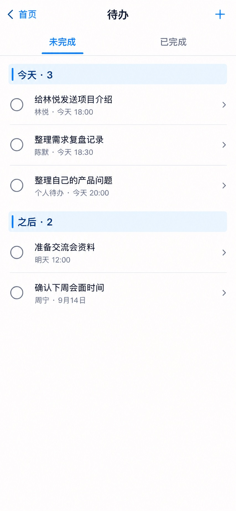

# P26 · 待办列表

[返回页面目录](../PAGE_CATALOG.md) · [独立设计图](../screens/26-tasks.jpg)

## 定位

路由／状态：`/tasks`。实现标记：现有。本页图是静态设计参考，不是运行中 App 的截图。

页面目标：未完成／已完成、个人或人脉事项、真实完成回读。

## 入口与返回

首页待办入口。

## 信息与动作

主要信息：未完成/已完成、今天/之后、个人或关联人脉的事项。

操作及去向：行到 P27；完成动作后真实回读；新增保留个人事项。

## 业务边界

没有联系人也能是合法个人待办；完成失败应恢复可操作状态。

## 布局要求

这是二级／表单／独立工作页，不显示全局底部导航；使用标准返回入口，保留来源上下文。 采用浅蓝章节、左侧细蓝线、对齐字段与轻分隔线。字号、触控、行高和安全区以 [UI 规格](../UI_DESIGN_SPEC.md) 为准，不从 JPEG 像素直接换算。

## 状态与验收

在主状态之外补齐适用的加载、空内容、搜索无结果、请求失败、无权限／过期状态。表单还需键盘遮挡、验证失败、保存中、保存失败保留输入与未保存退出提示；不适用的状态应标明，不强行增加功能。

至少核对：返回到原来源；动作对象不串号；失败不显示成功；长文本和系统大字号不截断关键内容。详细场景见 [状态与验收](../STATES_AND_ACCEPTANCE.md)，业务流程见 [功能规格](../FUNCTIONAL_SPEC.md)。

## 图像校订

图片决定视觉方向，字段权限、数据状态、按钮可用性以文字规格与真实契约为准。头像、事件和数值均为虚构样例；生成图中的额外文案或装饰不自动成为需求。

## 画面细化参考

以下是本页首轮图像的具体画面说明，便于复现视觉意图；它不是 API 规范。如与上方业务说明冲突，以中文业务说明为准。原始生成与校订记录保留在未压缩完整版；本上传版保留逐页画面说明。

Secondary 待办, back 首页, plus right, NOdock. Tabs 未完成 / 已完成, 未完成 active. Chapter 今天 · 3. Three checklistrows empty circular completioncontrols: 给林悦发送项目介绍 subtitle 林悦 · 今天18:00; 整理需求复盘记录 subtitle 陈默 · 今天18:30; 整理自己的产品问题 subtitle 个人待办 · 今天20:00. Chapter 之后 · 2 rows 准备交流会资料 明天12:00 and 确认下周会面时间 周宁 · 9月14日. Subtle rowchevrons to details, no unrelated AI CTA, no fakechecked pendingitems.
