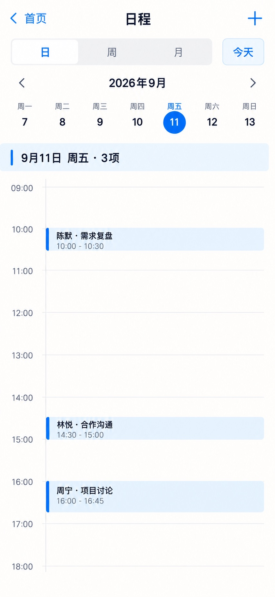

# P28 · 日历（日）

[返回页面目录](../PAGE_CATALOG.md) · [独立设计图](../screens/28-calendar-day.jpg)

## 定位

路由／状态：`/schedule（日视图）`。实现标记：现有。本页图是静态设计参考，不是运行中 App 的截图。

页面目标：正确时间轴、日程起止、选中日期与新增入口。

## 入口与返回

首页日程入口；日视图。

## 信息与动作

主要信息：日期条、日周月切换、时间轴、按真实起止定位的日程。

操作及去向：切周 P29、切月 P30；新增或编辑 P31；活动预览 P32。

## 业务边界

按时区计算；重叠、全天、跨日要单独处理，不复用同一时间块。

## 布局要求

这是二级／表单／独立工作页，不显示全局底部导航；使用标准返回入口，保留来源上下文。 采用浅蓝章节、左侧细蓝线、对齐字段与轻分隔线。字号、触控、行高和安全区以 [UI 规格](../UI_DESIGN_SPEC.md) 为准，不从 JPEG 像素直接换算。

## 状态与验收

在主状态之外补齐适用的加载、空内容、搜索无结果、请求失败、无权限／过期状态。表单还需键盘遮挡、验证失败、保存中、保存失败保留输入与未保存退出提示；不适用的状态应标明，不强行增加功能。

至少核对：返回到原来源；动作对象不串号；失败不显示成功；长文本和系统大字号不截断关键内容。详细场景见 [状态与验收](../STATES_AND_ACCEPTANCE.md)，业务流程见 [功能规格](../FUNCTIONAL_SPEC.md)。

## 图像校订

图片决定视觉方向，字段权限、数据状态、按钮可用性以文字规格与真实契约为准。头像、事件和数值均为虚构样例；生成图中的额外文案或装饰不自动成为需求。

## 画面细化参考

以下是本页首轮图像的具体画面说明，便于复现视觉意图；它不是 API 规范。如与上方业务说明冲突，以中文业务说明为准。原始生成与校订记录保留在未压缩完整版；本上传版保留逐页画面说明。

Secondary page 日程, back 首页, NO global dock. Right add plus. Segmented 日 / 周 / 月, 日 selected, 今天 quiet outlined control. Month 2026年9月 with prev next arrows. Real week strip 周一7 周二8 周三9 周四10 周五11 周六12 周日13, 11 blue circle. Pale-blue section strip 9月11日 周五 · 3项. Exact time grid from 09:00 to18:00, hourly labels must appear once each in increasing order. Three schedule blocks only: 陈默·需求复盘 10:00–10:30, 林悦·合作沟通 14:30–15:00, 周宁·项目讨论 16:00–16:45. Use proportional block positions/heights: 10:00start30min, 14:30 exactly halfway between14:00and15:00 lasting30min,16:00 lasting45min. 2pt left blue edge pale-blue fill, no giant blocks. Timeline labels small but legible. No repeated timestamps or arbitrary colored extra events.
