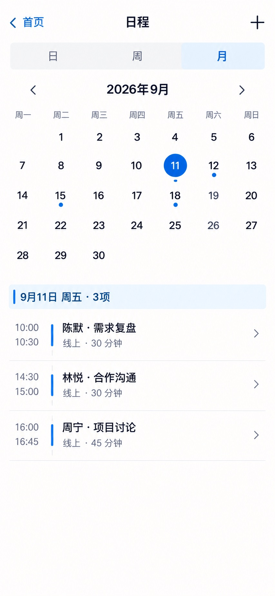

# P30 · 日历（月）

[返回页面目录](../PAGE_CATALOG.md) · [独立设计图](../screens/30-calendar-month.jpg)

## 定位

路由／状态：`/schedule（月视图）`。实现标记：现有。本页图是静态设计参考，不是运行中 App 的截图。

页面目标：月格、选中日期和当日日程列表。

## 入口与返回

同一日程页切换月。

## 信息与动作

主要信息：月历、选中日期、事件点、当日日程列表。

操作及去向：翻月、选择日期、查看或新增日程。

## 业务边界

2026 年 9 月 1 日是周二；格子位置和事件点均从日期计算。

## 布局要求

这是二级／表单／独立工作页，不显示全局底部导航；使用标准返回入口，保留来源上下文。 采用浅蓝章节、左侧细蓝线、对齐字段与轻分隔线。字号、触控、行高和安全区以 [UI 规格](../UI_DESIGN_SPEC.md) 为准，不从 JPEG 像素直接换算。

## 状态与验收

在主状态之外补齐适用的加载、空内容、搜索无结果、请求失败、无权限／过期状态。表单还需键盘遮挡、验证失败、保存中、保存失败保留输入与未保存退出提示；不适用的状态应标明，不强行增加功能。

至少核对：返回到原来源；动作对象不串号；失败不显示成功；长文本和系统大字号不截断关键内容。详细场景见 [状态与验收](../STATES_AND_ACCEPTANCE.md)，业务流程见 [功能规格](../FUNCTIONAL_SPEC.md)。

## 图像校订

地点元信息以真实日程为准，不从示例“线上”反推日程类型。

## 画面细化参考

以下是本页首轮图像的具体画面说明，便于复现视觉意图；它不是 API 规范。如与上方业务说明冲突，以中文业务说明为准。原始生成与校订记录保留在未压缩完整版；本上传版保留逐页画面说明。

Secondary 日程, back 首页, plus right, NOdock. Tabs 日 / 周 / 月 月 selected. Center 2026年9月 with arrows. Accurate MONTH calendar seven columns 一二三四五六日, Sep1 Tuesday: firstrow blank 1 2 3 4 5 6; secondrow7 8 9 10 11 12 13; third14 15 16 17 18 19 20; fourth21 22 23 24 25 26 27; fifth28 29 30 blanks. Selected11Fridaybluecircle. Tiny eventdots on11,12,15,18. Chapter 9月11日 周五 · 3项; rows 10:00–10:30 陈默·需求复盘;14:30–15:00 林悦·合作沟通;16:00–16:45 周宁·项目讨论. No duplicate dates, no non2026monthgrid.
