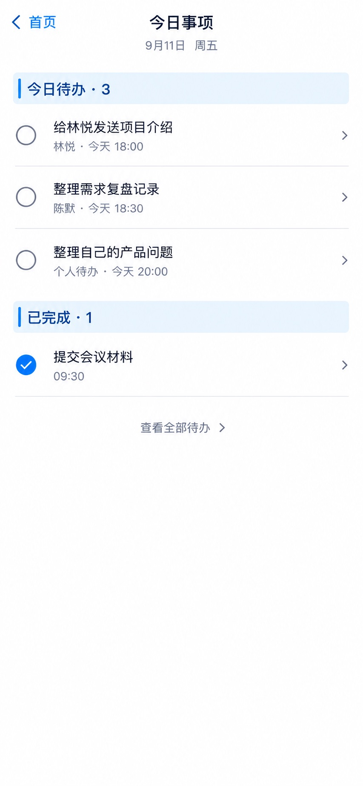

# P33 · 今日事项

[返回页面目录](../PAGE_CATALOG.md) · [独立设计图](../screens/33-today.jpg)

## 定位

路由／状态：`/today`。实现标记：现有。本页图是静态设计参考，不是运行中 App 的截图。

页面目标：当前Today消费的任务工作台，不与Web三来源集合等同。

## 入口与返回

兼容 /today 工作台或首页今日入口。

## 信息与动作

主要信息：今天待办、已完成事项。

操作及去向：查看全部到 P26；事项到 P27。

## 业务边界

当前 App Today 消费任务工作台，不宣称 Web 三来源聚合已迁移。

## 布局要求

这是二级／表单／独立工作页，不显示全局底部导航；使用标准返回入口，保留来源上下文。 采用浅蓝章节、左侧细蓝线、对齐字段与轻分隔线。字号、触控、行高和安全区以 [UI 规格](../UI_DESIGN_SPEC.md) 为准，不从 JPEG 像素直接换算。

## 状态与验收

在主状态之外补齐适用的加载、空内容、搜索无结果、请求失败、无权限／过期状态。表单还需键盘遮挡、验证失败、保存中、保存失败保留输入与未保存退出提示；不适用的状态应标明，不强行增加功能。

至少核对：返回到原来源；动作对象不串号；失败不显示成功；长文本和系统大字号不截断关键内容。详细场景见 [状态与验收](../STATES_AND_ACCEPTANCE.md)，业务流程见 [功能规格](../FUNCTIONAL_SPEC.md)。

## 图像校订

图片决定视觉方向，字段权限、数据状态、按钮可用性以文字规格与真实契约为准。头像、事件和数值均为虚构样例；生成图中的额外文案或装饰不自动成为需求。

## 画面细化参考

以下是本页首轮图像的具体画面说明，便于复现视觉意图；它不是 API 规范。如与上方业务说明冲突，以中文业务说明为准。原始生成与校订记录保留在未压缩完整版；本上传版保留逐页画面说明。

Secondary 今日事项, back 首页, NOdock. Date 9月11日 周五. Chapter 今日待办 · 3, three unchecked tasks 给林悦发送项目介绍 18:00 / 整理需求复盘记录 18:30 / 整理自己的产品问题 20:00. Each quiet relevantperson or 个人待办 source. Chapter 已完成 · 1 single checked 提交会议材料 09:30. Quiet 查看全部待办. This is current taskworkspace, do NOT add inboxalert or pretendWebthree-sourceaggregation.
