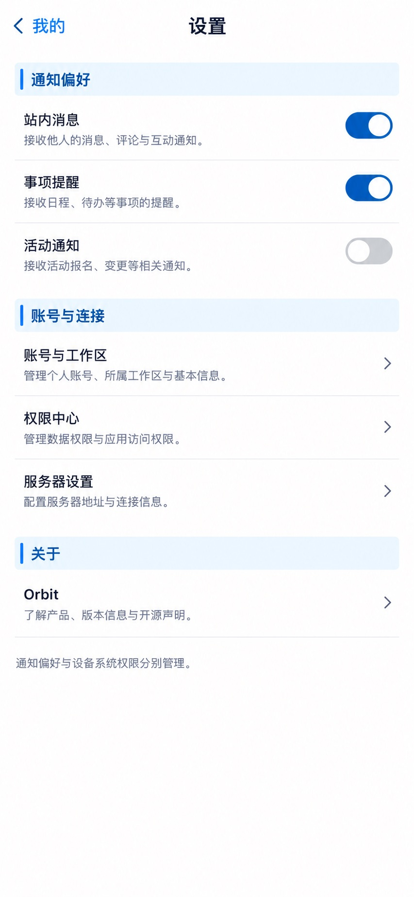

# P46 · 设置

[返回页面目录](../PAGE_CATALOG.md) · [独立设计图](../screens/46-settings.jpg)

## 定位

路由／状态：`/settings`。实现标记：现有＋D6偏好设计建议。本页图是静态设计参考，不是运行中 App 的截图。

页面目标：通知选择、账号／权限／服务器入口，语言范围待审。

## 入口与返回

我的设置入口。

## 信息与动作

主要信息：通知偏好、账号、权限、服务器、关于。

操作及去向：跳到对应页面；偏好保存失败显示实际状态。

## 业务边界

D6 尚待确认，语言与通知范围不因示例开关就视为已支持。

## 布局要求

这是二级／表单／独立工作页，不显示全局底部导航；使用标准返回入口，保留来源上下文。 采用浅蓝章节、左侧细蓝线、对齐字段与轻分隔线。字号、触控、行高和安全区以 [UI 规格](../UI_DESIGN_SPEC.md) 为准，不从 JPEG 像素直接换算。

## 状态与验收

在主状态之外补齐适用的加载、空内容、搜索无结果、请求失败、无权限／过期状态。表单还需键盘遮挡、验证失败、保存中、保存失败保留输入与未保存退出提示；不适用的状态应标明，不强行增加功能。

至少核对：返回到原来源；动作对象不串号；失败不显示成功；长文本和系统大字号不截断关键内容。详细场景见 [状态与验收](../STATES_AND_ACCEPTANCE.md)，业务流程见 [功能规格](../FUNCTIONAL_SPEC.md)。

## 图像校订

示例说明中的评论、互动、开源声明不构成已支持功能；精修删掉未证实的描述，保留准确入口。

## 画面细化参考

以下是本页首轮图像的具体画面说明，便于复现视觉意图；它不是 API 规范。如与上方业务说明冲突，以中文业务说明为准。原始生成与校订记录保留在未压缩完整版；本上传版保留逐页画面说明。

Secondary 设置, back 我的, NOdock. Chapter 通知偏好: 站内消息 toggleon / 事项提醒 toggleon / 活动通知 toggleoff, designproposedpreferences. Chapter 账号与连接: 账号与工作区 arrow / 权限中心 arrow / 服务器设置 arrow. Chapter 关于: Orbit row. Footerquiet 通知偏好与设备系统权限分别管理。 No languagepicker choices/multi-languagerollout, no billingorversioninvented, no threefakelegallinks.
