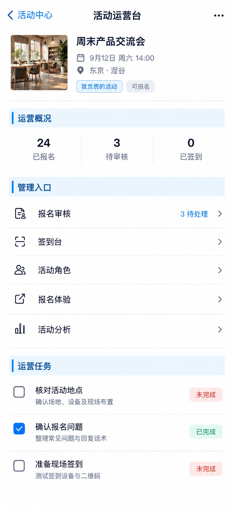

# P52 · 活动运营台

[返回页面目录](../PAGE_CATALOG.md) · [独立设计图](../screens/52-event-operations.jpg)

## 定位

路由／状态：`/events/[id]/operations`。实现标记：现有 · 角色敏感。本页图是静态设计参考，不是运行中 App 的截图。

页面目标：运营摘要、任务状态、签到／角色／体验／分析入口。

## 入口与返回

有权限的活动管理入口。

## 信息与动作

主要信息：运营概况、待处理任务、报名/签到/角色/体验/分析入口。

操作及去向：分别到 P53–P57。

## 业务边界

所有数据限定当前活动；角色变化后重新核对能力。

## 布局要求

这是二级／表单／独立工作页，不显示全局底部导航；使用标准返回入口，保留来源上下文。 采用浅蓝章节、左侧细蓝线、对齐字段与轻分隔线。字号、触控、行高和安全区以 [UI 规格](../UI_DESIGN_SPEC.md) 为准，不从 JPEG 像素直接换算。

## 状态与验收

在主状态之外补齐适用的加载、空内容、搜索无结果、请求失败、无权限／过期状态。表单还需键盘遮挡、验证失败、保存中、保存失败保留输入与未保存退出提示；不适用的状态应标明，不强行增加功能。

至少核对：返回到原来源；动作对象不串号；失败不显示成功；长文本和系统大字号不截断关键内容。详细场景见 [状态与验收](../STATES_AND_ACCEPTANCE.md)，业务流程见 [功能规格](../FUNCTIONAL_SPEC.md)。

## 图像校订

去掉生成图中运营任务的“测试设备与二维码”等未证实说明；未完成不默认使用错误红色。按钮范围以当前运营能力为准。

图片决定视觉方向，字段权限、数据状态、按钮可用性以文字规格与真实契约为准。头像、事件和数值均为虚构样例；生成图中的额外文案或装饰不自动成为需求。

## 画面细化参考

以下是本页首轮图像的具体画面说明，便于复现视觉意图；它不是 API 规范。如与上方业务说明冲突，以中文业务说明为准。原始生成与校订记录保留在未压缩完整版；本上传版保留逐页画面说明。

Secondary 活动运营台, back 活动中心, NOdock. Context 周末产品交流会 9月12日周六14:00 东京·涩谷, role 负责人. Bluechapter 运营概况 compactinline 24已报名 / 3待审核 / 0已签到. Bluechapter 管理入口, rows 报名审核3待处理 / 签到台 / 活动角色 / 报名体验 / 活动分析 eacharrow. Bluechapter 运营任务, checklist 核对活动地点 未完成 / 确认报名问题 已完成 / 准备现场签到 未完成. No fakepublishbigbutton/CRMdealmetrics, no unrequesteddeleteevent.
