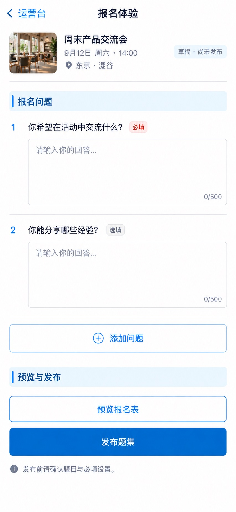

# P56 · 报名体验

[返回页面目录](../PAGE_CATALOG.md) · [独立设计图](../screens/56-registration-experience.jpg)

## 定位

路由／状态：`/events/[id]/operations/experience`。实现标记：现有 · 角色敏感。本页图是静态设计参考，不是运行中 App 的截图。

页面目标：题集草稿、标准／自选问题、预览、发布与冻结。

## 入口与返回

运营台报名体验入口。

## 信息与动作

主要信息：题集草稿、必填/选填、编辑、预览、发布。

操作及去向：先预览，明确发布；遵守已发布/冻结规则。

## 业务边界

不因页面重绘覆盖历史报名回答或静默发布新题集。

## 布局要求

这是二级／表单／独立工作页，不显示全局底部导航；使用标准返回入口，保留来源上下文。 采用浅蓝章节、左侧细蓝线、对齐字段与轻分隔线。字号、触控、行高和安全区以 [UI 规格](../UI_DESIGN_SPEC.md) 为准，不从 JPEG 像素直接换算。

## 状态与验收

在主状态之外补齐适用的加载、空内容、搜索无结果、请求失败、无权限／过期状态。表单还需键盘遮挡、验证失败、保存中、保存失败保留输入与未保存退出提示；不适用的状态应标明，不强行增加功能。

至少核对：返回到原来源；动作对象不串号；失败不显示成功；长文本和系统大字号不截断关键内容。详细场景见 [状态与验收](../STATES_AND_ACCEPTANCE.md)，业务流程见 [功能规格](../FUNCTIONAL_SPEC.md)。

## 图像校订

画面把题目配置画成了答题输入框。精修时将两块大输入框改为题目配置行：题目文本、类型、必填开关、编辑入口；删除 0/500。作答样式只在“预览报名表”状态展示。发布前必须确认题集。

图片决定视觉方向，字段权限、数据状态、按钮可用性以文字规格与真实契约为准。头像、事件和数值均为虚构样例；生成图中的额外文案或装饰不自动成为需求。

## 画面细化参考

以下是本页首轮图像的具体画面说明，便于复现视觉意图；它不是 API 规范。如与上方业务说明冲突，以中文业务说明为准。原始生成与校订记录保留在未压缩完整版；本上传版保留逐页画面说明。

Secondary 报名体验, back 运营台, NOdock. Context 周末产品交流会. Status 草稿 · 尚未发布. Chapter 报名问题, twoorderedrows 1你希望在活动中交流什么？ 必填 多行文本 编辑; 2你能分享哪些经验？ 选填 多行文本 编辑. Quiet 添加问题. Chapter 预览与发布, buttons 预览报名表 and primary 发布题集. Muted 发布前请确认题目与必填设置。 No fakepublishedsuccess/currentversioncounter, no unrequestedAIautogeneration. Existingregistrationanswersmustnotbeoverwritten.
