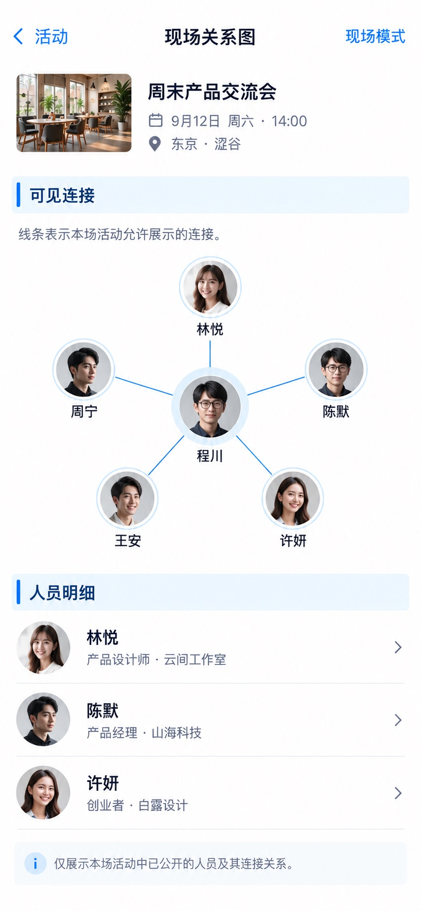

# P60 · 现场关系图

[返回页面目录](../PAGE_CATALOG.md) · [独立设计图](../screens/60-party-graph.jpg)

## 定位

路由／状态：`/party/graph`。实现标记：现有 · 需eventId或code。本页图是静态设计参考，不是运行中 App 的截图。

页面目标：授权可见的关系分组与连接图，不推断私人关系。

## 入口与返回

现场模式的可见关系入口。

## 信息与动作

主要信息：有限节点、图例、可见连接与人员明细。

操作及去向：查看授权人员详情。

## 业务边界

图中连线仅为设计样例，不推断私人关系或个人社交强度。

## 布局要求

这是二级／表单／独立工作页，不显示全局底部导航；使用标准返回入口，保留来源上下文。 采用浅蓝章节、左侧细蓝线、对齐字段与轻分隔线。字号、触控、行高和安全区以 [UI 规格](../UI_DESIGN_SPEC.md) 为准，不从 JPEG 像素直接换算。

## 状态与验收

在主状态之外补齐适用的加载、空内容、搜索无结果、请求失败、无权限／过期状态。表单还需键盘遮挡、验证失败、保存中、保存失败保留输入与未保存退出提示；不适用的状态应标明，不强行增加功能。

至少核对：返回到原来源；动作对象不串号；失败不显示成功；长文本和系统大字号不截断关键内容。详细场景见 [状态与验收](../STATES_AND_ACCEPTANCE.md)，业务流程见 [功能规格](../FUNCTIONAL_SPEC.md)。

## 图像校订

图片决定视觉方向，字段权限、数据状态、按钮可用性以文字规格与真实契约为准。头像、事件和数值均为虚构样例；生成图中的额外文案或装饰不自动成为需求。

## 画面细化参考

以下是本页首轮图像的具体画面说明，便于复现视觉意图；它不是 API 规范。如与上方业务说明冲突，以中文业务说明为准。原始生成与校订记录保留在未压缩完整版；本上传版保留逐页画面说明。

Secondary 现场关系图, back 现场模式, NOdock. Context 周末产品交流会. Bluechapter 可见连接. Restrained REAL graph rendering byImageGen: sixcircular headshotnodes evenlyspaced center 程川, connected 林悦/陈默/许妍 byfineblue lines, outer 周宁/王安 onlyifconnectionsstated inlegend. Subtle node names legible, no tangledhundreds. Legend 线条表示本场活动允许展示的连接。 Bluechapter 人员明细 rows 林悦 云间工作室 / 陈默 山海科技 /许妍白露设计 arrows. No inferredfriendships, moneystrengthorromanticrelationships, no privatedata.
