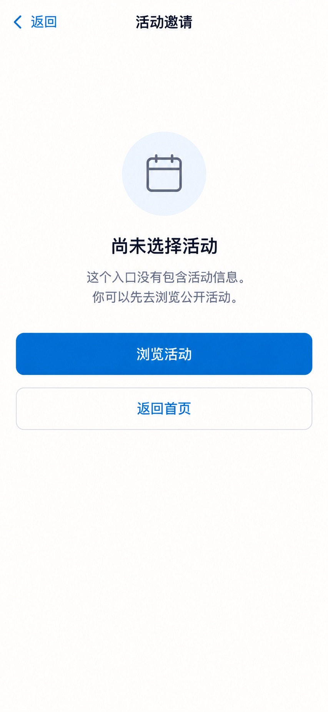

# P72 · 未指定活动的邀请入口

[返回页面目录](../PAGE_CATALOG.md) · [独立设计图](../screens/72-invitation-empty.jpg)

## 定位

路由／状态：`/register`。实现标记：现有 · 空态。本页图是静态设计参考，不是运行中 App 的截图。

页面目标：说明尚未选择活动，转去公开活动；不伪造邀请码。

## 入口与返回

没有 code 的 /register 空态。

## 信息与动作

主要信息：说明未选择活动和浏览入口。

操作及去向：转公开活动 P19 或返回首页。

## 业务边界

不是认证失败或网络错误，不伪造默认活动。

## 布局要求

这是二级／表单／独立工作页，不显示全局底部导航；使用标准返回入口，保留来源上下文。 采用浅蓝章节、左侧细蓝线、对齐字段与轻分隔线。字号、触控、行高和安全区以 [UI 规格](../UI_DESIGN_SPEC.md) 为准，不从 JPEG 像素直接换算。

## 状态与验收

在主状态之外补齐适用的加载、空内容、搜索无结果、请求失败、无权限／过期状态。表单还需键盘遮挡、验证失败、保存中、保存失败保留输入与未保存退出提示；不适用的状态应标明，不强行增加功能。

至少核对：返回到原来源；动作对象不串号；失败不显示成功；长文本和系统大字号不截断关键内容。详细场景见 [状态与验收](../STATES_AND_ACCEPTANCE.md)，业务流程见 [功能规格](../FUNCTIONAL_SPEC.md)。

## 图像校订

图片决定视觉方向，字段权限、数据状态、按钮可用性以文字规格与真实契约为准。头像、事件和数值均为虚构样例；生成图中的额外文案或装饰不自动成为需求。

## 画面细化参考

以下是本页首轮图像的具体画面说明，便于复现视觉意图；它不是 API 规范。如与上方业务说明冲突，以中文业务说明为准。原始生成与校订记录保留在未压缩完整版；本上传版保留逐页画面说明。

Secondary 活动邀请, back 返回, NOdock. Modestoutlinecalendaricon, compacttitle 尚未选择活动. Text 这个入口没有包含活动信息。你可以先去浏览公开活动。. Primary 浏览活动, quiet 返回首页. Largecalmwhitespace, no bigillustrationmarketing, no fakeinvitationcode, no wronglyloggedout/brokennetworkerror.
