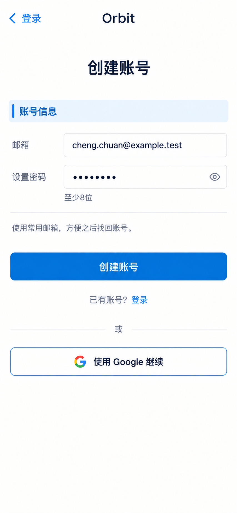

# P03 · 创建账号

[返回页面目录](../PAGE_CATALOG.md) · [独立设计图](../screens/03-signup.png)

## 定位

路由／状态：`/account/signup`。实现标记：现有。本页图是静态设计参考，不是运行中 App 的截图。

页面目标：邮箱与设置密码；创建后进入登录／资料完成流程。

## 入口与返回

从登录进入；返回 P02。

## 信息与动作

主要信息：邮箱、设置密码，当前最少 8 位；不混入姓名或行业。

操作及去向：创建账号后按真实认证结果进入后续步骤。

## 业务边界

重复请求防重入；不在没有响应时显示已发送验证邮件。

## 布局要求

这是二级／表单／独立工作页，不显示全局底部导航；使用标准返回入口，保留来源上下文。 采用浅蓝章节、左侧细蓝线、对齐字段与轻分隔线。字号、触控、行高和安全区以 [UI 规格](../UI_DESIGN_SPEC.md) 为准，不从 PNG 像素直接换算。

## 状态与验收

在主状态之外补齐适用的加载、空内容、搜索无结果、请求失败、无权限／过期状态。表单还需键盘遮挡、验证失败、保存中、保存失败保留输入与未保存退出提示；不适用的状态应标明，不强行增加功能。

至少核对：返回到原来源；动作对象不串号；失败不显示成功；长文本和系统大字号不截断关键内容。详细场景见 [状态与验收](../STATES_AND_ACCEPTANCE.md)，业务流程见 [功能规格](../FUNCTIONAL_SPEC.md)。

## 图像校订

图片决定视觉方向，字段权限、数据状态、按钮可用性以文字规格与真实契约为准。头像、事件和数值均为虚构样例；生成图中的额外文案或装饰不自动成为需求。

## 画面细化参考

以下是本页首轮图像的具体画面说明，便于复现视觉意图；它不是 API 规范。如与上方业务说明冲突，以中文业务说明为准。后续校订的原始提示另见生成记录。

Authentication 创建账号, back 登录, small Orbit. No dock. Pale-blue chapter 账号信息, ONLY TWO form fields: 邮箱 cheng.chuan@example.test and 设置密码 masked. Helper 至少8位 (existing policy). Small note 使用常用邮箱，方便之后找回账号。 Primary 创建账号, quiet 已有账号？登录. Secondary outlined 使用 Google 继续 in service-enabled fixture. Do not add name, company, password-confirmation, phone, terms checkbox or industry fields; profile comes later. Do not show success or already sent mail. Restrained clean form and comfortable lower blankspace.

