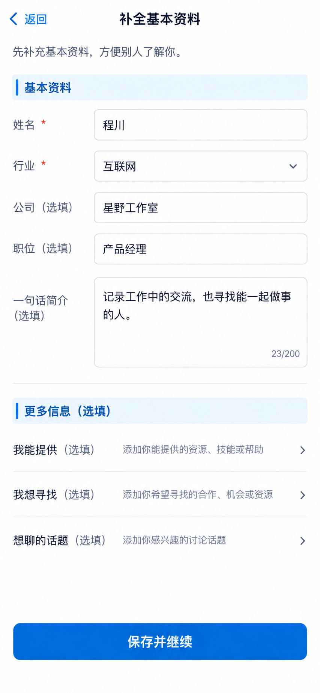

# P06 · 补全基本资料

[返回页面目录](../PAGE_CATALOG.md) · [独立设计图](../screens/06-profile-completion.png)

## 定位

路由／状态：`/profile（补全状态，非新增已存在路由）`。实现标记：设计建议 · B1/D2。本页图是静态设计参考，不是运行中 App 的截图。

页面目标：姓名与行业优先；可选公司、职位、简介及扩展标签。

## 入口与返回

登录后的资料不足状态；不宣称已有独立路由。

## 信息与动作

主要信息：姓名、行业优先；公司、职位、简介、合作标签为可选设计。

操作及去向：保存并继续原任务，不把活动目标强塞成全局资料。

## 业务边界

必填集合属于 B1/D2 待确认，不能凭此图直接改变后端验证。

## 布局要求

这是二级／表单／独立工作页，不显示全局底部导航；使用标准返回入口，保留来源上下文。 采用浅蓝章节、左侧细蓝线、对齐字段与轻分隔线。字号、触控、行高和安全区以 [UI 规格](../UI_DESIGN_SPEC.md) 为准，不从 PNG 像素直接换算。

## 状态与验收

在主状态之外补齐适用的加载、空内容、搜索无结果、请求失败、无权限／过期状态。表单还需键盘遮挡、验证失败、保存中、保存失败保留输入与未保存退出提示；不适用的状态应标明，不强行增加功能。

至少核对：返回到原来源；动作对象不串号；失败不显示成功；长文本和系统大字号不截断关键内容。详细场景见 [状态与验收](../STATES_AND_ACCEPTANCE.md)，业务流程见 [功能规格](../FUNCTIONAL_SPEC.md)。

## 图像校订

图中若出现 23/200 等计数器，忽略该生成细节；资料长度规则以当前验证与待确认需求为准。

## 画面细化参考

以下是本页首轮图像的具体画面说明，便于复现视觉意图；它不是 API 规范。如与上方业务说明冲突，以中文业务说明为准。后续校订的原始提示另见生成记录。

Secondary onboarding 补全基本资料, back arrow, NO dock. Intro 先补充基本资料，方便别人了解你。 Pale-blue chapter 基本资料; fields 姓名 required 程川; 行业 required 互联网 select; 公司（选填）星野工作室; 职位（选填）产品经理; 一句话简介（选填） multiline 记录工作中的交流，也寻找能一起做事的人。 Fineblue labelalignment, inputarea natural height. Quiet optional collapsed section 我能提供／我想寻找／想聊的话题 with 选填 text. Primary 保存并继续. No progresspercent, no required profilematchingquiz, no forced activitygoal. Requiredfieldchoices are a designproposal not yet frozen rule.

