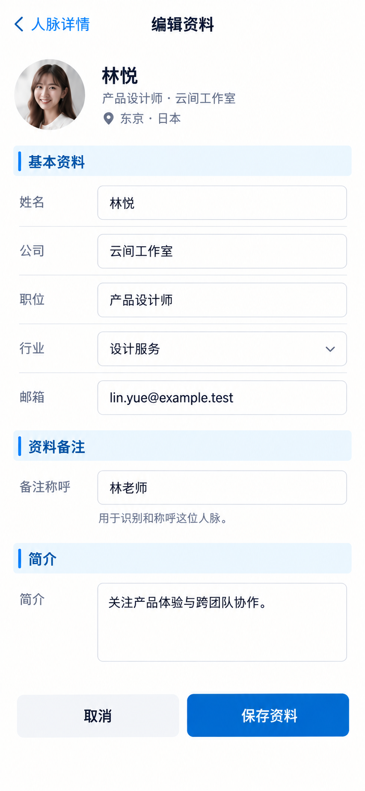

# P09 · 编辑人脉资料

[返回页面目录](../PAGE_CATALOG.md) · [独立设计图](../screens/09-contact-edit.png)

## 定位

路由／状态：`/contacts/[id]（编辑状态，路由形态待确认）`。实现标记：设计建议 · B4/B8。本页图是静态设计参考，不是运行中 App 的截图。

页面目标：只改授权资料与资料备注，不录入互动纪要。

## 入口与返回

从人脉详情的编辑资料进入。

## 信息与动作

主要信息：只编辑当前用户有权限的身份字段、简介与资料备注。

操作及去向：保存后回读同一人脉；取消保留原值。

## 业务边界

不把资料备注当成互动日志；字段级写权限以现有契约为准。

## 布局要求

这是二级／表单／独立工作页，不显示全局底部导航；使用标准返回入口，保留来源上下文。 采用浅蓝章节、左侧细蓝线、对齐字段与轻分隔线。字号、触控、行高和安全区以 [UI 规格](../UI_DESIGN_SPEC.md) 为准，不从 PNG 像素直接换算。

## 状态与验收

在主状态之外补齐适用的加载、空内容、搜索无结果、请求失败、无权限／过期状态。表单还需键盘遮挡、验证失败、保存中、保存失败保留输入与未保存退出提示；不适用的状态应标明，不强行增加功能。

至少核对：返回到原来源；动作对象不串号；失败不显示成功；长文本和系统大字号不截断关键内容。详细场景见 [状态与验收](../STATES_AND_ACCEPTANCE.md)，业务流程见 [功能规格](../FUNCTIONAL_SPEC.md)。

## 图像校订

图片决定视觉方向，字段权限、数据状态、按钮可用性以文字规格与真实契约为准。头像、事件和数值均为虚构样例；生成图中的额外文案或装饰不自动成为需求。

## 画面细化参考

以下是本页首轮图像的具体画面说明，便于复现视觉意图；它不是 API 规范。如与上方业务说明冲突，以中文业务说明为准。后续校订的原始提示另见生成记录。

Secondary fullpage form 编辑资料, back 人脉详情, no dock. Editing 林悦. Pale-blue chapter 基本资料; aligned editable fields 姓名 林悦 / 公司 云间工作室 / 职位 产品设计师 / 行业 设计服务 / 邮箱 lin.yue@example.test. Second chapter 资料备注; single field 备注称呼 林老师; helper 用于识别和称呼这位人脉。 Third 简介 field 关注产品体验与跨团队协作。 Primary 保存资料, quiet 取消. No meetingminutes/date memo/interactionnoteeditor; no fake save-success. This is proposed authorized-field edit state, not a claim all fields already have API write support. No invented character counters or quotas.

