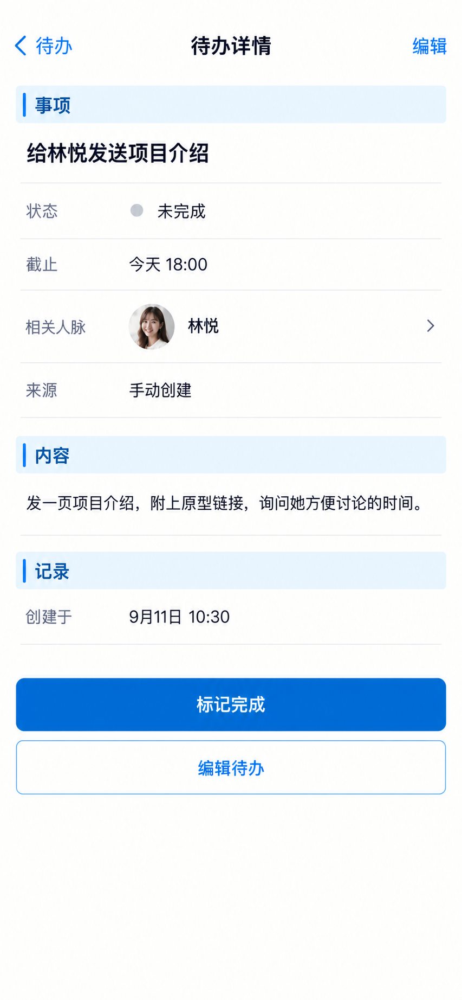

# P27 · 待办详情

[返回页面目录](../PAGE_CATALOG.md) · [独立设计图](../screens/27-task-detail.png)

## 定位

路由／状态：`/tasks/[id]`。实现标记：现有＋APP-11编辑目标。本页图是静态设计参考，不是运行中 App 的截图。

页面目标：标题、期限、状态、相关人脉可选、历史和编辑。

## 入口与返回

从列表或跟进入口进入。

## 信息与动作

主要信息：标题、截止、状态、关联人脉、内容、创建记录。

操作及去向：标记完成、编辑并保存；回到原列表。

## 业务边界

完整编辑为 APP-11 目标；待办正文提及发信并不等于已经发信。

## 布局要求

这是二级／表单／独立工作页，不显示全局底部导航；使用标准返回入口，保留来源上下文。 采用浅蓝章节、左侧细蓝线、对齐字段与轻分隔线。字号、触控、行高和安全区以 [UI 规格](../UI_DESIGN_SPEC.md) 为准，不从 PNG 像素直接换算。

## 状态与验收

在主状态之外补齐适用的加载、空内容、搜索无结果、请求失败、无权限／过期状态。表单还需键盘遮挡、验证失败、保存中、保存失败保留输入与未保存退出提示；不适用的状态应标明，不强行增加功能。

至少核对：返回到原来源；动作对象不串号；失败不显示成功；长文本和系统大字号不截断关键内容。详细场景见 [状态与验收](../STATES_AND_ACCEPTANCE.md)，业务流程见 [功能规格](../FUNCTIONAL_SPEC.md)。

## 图像校订

顶部“编辑”和底部“编辑待办”重复，精修只保留一个主编辑入口。

## 画面细化参考

以下是本页首轮图像的具体画面说明，便于复现视觉意图；它不是 API 规范。如与上方业务说明冲突，以中文业务说明为准。后续校订的原始提示另见生成记录。

Secondary 待办详情, back 待办, right 编辑, NOdock. Chapter 事项, title 给林悦发送项目介绍. Aligned 状态 未完成 / 截止 今天18:00 / 相关人脉 林悦 arrow / 来源 手动创建. Chapter 内容, text 发一页项目介绍，附上原型链接，询问她方便讨论的时间。 Chapter 记录, 创建于9月11日10:30. Primary 标记完成. Quiet secondary 编辑待办. No automaticallysentmessage, no invoice, no fake alreadycompleted state.

