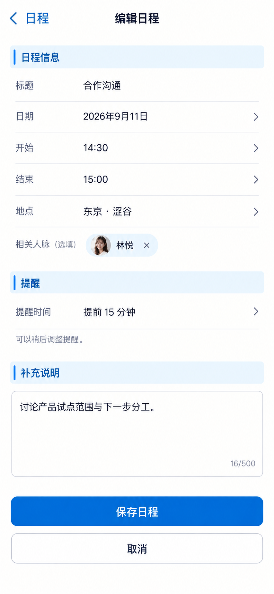

# P31 · 编辑日程

[返回页面目录](../PAGE_CATALOG.md) · [独立设计图](../screens/31-schedule-edit.png)

## 定位

路由／状态：`/schedule（编辑状态，路由形态待确认）`。实现标记：设计建议 · APP-11/B6。本页图是静态设计参考，不是运行中 App 的截图。

页面目标：标题、起止时间、地点、人脉可选、提醒与保存。

## 入口与返回

新增或编辑日程的设计状态。

## 信息与动作

主要信息：标题、日期、起止、地点、可选人脉、提醒、补充说明。

操作及去向：保存成功回读；取消或失败保留原数据/草稿。

## 业务边界

提醒控件属于建议，不代表外部日历或通知链路已接通。

## 布局要求

这是二级／表单／独立工作页，不显示全局底部导航；使用标准返回入口，保留来源上下文。 采用浅蓝章节、左侧细蓝线、对齐字段与轻分隔线。字号、触控、行高和安全区以 [UI 规格](../UI_DESIGN_SPEC.md) 为准，不从 PNG 像素直接换算。

## 状态与验收

在主状态之外补齐适用的加载、空内容、搜索无结果、请求失败、无权限／过期状态。表单还需键盘遮挡、验证失败、保存中、保存失败保留输入与未保存退出提示；不适用的状态应标明，不强行增加功能。

至少核对：返回到原来源；动作对象不串号；失败不显示成功；长文本和系统大字号不截断关键内容。详细场景见 [状态与验收](../STATES_AND_ACCEPTANCE.md)，业务流程见 [功能规格](../FUNCTIONAL_SPEC.md)。

## 图像校订

移除生成的 16/500 计数器；提醒方式属于设计建议，未接通时不可假装已生效。

## 画面细化参考

以下是本页首轮图像的具体画面说明，便于复现视觉意图；它不是 API 规范。如与上方业务说明冲突，以中文业务说明为准。后续校订的原始提示另见生成记录。

Secondary 编辑日程, back 日程, NOdock. Chapter 日程信息; fields 标题 合作沟通 / 日期 2026年9月11日 / 开始 14:30 / 结束 15:00 / 地点 东京·涩谷 / 相关人脉（选填）林悦 removablepill. Chapter 提醒, 提醒时间 提前15分钟 as proposed preference, quiet 可以稍后调整提醒。 Chapter 补充说明, 讨论产品试点范围与下一步分工。 Primary 保存日程; secondary 取消. This is unsaved form, no automaticallyinvitedcontact or sentcalendarinvitation, no successcheckmark.

