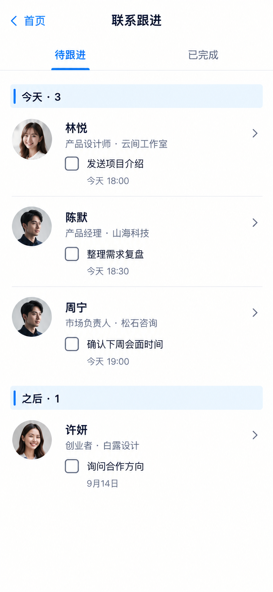

# P34 · 联系跟进

[返回页面目录](../PAGE_CATALOG.md) · [独立设计图](../screens/34-followups.png)

## 定位

路由／状态：`/followups`。实现标记：现有。本页图是静态设计参考，不是运行中 App 的截图。

页面目标：按到期时间整理跟进，进入同一联系人／事项。

## 入口与返回

首页联系跟进进入。

## 信息与动作

主要信息：按到期日整理的联系人和待处理事项。

操作及去向：查看原事项、完成后刷新、去联系人资料。

## 业务边界

事项名称相同不够判定同一条，跳转保留稳定 ID。

## 布局要求

这是二级／表单／独立工作页，不显示全局底部导航；使用标准返回入口，保留来源上下文。 采用浅蓝章节、左侧细蓝线、对齐字段与轻分隔线。字号、触控、行高和安全区以 [UI 规格](../UI_DESIGN_SPEC.md) 为准，不从 PNG 像素直接换算。

## 状态与验收

在主状态之外补齐适用的加载、空内容、搜索无结果、请求失败、无权限／过期状态。表单还需键盘遮挡、验证失败、保存中、保存失败保留输入与未保存退出提示；不适用的状态应标明，不强行增加功能。

至少核对：返回到原来源；动作对象不串号；失败不显示成功；长文本和系统大字号不截断关键内容。详细场景见 [状态与验收](../STATES_AND_ACCEPTANCE.md)，业务流程见 [功能规格](../FUNCTIONAL_SPEC.md)。

## 图像校订

头像可能跨页面近似或重复；姓名+公司+稳定 ID 才是识别依据，不使用头像做数据关联。

## 画面细化参考

以下是本页首轮图像的具体画面说明，便于复现视觉意图；它不是 API 规范。如与上方业务说明冲突，以中文业务说明为准。后续校订的原始提示另见生成记录。

Secondary 联系跟进, back 首页, NOdock. Tabs 待跟进 / 已完成, firstactive. Chapter 今天 · 3. Personrow 林悦 产品设计师·云间工作室 next 发送项目介绍 今天18:00; 陈默 产品经理·山海科技 next 整理需求复盘 今天18:30; 周宁 市场负责人·松石咨询 next 确认下周会面时间 今天19:00. Each 查看事项 chevron. Chapter 之后 · 1 许妍 创业者·白露设计 询问合作方向 9月14日. No autonomous send, no contactnoteinput, no fake urgency score.

