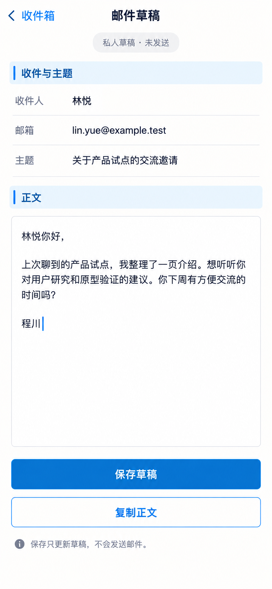

# P36 · 收件箱详情／邮件草稿

[返回页面目录](../PAGE_CATALOG.md) · [独立设计图](../screens/36-inbox-thread.png)

## 定位

路由／状态：`/inbox/[id]`。实现标记：现有 · 区分草稿与消息。本页图是静态设计参考，不是运行中 App 的截图。

页面目标：私人草稿明确未发送，查看来往内容与编辑／复制。

## 入口与返回

收件箱中的私人草稿。

## 信息与动作

主要信息：收件人与主题、正文、明确未发送标签。

操作及去向：编辑保存草稿或复制正文。

## 业务边界

保存不是发送；原始输入和外发动作必须分离。

## 布局要求

这是二级／表单／独立工作页，不显示全局底部导航；使用标准返回入口，保留来源上下文。 采用浅蓝章节、左侧细蓝线、对齐字段与轻分隔线。字号、触控、行高和安全区以 [UI 规格](../UI_DESIGN_SPEC.md) 为准，不从 PNG 像素直接换算。

## 状态与验收

在主状态之外补齐适用的加载、空内容、搜索无结果、请求失败、无权限／过期状态。表单还需键盘遮挡、验证失败、保存中、保存失败保留输入与未保存退出提示；不适用的状态应标明，不强行增加功能。

至少核对：返回到原来源；动作对象不串号；失败不显示成功；长文本和系统大字号不截断关键内容。详细场景见 [状态与验收](../STATES_AND_ACCEPTANCE.md)，业务流程见 [功能规格](../FUNCTIONAL_SPEC.md)。

## 图像校订

图片决定视觉方向，字段权限、数据状态、按钮可用性以文字规格与真实契约为准。头像、事件和数值均为虚构样例；生成图中的额外文案或装饰不自动成为需求。

## 画面细化参考

以下是本页首轮图像的具体画面说明，便于复现视觉意图；它不是 API 规范。如与上方业务说明冲突，以中文业务说明为准。后续校订的原始提示另见生成记录。

Secondary 邮件草稿, back 收件箱, NOdock. Prominent small neutral pill 私人草稿 · 未发送. Chapter 收件与主题, aligned 收件人 林悦 / 邮箱 lin.yue@example.test / 主题 关于产品试点的交流邀请. Chapter 正文, editable content 林悦你好，\n上次聊到的产品试点，我整理了一页介绍。想听听你对用户研究和原型验证的建议。你下周有方便交流的时间吗？\n程川. Primary 保存草稿, secondary 复制正文. Smallnote 保存只更新草稿，不会发送邮件。 NOsendbutton/no sentstatus/no hiddenexternal action.

