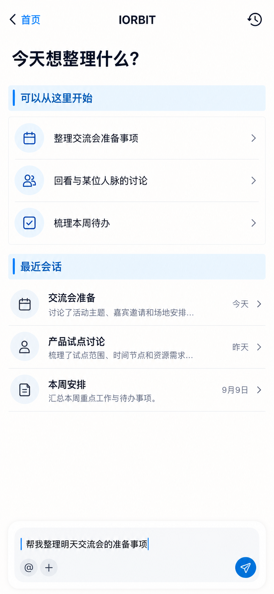

# P39 · IORBIT 新会话与历史

[返回页面目录](../PAGE_CATALOG.md) · [独立设计图](../screens/39-iorbit-home.png)

## 定位

路由／状态：`/ai`。实现标记：现有＋APP-01全屏入口目标。本页图是静态设计参考，不是运行中 App 的截图。

页面目标：问题草稿、历史入口、上下文预填不自动发送。

## 入口与返回

中央 IORBIT 动作或带上下文的入口。

## 信息与动作

主要信息：新问题草稿、可选建议、历史会话、输入器。

操作及去向：手动发送；历史到 P40；引用人脉到 P41。

## 业务边界

预填不自动发送，进入或返回页面不自动调用模型。

## 布局要求

这是二级／表单／独立工作页，不显示全局底部导航；使用标准返回入口，保留来源上下文。 采用浅蓝章节、左侧细蓝线、对齐字段与轻分隔线。字号、触控、行高和安全区以 [UI 规格](../UI_DESIGN_SPEC.md) 为准，不从 PNG 像素直接换算。

## 状态与验收

在主状态之外补齐适用的加载、空内容、搜索无结果、请求失败、无权限／过期状态。表单还需键盘遮挡、验证失败、保存中、保存失败保留输入与未保存退出提示；不适用的状态应标明，不强行增加功能。

至少核对：返回到原来源；动作对象不串号；失败不显示成功；长文本和系统大字号不截断关键内容。详细场景见 [状态与验收](../STATES_AND_ACCEPTANCE.md)，业务流程见 [功能规格](../FUNCTIONAL_SPEC.md)。

## 图像校订

历史会话摘要为示例文案，不与 P40 的具体内容绑定成真实历史；标题字号按 22pt 上限精修。

## 画面细化参考

以下是本页首轮图像的具体画面说明，便于复现视觉意图；它不是 API 规范。如与上方业务说明冲突，以中文业务说明为准。后续校订的原始提示另见生成记录。

Full-screen IORBIT, back 首页, historyclock icon right, NOdock. Title IORBIT18pt. Concise prompt 今天想整理什么？22ptmax. Pale-blue chapter 可以从这里开始. Three factual suggestionrows 整理交流会准备事项 / 回看与某位人脉的讨论 / 梳理本周待办 with smallarrow icons. Bluechapter 最近会话, rows 交流会准备 今天 / 产品试点讨论 昨天 / 本周安排 9月9日. Bottom visiblecomposer with unsentdraft 帮我整理明天交流会的准备事项 and @,+,sendarrow. Do NOT alreadyanswer or auto-sendprefill, no sloganorAIillustration.

