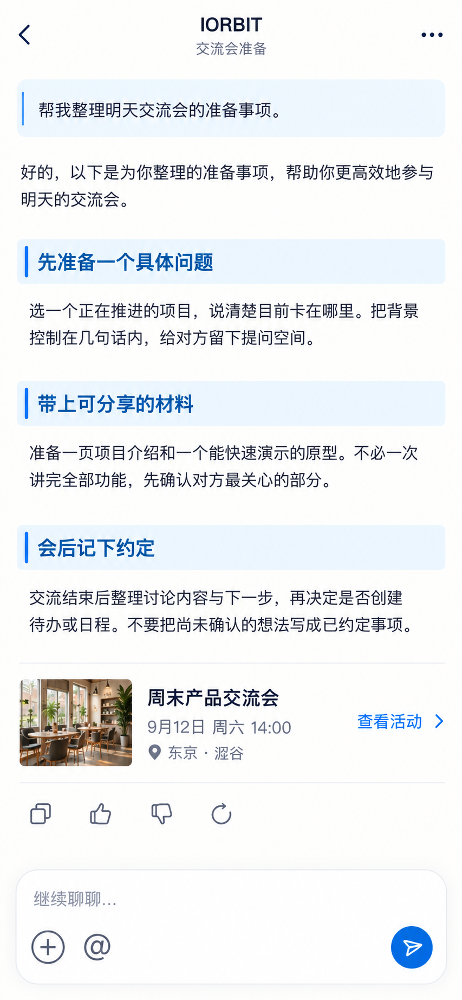

# P40 · IORBIT 会话

[返回页面目录](../PAGE_CATALOG.md) · [独立设计图](../screens/40-iorbit-conversation.png)

## 定位

路由／状态：`/ai/[id]`。实现标记：现有＋B3稳定性目标。本页图是静态设计参考，不是运行中 App 的截图。

页面目标：连续阅读、引用、继续提问和独立保存失败状态。

## 入口与返回

已有 AI 会话或手动发送后进入。

## 信息与动作

主要信息：用户问题、连续长文回答、引用、复制反馈、继续输入。

操作及去向：继续提问、打开真实引用、单独重试保存。

## 业务边界

流式生成与保存状态分开；保存失败不能抹掉已生成正文。

## 布局要求

这是二级／表单／独立工作页，不显示全局底部导航；使用标准返回入口，保留来源上下文。 采用浅蓝章节、左侧细蓝线、对齐字段与轻分隔线。字号、触控、行高和安全区以 [UI 规格](../UI_DESIGN_SPEC.md) 为准，不从 PNG 像素直接换算。

## 状态与验收

在主状态之外补齐适用的加载、空内容、搜索无结果、请求失败、无权限／过期状态。表单还需键盘遮挡、验证失败、保存中、保存失败保留输入与未保存退出提示；不适用的状态应标明，不强行增加功能。

至少核对：返回到原来源；动作对象不串号；失败不显示成功；长文本和系统大字号不截断关键内容。详细场景见 [状态与验收](../STATES_AND_ACCEPTANCE.md)，业务流程见 [功能规格](../FUNCTIONAL_SPEC.md)。

## 图像校订

去掉无必要的 AI 客套开头。重新生成只在用户明确操作后发生，不增加自动重跑行为。

## 画面细化参考

以下是本页首轮图像的具体画面说明，便于复现视觉意图；它不是 API 规范。如与上方业务说明冲突，以中文业务说明为准。后续校订的原始提示另见生成记录。

Independent full-screen IORBIT conversation, NO global dock. Back chevron, centered IORBIT exactly, small subtitle 交流会准备, quiet overflow menu. User question in slim pale-blue quote strip: 帮我整理明天交流会的准备事项。 A continuous article answer, not bubbles/cards. 3 small chapter bands with thin blue ticks: 先准备一个具体问题 / 带上可分享的材料 / 会后记下约定. Body text: 选一个正在推进的项目，说清楚目前卡在哪里。把背景控制在几句话内，给对方留下提问空间。 Next: 准备一页项目介绍和一个能快速演示的原型。不必一次讲完全部功能，先确认对方最关心的部分。 Next: 交流结束后整理讨论内容与下一步，再决定是否创建待办或日程。不要把尚未确认的想法写成已约定事项。 One modest event reference row photo 周末产品交流会 9月12日 周六14:00 东京·涩谷 查看活动. Small copy/thumbup/thumbdown underanswer. Bottom white rounded multiline composer 继续聊聊… with plus and @ controls, blue sendicon. Long-text lineheight23pt readable. No automatic-action success or AI permission claims, no fake model picker.

