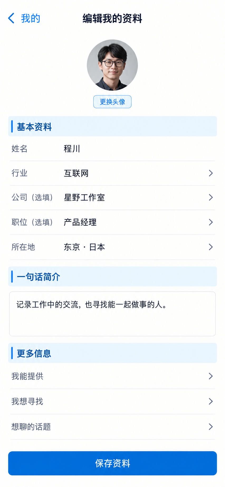

# P43 · 编辑我的资料

[返回页面目录](../PAGE_CATALOG.md) · [独立设计图](../screens/43-profile-edit.png)

## 定位

路由／状态：`/profile（编辑状态）`。实现标记：现有＋D2设计建议。本页图是静态设计参考，不是运行中 App 的截图。

页面目标：资料编辑、可选匹配资料、保存失败与提取复核。

## 入口与返回

我的资料编辑状态。

## 信息与动作

主要信息：头像、身份资料、简介、可选扩展信息。

操作及去向：保存回读；资料提取需要人工复核。

## 业务边界

必填与能力标签简化属于 D2，不能单靠图改规则。

## 布局要求

这是二级／表单／独立工作页，不显示全局底部导航；使用标准返回入口，保留来源上下文。 采用浅蓝章节、左侧细蓝线、对齐字段与轻分隔线。字号、触控、行高和安全区以 [UI 规格](../UI_DESIGN_SPEC.md) 为准，不从 PNG 像素直接换算。

## 状态与验收

在主状态之外补齐适用的加载、空内容、搜索无结果、请求失败、无权限／过期状态。表单还需键盘遮挡、验证失败、保存中、保存失败保留输入与未保存退出提示；不适用的状态应标明，不强行增加功能。

至少核对：返回到原来源；动作对象不串号；失败不显示成功；长文本和系统大字号不截断关键内容。详细场景见 [状态与验收](../STATES_AND_ACCEPTANCE.md)，业务流程见 [功能规格](../FUNCTIONAL_SPEC.md)。

## 图像校订

图片决定视觉方向，字段权限、数据状态、按钮可用性以文字规格与真实契约为准。头像、事件和数值均为虚构样例；生成图中的额外文案或装饰不自动成为需求。

## 画面细化参考

以下是本页首轮图像的具体画面说明，便于复现视觉意图；它不是 API 规范。如与上方业务说明冲突，以中文业务说明为准。后续校订的原始提示另见生成记录。

Secondary 编辑我的资料, back 我的, NOdock. Avatar 程川 with quiet 更换头像. Chapter 基本资料: 姓名 程川 / 行业 互联网 / 公司（选填）星野工作室 / 职位（选填）产品经理 / 所在地 东京·日本. Chapter 一句话简介 with textarea 记录工作中的交流，也寻找能一起做事的人。. Optionalcollapsedrow 我能提供／我想寻找／想聊的话题. Primary 保存资料. No fakecharactercounter, no forcedmatchingquiz, no changedpasswordhere.

