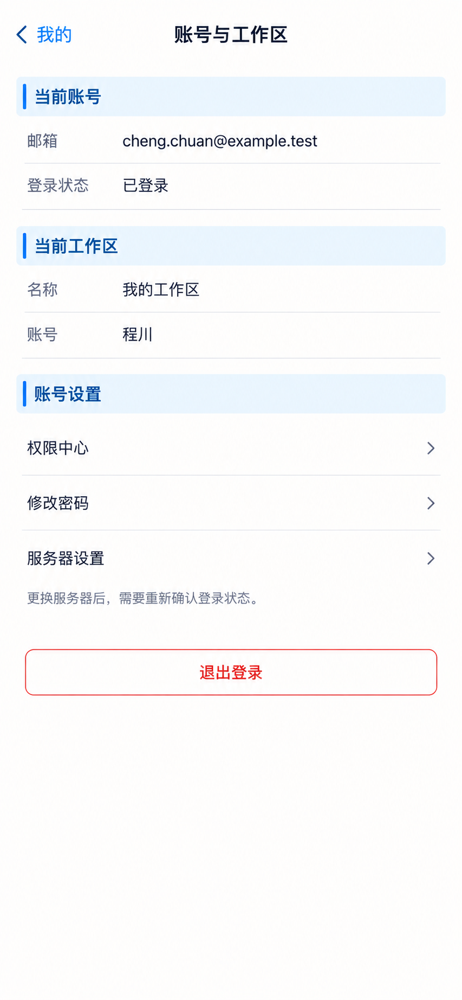

# P44 · 账号与工作区

[返回页面目录](../PAGE_CATALOG.md) · [独立设计图](../screens/44-account.png)

## 定位

路由／状态：`/account`。实现标记：现有。本页图是静态设计参考，不是运行中 App 的截图。

页面目标：登录主体、工作区和会话状态，登出不串号。

## 入口与返回

我的账号入口。

## 信息与动作

主要信息：登录主体、当前工作区、权限和连接入口。

操作及去向：权限 P45；服务器 P47；退出登录。

## 业务边界

切账号/服务后清理错误主体缓存；修改密码应复用已支持的重置流程。

## 布局要求

这是二级／表单／独立工作页，不显示全局底部导航；使用标准返回入口，保留来源上下文。 采用浅蓝章节、左侧细蓝线、对齐字段与轻分隔线。字号、触控、行高和安全区以 [UI 规格](../UI_DESIGN_SPEC.md) 为准，不从 PNG 像素直接换算。

## 状态与验收

在主状态之外补齐适用的加载、空内容、搜索无结果、请求失败、无权限／过期状态。表单还需键盘遮挡、验证失败、保存中、保存失败保留输入与未保存退出提示；不适用的状态应标明，不强行增加功能。

至少核对：返回到原来源；动作对象不串号；失败不显示成功；长文本和系统大字号不截断关键内容。详细场景见 [状态与验收](../STATES_AND_ACCEPTANCE.md)，业务流程见 [功能规格](../FUNCTIONAL_SPEC.md)。

## 图像校订

“修改密码”若没有独立已支持流程，链接到现有找回/重置路径，不新增未授权路由。

## 画面细化参考

以下是本页首轮图像的具体画面说明，便于复现视觉意图；它不是 API 规范。如与上方业务说明冲突，以中文业务说明为准。后续校订的原始提示另见生成记录。

Secondary 账号与工作区, back 我的, NOdock. Chapter 当前账号 rows 邮箱 cheng.chuan@example.test / 登录状态 已登录. Chapter 当前工作区 rows 名称 我的工作区 / 账号 程川. Chapter 账号设置 links 权限中心 / 修改密码 / 服务器设置. Quiet explanatory 更换服务器后，需要重新确认登录状态。 Distinct redoutlined 退出登录 nearbottom. No subscriptionbilling/realapikey/workspaceswitcherunsupportedpermission, no copiedsessionbetweenaccounts.

