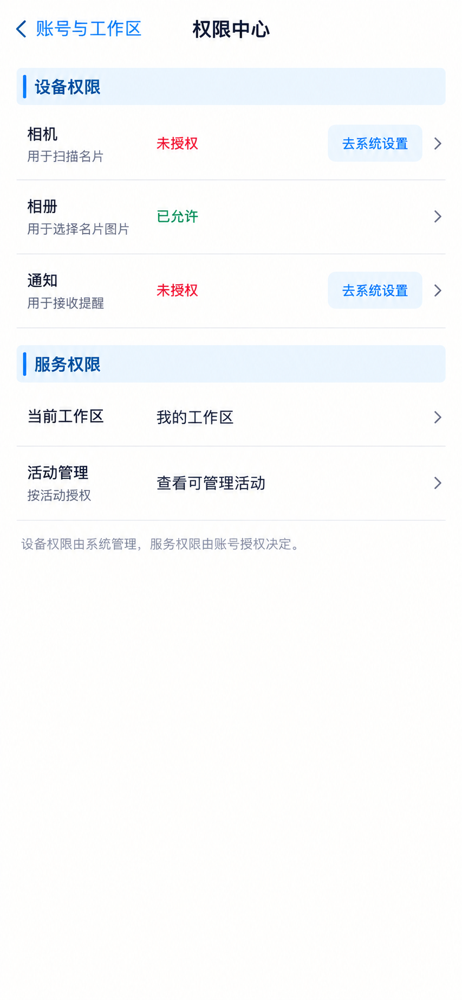

# P45 · 权限中心

[返回页面目录](../PAGE_CATALOG.md) · [独立设计图](../screens/45-permissions.png)

## 定位

路由／状态：`/account/permissions`。实现标记：现有。本页图是静态设计参考，不是运行中 App 的截图。

页面目标：服务权限与设备权限区分，不伪造授权。

## 入口与返回

账号或设置中的权限入口。

## 信息与动作

主要信息：设备权限与服务权限分别展示。

操作及去向：设备权限转系统；服务权限查看已授权范围。

## 业务边界

图示设备区是设计扩展，当前服务权限页能力须保留；未检测不得显示已授权。

## 布局要求

这是二级／表单／独立工作页，不显示全局底部导航；使用标准返回入口，保留来源上下文。 采用浅蓝章节、左侧细蓝线、对齐字段与轻分隔线。字号、触控、行高和安全区以 [UI 规格](../UI_DESIGN_SPEC.md) 为准，不从 PNG 像素直接换算。

## 状态与验收

在主状态之外补齐适用的加载、空内容、搜索无结果、请求失败、无权限／过期状态。表单还需键盘遮挡、验证失败、保存中、保存失败保留输入与未保存退出提示；不适用的状态应标明，不强行增加功能。

至少核对：返回到原来源；动作对象不串号；失败不显示成功；长文本和系统大字号不截断关键内容。详细场景见 [状态与验收](../STATES_AND_ACCEPTANCE.md)，业务流程见 [功能规格](../FUNCTIONAL_SPEC.md)。

## 图像校订

设备权限区域是扩展设计，服务端能力检查为既有核心；实施前分别确认，不将设备未授权涂红视为错误阻断。

## 画面细化参考

以下是本页首轮图像的具体画面说明，便于复现视觉意图；它不是 API 规范。如与上方业务说明冲突，以中文业务说明为准。后续校订的原始提示另见生成记录。

Secondary 权限中心, back 账号与工作区, NOdock. Chapter 设备权限. Rows 相机 用于扫描名片 status 未授权 button 去系统设置; 相册 用于选择名片图片 status 已允许; 通知 用于接收提醒 status 未授权 button 去系统设置. Chapter 服务权限: 当前工作区 我的工作区; 活动管理 按活动授权 查看可管理活动. Note 设备权限由系统管理，服务权限由账号授权决定。 Do not showfakeworkingtogglethatgrantsserverroles, no contactsaddressbook uploadpermission invented.

