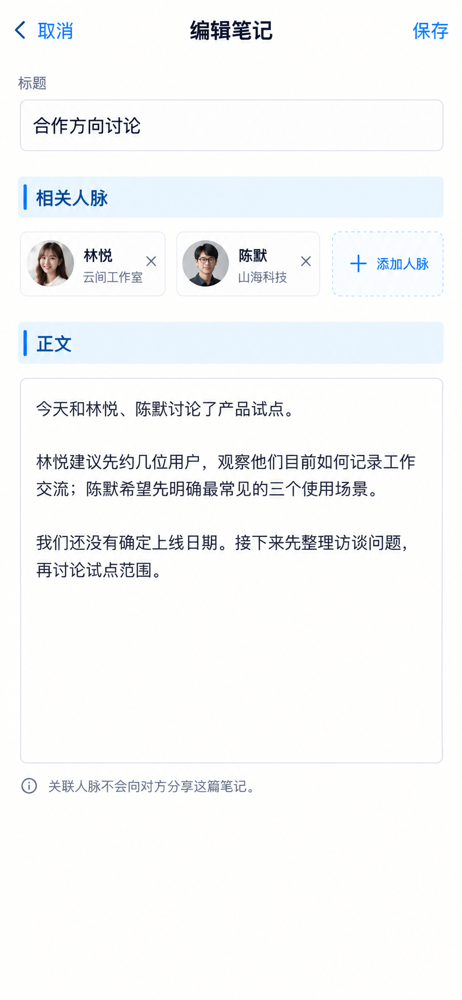

# P50 · 编辑笔记

[返回页面目录](../PAGE_CATALOG.md) · [独立设计图](../screens/50-note-edit.png)

## 定位

路由／状态：`建议 /notes/[id]/edit（当前不存在）`。实现标记：后期 · D7/APP-16/B8。本页图是静态设计参考，不是运行中 App 的截图。

页面目标：一份正文，多人关联，不向被关联者自动分享。

## 入口与返回

新建或编辑笔记，后期新增。

## 信息与动作

主要信息：一份标题正文、零个或多个相关人脉。

操作及去向：保存、取消、选择人脉 P51；未保存离开提示。

## 业务边界

关联不自动分享；旧备注输入只能在新能力可用并保全内容后移除。

## 布局要求

这是二级／表单／独立工作页，不显示全局底部导航；使用标准返回入口，保留来源上下文。 采用浅蓝章节、左侧细蓝线、对齐字段与轻分隔线。字号、触控、行高和安全区以 [UI 规格](../UI_DESIGN_SPEC.md) 为准，不从 PNG 像素直接换算。

## 状态与验收

在主状态之外补齐适用的加载、空内容、搜索无结果、请求失败、无权限／过期状态。表单还需键盘遮挡、验证失败、保存中、保存失败保留输入与未保存退出提示；不适用的状态应标明，不强行增加功能。

至少核对：返回到原来源；动作对象不串号；失败不显示成功；长文本和系统大字号不截断关键内容。详细场景见 [状态与验收](../STATES_AND_ACCEPTANCE.md)，业务流程见 [功能规格](../FUNCTIONAL_SPEC.md)。

## 图像校订

一篇笔记只有一个正文；两个人脉卡片不是两份副本。最终精修可将卡片压为轻量标签。

## 画面细化参考

以下是本页首轮图像的具体画面说明，便于复现视觉意图；它不是 API 规范。如与上方业务说明冲突，以中文业务说明为准。后续校订的原始提示另见生成记录。

Secondary 编辑笔记, back 取消, title 编辑笔记, right 保存, NOdock. Titlefield 合作方向讨论. Bluechapter 相关人脉, removablechips 林悦 云间工作室 and 陈默 山海科技, quiet 添加人脉. Bluechapter 正文 roomyeditor content 今天和林悦、陈默讨论了产品试点。\n林悦建议先约几位用户，观察他们目前如何记录工作交流；陈默希望先明确最常见的三个使用场景。\n我们还没有确定上线日期。接下来先整理访谈问题，再讨论试点范围。. Smallnote 关联人脉不会向对方分享这篇笔记。 No keyboard required,nofakeautosavedbadge/no charcounter, no percontactduplicatedtexteditors.

