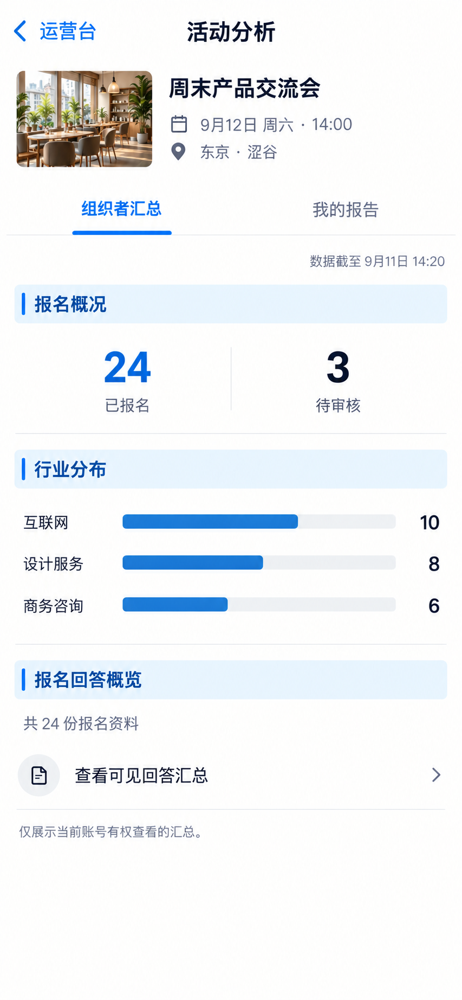

# P57 · 活动分析

[返回页面目录](../PAGE_CATALOG.md) · [独立设计图](../screens/57-event-analytics.png)

## 定位

路由／状态：`/events/[id]/analytics`。实现标记：现有 · 角色敏感。本页图是静态设计参考，不是运行中 App 的截图。

页面目标：组织者汇总／我的报告，数据范围和时间明确。

## 入口与返回

活动分析入口。

## 信息与动作

主要信息：组织者汇总/我的报告、统计范围和更新时间。

操作及去向：查看允许的数据分组或报告。

## 业务边界

示例是虚构统计，不能由截图推断新增聚合接口或隐私权限。

## 布局要求

这是二级／表单／独立工作页，不显示全局底部导航；使用标准返回入口，保留来源上下文。 采用浅蓝章节、左侧细蓝线、对齐字段与轻分隔线。字号、触控、行高和安全区以 [UI 规格](../UI_DESIGN_SPEC.md) 为准，不从 PNG 像素直接换算。

## 状态与验收

在主状态之外补齐适用的加载、空内容、搜索无结果、请求失败、无权限／过期状态。表单还需键盘遮挡、验证失败、保存中、保存失败保留输入与未保存退出提示；不适用的状态应标明，不强行增加功能。

至少核对：返回到原来源；动作对象不串号；失败不显示成功；长文本和系统大字号不截断关键内容。详细场景见 [状态与验收](../STATES_AND_ACCEPTANCE.md)，业务流程见 [功能规格](../FUNCTIONAL_SPEC.md)。

## 图像校订

图片决定视觉方向，字段权限、数据状态、按钮可用性以文字规格与真实契约为准。头像、事件和数值均为虚构样例；生成图中的额外文案或装饰不自动成为需求。

## 画面细化参考

以下是本页首轮图像的具体画面说明，便于复现视觉意图；它不是 API 规范。如与上方业务说明冲突，以中文业务说明为准。后续校订的原始提示另见生成记录。

Secondary 活动分析, back 运营台, NOdock. 周末产品交流会. Tabs 组织者汇总 / 我的报告 firstactiveauthorized. Caption 数据截至9月11日14:20. Bluechapter 报名概况 inline 24已报名 3待审核. Bluechapter 行业分布 horizontal bars 互联网10 / 设计服务8 / 商务咨询6 sum24, proportional. Bluechapter 报名回答概览 factual 共24份报名资料; row 查看可见回答汇总 arrow. Smallnote 仅展示当前账号有权查看的汇总。 No attendeeemail, no privatecross-eventdata, no fabricatedsentiment/opportunityscores or autogeneratedreportclaims.

