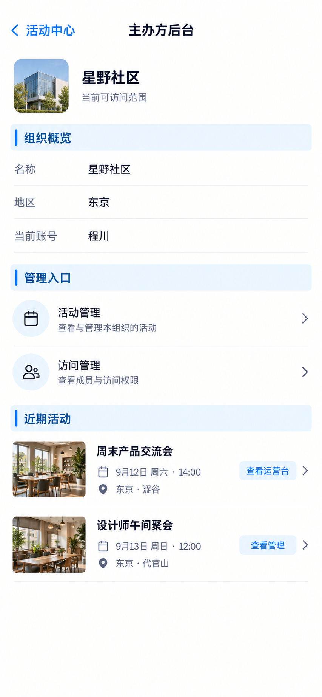

# P61 · 主办方后台概览

[返回页面目录](../PAGE_CATALOG.md) · [独立设计图](../screens/61-admin-dashboard.png)

## 定位

路由／状态：`/admin`。实现标记：现有 · 核对与跳转。本页图是静态设计参考，不是运行中 App 的截图。

页面目标：组织信息、近期活动与成员概览，不新增后台写操作。

## 入口与返回

现有主办方后台入口。

## 信息与动作

主要信息：组织概览、活动和访问管理导航。

操作及去向：活动到 P63；访问到 P62；正式运营到 P52。

## 业务边界

当前以核对和跳转为边界，不在本页增写操作。

## 布局要求

这是二级／表单／独立工作页，不显示全局底部导航；使用标准返回入口，保留来源上下文。 采用浅蓝章节、左侧细蓝线、对齐字段与轻分隔线。字号、触控、行高和安全区以 [UI 规格](../UI_DESIGN_SPEC.md) 为准，不从 PNG 像素直接换算。

## 状态与验收

在主状态之外补齐适用的加载、空内容、搜索无结果、请求失败、无权限／过期状态。表单还需键盘遮挡、验证失败、保存中、保存失败保留输入与未保存退出提示；不适用的状态应标明，不强行增加功能。

至少核对：返回到原来源；动作对象不串号；失败不显示成功；长文本和系统大字号不截断关键内容。详细场景见 [状态与验收](../STATES_AND_ACCEPTANCE.md)，业务流程见 [功能规格](../FUNCTIONAL_SPEC.md)。

## 图像校订

图片决定视觉方向，字段权限、数据状态、按钮可用性以文字规格与真实契约为准。头像、事件和数值均为虚构样例；生成图中的额外文案或装饰不自动成为需求。

## 画面细化参考

以下是本页首轮图像的具体画面说明，便于复现视觉意图；它不是 API 规范。如与上方业务说明冲突，以中文业务说明为准。后续校订的原始提示另见生成记录。

Secondary 主办方后台, back 活动中心, NOdock. Organization 星野社区, smallsubtitle 当前可访问范围. Bluechapter 组织概览 aligned 名称 星野社区 / 地区 东京 / 当前账号 程川. Bluechapter 管理入口 rows 活动管理 / 访问管理. Bluechapter 近期活动 rows 周末产品交流会 9月12日14:00 查看运营台; 设计师午间聚会9月13日12:00 查看管理. Thisadminpageonlyreadandnavigation, NO createorganization/user/delete/editwritebuttons.

