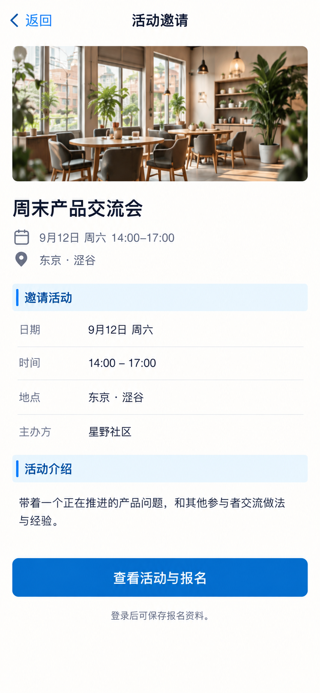

# P66 · 活动邀请入口

[返回页面目录](../PAGE_CATALOG.md) · [独立设计图](../screens/66-event-invitation.png)

## 定位

路由／状态：`/register/[code]`。实现标记：现有 · public。本页图是静态设计参考，不是运行中 App 的截图。

页面目标：有效活动码对应公开活动和报名入口。

## 入口与返回

带有效 code 的活动邀请入口。

## 信息与动作

主要信息：公开活动和报名入口。

操作及去向：活动详情或认证后继续报名。

## 业务边界

无效、过期与不存在分别反馈；不打印真实邀请码。

## 布局要求

这是二级／表单／独立工作页，不显示全局底部导航；使用标准返回入口，保留来源上下文。 采用浅蓝章节、左侧细蓝线、对齐字段与轻分隔线。字号、触控、行高和安全区以 [UI 规格](../UI_DESIGN_SPEC.md) 为准，不从 PNG 像素直接换算。

## 状态与验收

在主状态之外补齐适用的加载、空内容、搜索无结果、请求失败、无权限／过期状态。表单还需键盘遮挡、验证失败、保存中、保存失败保留输入与未保存退出提示；不适用的状态应标明，不强行增加功能。

至少核对：返回到原来源；动作对象不串号；失败不显示成功；长文本和系统大字号不截断关键内容。详细场景见 [状态与验收](../STATES_AND_ACCEPTANCE.md)，业务流程见 [功能规格](../FUNCTIONAL_SPEC.md)。

## 图像校订

图片决定视觉方向，字段权限、数据状态、按钮可用性以文字规格与真实契约为准。头像、事件和数值均为虚构样例；生成图中的额外文案或装饰不自动成为需求。

## 画面细化参考

以下是本页首轮图像的具体画面说明，便于复现视觉意图；它不是 API 规范。如与上方业务说明冲突，以中文业务说明为准。后续校订的原始提示另见生成记录。

Secondary 活动邀请, back 返回, NOdock. Modestcafeeventphoto. Title 周末产品交流会. Bluechapter 邀请活动 aligned 日期9月12日周六 / 时间14:00–17:00 / 地点东京·涩谷 / 主办方星野社区. Factualbody 带着一个正在推进的产品问题，和其他参与者交流做法与经验。. Primary 查看活动与报名, quiet 登录后可保存报名资料。. No realinvitecode, no fakealreadyjoined/RSVP/no directprivategroupmemberupload.

