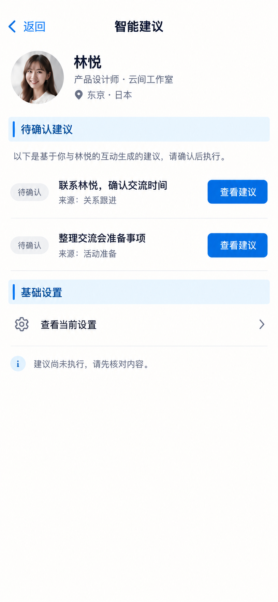

# P67 · 建议动作

[返回页面目录](../PAGE_CATALOG.md) · [独立设计图](../screens/67-agent-actions.png)

## 定位

路由／状态：`/agent`。实现标记：现有 · 非AI主会话页。本页图是静态设计参考，不是运行中 App 的截图。

页面目标：查看现有建议与基础设置，不作为第二个对话首页。

## 入口与返回

现有建议动作页。

## 信息与动作

主要信息：待确认建议及基础设置入口。

操作及去向：先查看建议，再确认具体动作。

## 业务边界

不是第二个 AI 聊天首页；建议状态不等于执行成功。

## 布局要求

这是二级／表单／独立工作页，不显示全局底部导航；使用标准返回入口，保留来源上下文。 采用浅蓝章节、左侧细蓝线、对齐字段与轻分隔线。字号、触控、行高和安全区以 [UI 规格](../UI_DESIGN_SPEC.md) 为准，不从 PNG 像素直接换算。

## 状态与验收

在主状态之外补齐适用的加载、空内容、搜索无结果、请求失败、无权限／过期状态。表单还需键盘遮挡、验证失败、保存中、保存失败保留输入与未保存退出提示；不适用的状态应标明，不强行增加功能。

至少核对：返回到原来源；动作对象不串号；失败不显示成功；长文本和系统大字号不截断关键内容。详细场景见 [状态与验收](../STATES_AND_ACCEPTANCE.md)，业务流程见 [功能规格](../FUNCTIONAL_SPEC.md)。

## 图像校订

这是全局建议动作入口，生成图顶部的林悦资料块不是必需内容，应移除；标题精修为“建议动作”。不要声称所有建议都由与林悦的互动生成。

图片决定视觉方向，字段权限、数据状态、按钮可用性以文字规格与真实契约为准。头像、事件和数值均为虚构样例；生成图中的额外文案或装饰不自动成为需求。

## 画面细化参考

以下是本页首轮图像的具体画面说明，便于复现视觉意图；它不是 API 规范。如与上方业务说明冲突，以中文业务说明为准。后续校订的原始提示另见生成记录。

Secondary 建议动作, back 返回, NOdock. Bluechapter 待确认建议. Two separatedsuggestions 联系林悦，确认交流时间 source关系跟进 primary查看建议; 整理交流会准备事项 source活动准备 primary查看建议. Each neutralbadge 待确认. Bluechapter 基础设置 row 查看当前设置 arrow. Quiet note 建议尚未执行，请先核对内容。. No chatcomposer/secondIORBIThome, no autopilotactivationtoggle, no automaticexternalmessages.
