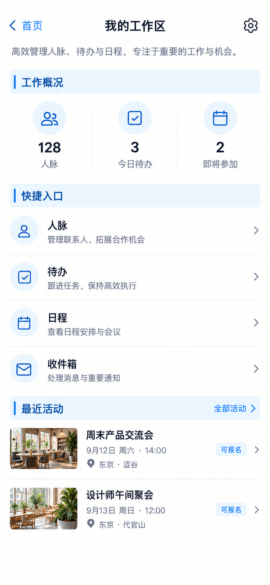

# P69 · 工作区总览

[返回页面目录](../PAGE_CATALOG.md) · [独立设计图](../screens/69-dashboard.png)

## 定位

路由／状态：`/dashboard`。实现标记：现有 · 兼容工作台。本页图是静态设计参考，不是运行中 App 的截图。

页面目标：保留既有总览能力，不替代已选新首页。

## 入口与返回

现有工作区总览兼容入口。

## 信息与动作

主要信息：工作概况、快捷入口和近期活动。

操作及去向：跳转既有业务页。

## 业务边界

保留能力但不替换用户已选首页，不显示根页底栏。

## 布局要求

这是二级／表单／独立工作页，不显示全局底部导航；使用标准返回入口，保留来源上下文。 采用浅蓝章节、左侧细蓝线、对齐字段与轻分隔线。字号、触控、行高和安全区以 [UI 规格](../UI_DESIGN_SPEC.md) 为准，不从 PNG 像素直接换算。

## 状态与验收

在主状态之外补齐适用的加载、空内容、搜索无结果、请求失败、无权限／过期状态。表单还需键盘遮挡、验证失败、保存中、保存失败保留输入与未保存退出提示；不适用的状态应标明，不强行增加功能。

至少核对：返回到原来源；动作对象不串号；失败不显示成功；长文本和系统大字号不截断关键内容。详细场景见 [状态与验收](../STATES_AND_ACCEPTANCE.md)，业务流程见 [功能规格](../FUNCTIONAL_SPEC.md)。

## 图像校订

删除页头和快捷入口中“高效”“拓展合作机会”等泛化宣传文案，保留功能名称即可。图中“可报名”与“即将参加”不得混为同一状态。

图片决定视觉方向，字段权限、数据状态、按钮可用性以文字规格与真实契约为准。头像、事件和数值均为虚构样例；生成图中的额外文案或装饰不自动成为需求。

## 画面细化参考

以下是本页首轮图像的具体画面说明，便于复现视觉意图；它不是 API 规范。如与上方业务说明冲突，以中文业务说明为准。后续校订的原始提示另见生成记录。

Secondary 工作区总览, back 首页, NOdock. Context 我的工作区. Bluechapter 工作概况 smallinline128人脉 /3今日待办 /2即将参加. Bluechapter 快捷入口 rows 人脉 / 待办 / 日程 / 收件箱. Bluechapter 最近活动 twoeventrows 周末产品交流会9月12日 and设计师午间聚会9月13日. ThiscompatibilityworkspaceisNOTnewhome; no bottomdock nor extraAIcomposer nor giantmarketinghero.
