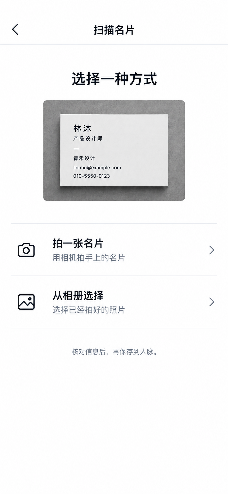

# 扫描名片入口：方案 C 黑白版

状态：用户已确认方案 C 黑白版作为后续 App 实现目标。此处是批准的视觉与文案目标，尚未修改 App。

## 入口页

- 标题：扫描名片
- 引导：选择一种方式
- 第一行：拍一张名片；说明：用相机拍手上的名片
- 第二行：从相册选择；说明：选择已经拍好的照片
- 底部：核对信息后，再保存到人脉。

白底、近黑文字、灰色说明和分隔线、黑色线性图标。对齐现有 `src/design/tokens.ts` 的 light `bg`、`ink`、`muted` 和 `border`，不沿用原 C 图中的亮蓝图标与圆形底色。两行同等醒目；相机权限只在用户选择拍摄后请求。

## 后续流程与边界

拍摄或选图 → 图片超出既有 10 MiB 上限时先在本机压缩 → 核对识别字段 → 用户明确点击“保存到人脉”。压缩失败时提示重选或重拍，不上传原大图；正反面、补拍和替换图片遵守同一规则。核对页标题“核对名片信息”，保存成功提示“已保存到人脉”。不在入口页展示外部导入、引荐、重复检查或内部“候选”术语。现有双面名片、字段来源与按卡确认能力继续遵守 Bridge BR-012；视觉简化不改变其数据与确认约束。

本图只示意 App 的浅色外观；深色外观在实现时复用现有 `darkColors`，不另造一套颜色或改变操作流程。OCR、权限、实体设备和跨端保存结果未在本次设计稿中验证。

预览：<https://orbit-card-scan-options.agenthubs-app.chatgpt.site>（私有 Site，刷新可见最新版）。

## 手动添加：当前实现，尚非新设计目标

用户提出第三个问题后，按当前源码核对并在同一 Site 增加入口与表单结构示意：

- 非空人脉列表：右上角黑底 `＋` 跳转 `/contacts/new?mode=manual`；旁边的取景框图标跳转 `/contacts/new`。空列表直接显示“扫名片”“手动添加”两个按钮。见 `src/screens/contacts/ContactsScreen.tsx`。
- 进入后仍是共用的“添加人脉”页，显示“批量导入名片”、名片／QR／手动来源标签，并选中“手动”。表单依次为姓名、公司、职位、关系备注、下一步、标签。见 `src/screens/contacts/ContactAcquisitionScreen.tsx`。
- 当前按钮原文是“生成待确认候选”。`buildContactAcquisitionRequest` 对手动模式要求姓名，提交到手动草稿接口；生成草稿后仍需确认才写入联系人。见 `src/view-models/contact-acquisition.ts`。

手动添加界面只是现状说明，不因方案 C 获批而自动批准重做；尤其不能把“手动添加”塞回仅用于拍照／选图的名片扫描页。后续是否简化手动提交与确认文案，需要用户单独决定。

用户反馈当前手动表单视觉过于繁杂，并在三张新稿中选择了「姓名先行／最快开始」。[手动添加设计](../2026-10-03-manual-add-redesign/README.md)独立记录该目标，不改变本页已确认的扫描名片目标。
