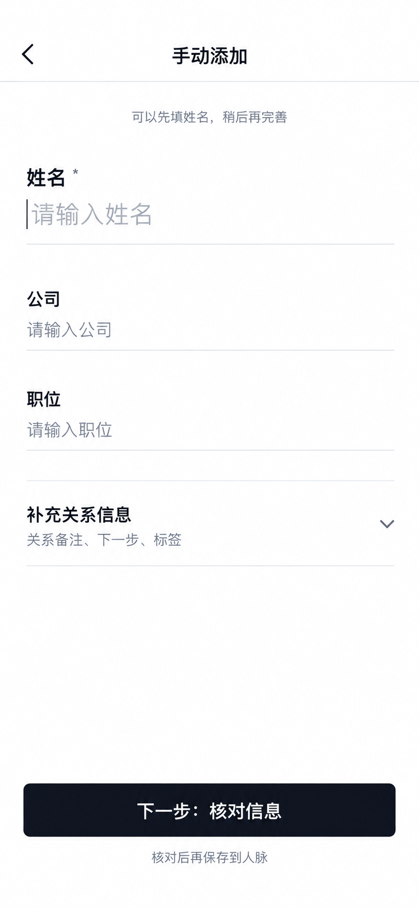

# 手动添加人脉：姓名先行方案

状态：用户在三张视觉稿中选择了方案 2「姓名先行／最快开始」作为后续 App 实现目标；App 尚未修改。扫描名片的 C 黑白版目标另见 [名片扫描设计](../2026-10-03-card-scan-simplify/README.md)。

## 共同边界

- “手动添加”从人脉页进入独立表单，不与扫描名片或其他导入方式混在一起。
- 保留现有六项信息：姓名、公司、职位、关系备注、下一步、标签；姓名为必填。
- 此页主按钮写“下一步：核对信息”，下方提示“核对后再保存到人脉”。现有“生成待确认候选”不再作为用户可见文案目标；当前 App 的提交与确认流程尚未修改。
- 使用已选名片扫描 C 版的白底、近黑文字、灰色次级文字与轻分隔线。图中输入内容是示意，不是真实用户资料。

## 已选布局

先露出姓名、公司、职位；「补充关系信息」展开后填写关系备注、下一步、标签。姓名仍为必填，其余三项不能因默认收起而丢失已填内容。用户点击主按钮后进入核对，再由用户明确确认保存。

## 其他对比稿（未选）

1. [分组直填](manual-1-grouped.png)：六项依次展开，按“基本信息 / 关系信息”分组。适合一次填完整。
2. [关系备忘](manual-3-relationship.png)：保留六项，同时给关系备注更多空间，适合记住相遇情境和后续动作。

三张稿都在 [私有 Site](https://orbit-card-scan-options.agenthubs-app.chatgpt.site/#manual-current) 对比；Site 当前仍显示选择前的状态，不能用它判断哪张已获批准。本文件记录最终选择，实际 App 行为仍需按 Sprint 验收。
